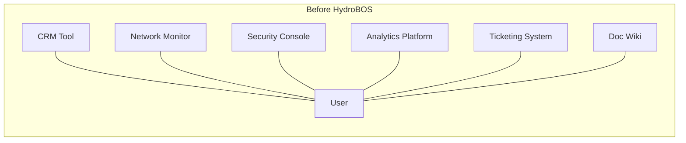
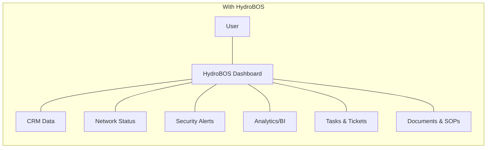
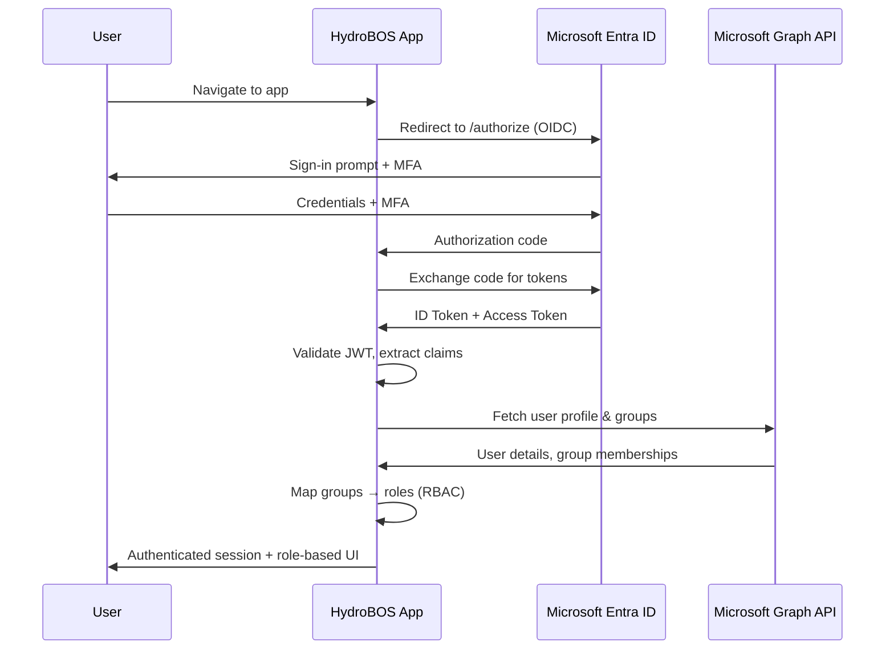
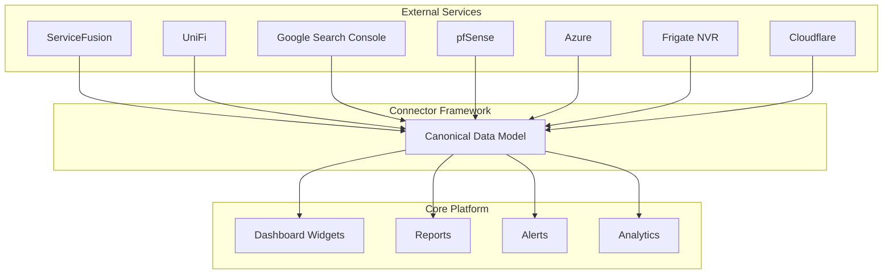
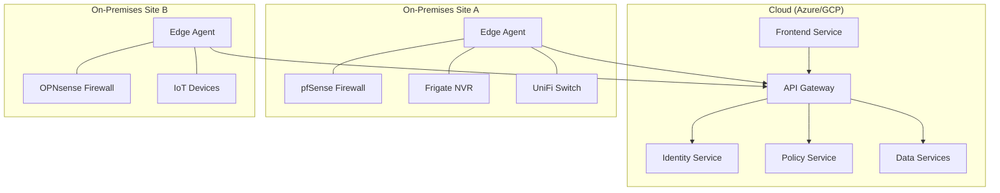
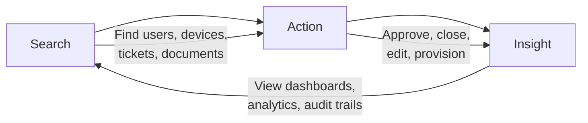

# 01 — Vision & Core Objectives

## Executive Vision

Build a **modern Business Operating System dashboard** — a unified, extensible platform that serves as a **single pane of glass** for all critical business, IT, and security operations. This platform functions as an internal **control plane** for the organization's day-to-day operations and is designed to be productized as a **scalable SaaS/PaaS** offering for external customers.

It centralizes multiple tools and systems into one cohesive, user-friendly dashboard, integrating:

- Identity management
- Operational workflows
- Analytics & business intelligence
- Documentation & knowledge management
- Security controls (digital + physical)
- Third-party service connectors

The end goal is a comprehensive **Business Operating System** that:

1. **Increases visibility and efficiency** across the organization
2. **Enforces strong security by design**
3. **Serves as a foundation** for both internal operations and a revenue-generating SaaS product

---

## Core Value Propositions

### Unified Control Plane for the Enterprise
Provides a **single, unified interface** for business, IT, and security operations — consolidating identity management, operations, analytics, documentation, and more into one seamless platform. Eliminates siloed tools and fragmented workflows.

### SSO-First, Identity-Centric Security
Integrates Microsoft Entra ID (Azure AD) Single Sign-On via OpenID Connect (OIDC) to streamline authentication. Users sign in with corporate credentials; the app consumes standard OIDC tokens, eliminating the need to manage separate passwords. Role-Based Access Control (RBAC) aligned with least-privilege principles is built in from day one.

### Integration Hub & Extensibility
Features a flexible connector framework for rapid integration of third-party APIs and internal micro-apps. Supports connectors for cloud services, networking equipment, security systems, and more — enabling a **holistic view** of enterprise systems. A *canonical data model* allows unified widgets and analytics across diverse data sources.

### Security-First & Zero Trust Aligned
Security as a core tenet: fine-grained access controls (RBAC with future ABAC), audit logging, and Zero Trust principles — verifying identity, device, and context for each action. Both digital and physical security controls (network access via RADIUS, camera/NVR monitoring) are unified under the same identity-driven policies.

### SaaS-Ready & Scalable Architecture
Cloud-native, microservices-based application using Docker containers for portability and scalability. Multi-tenant design with strict tenant isolation. The architecture supports hybrid deployments and is ready to scale into data lake and analytics use cases.

---

## Non-Negotiable Objectives

These are the **seven pillars** that define the product's minimum requirements. No trade-offs allowed on these:

### 1. Single Pane of Glass for Operations

Provide one **central dashboard** for monitoring and managing **all facets of the business** — from high-level executive KPIs to IT systems status and security posture.

**Why it matters:**
- Reduces context-switching between tools
- Improves situational awareness
- Increases operational efficiency

---

### 2. SSO-First Identity Integration

Implement **Microsoft Entra ID** (Azure AD) for single sign-on using **OpenID Connect (OIDC)** and **OAuth 2.0**.

**Requirements:**
- User authentication offloaded to Azure AD (trusted IdP)
- App trusts **ID tokens** issued by Azure AD
- **No local password storage** whatsoever
- Enforce **multi-factor authentication (MFA)** via Entra ID
- Extract user attributes/roles from Azure AD claims
- Map Azure AD groups to in-app roles for RBAC
- Enforce **least-privilege access**: minimum permissions, narrowest scope

---

### 3. Integration & Extensibility

Serve as an **integration hub** for both cloud services and on-prem systems via a modular connector framework.

**Requirements:**
- Quick integration of new third-party APIs via connectors
- Connectors map external data into a **canonical data model**
- Core modules consume data in a consistent format regardless of source
- Adding/swapping integrations does not require rearchitecting the core

---

### 4. Security & Compliance by Design

Embed robust security controls and auditing from the ground up — **built-in, not bolted on**.

**Requirements:**
- RBAC/ACL for feature access
- Future ABAC to incorporate contextual policies (MFA status, device posture)
- **Audit logs** of all user actions and security events
- **Zero Trust Architecture**: verify **who** (identity), **what** (permissions), **context** (device, network) for every request
- Step-up MFA for sensitive operations
- Dedicated **policy engine** microservice for fine-grained policy evaluation
- Physical security integrations tied to the same identity framework

---

### 5. Scalability & SaaS-Readiness

**Requirements:**
- **Microservices** orchestrated via Docker containers
- Deployable on Azure and/or AWS
- Each service addresses a distinct domain → independent scaling
- **Multi-tenant design**: strict tenant isolation at data, application, and network layers
- Tenant context extracted early and passed through the system
- Common libraries handle tenant-specific policy enforcement
- Data architecture scalable from per-tenant DBs to a consolidated **data lakehouse**

---

### 6. Hybrid Cloud Support

**Requirements:**
- Platform operates in the cloud while interfacing with **on-premises and edge systems**
- **Edge agents** (lightweight Docker containers) deployed on-prem for local resources
- Edge agents feed data securely back to the cloud control plane
- Support use cases: branch offices, factories, datacenters, local IoT

---

### 7. Modern User Experience

**Requirements:**
- Clean, responsive, "premium" enterprise UI
- **Customizable dashboards** with drag-and-drop widgets
- Global search / command palette for fast navigation
- Role-based default views
- **Widget marketplace** for extensibility
- Consistent UX patterns: **Search → Action → Insight**

---

## Success Criteria

| Metric | Target |
|--------|--------|
| **Time to onboard new integration** | < 2 weeks for a standard API connector |
| **User authentication** | Local accounts + optional Entra ID SSO |
| **Uptime SLA** | 99.9% for cloud-hosted components |
| **Tenant data isolation** | Zero cross-tenant data leakage (verified by pen test) |
| **UI page load** | < 2 seconds for dashboard with 10+ widgets |
| **Audit coverage** | 100% of admin actions and security events logged |
| **Accessibility** | WCAG 2.1 AA compliance |
