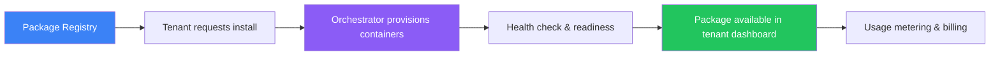
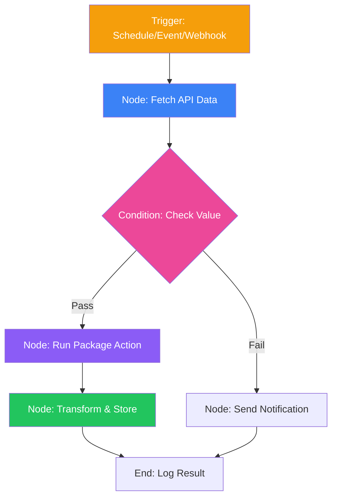

# 02 — Roadmap

## Phased Delivery Plan

HydroBOS follows a **frontend-first, progressive layering** approach. We start with a working UI and layer backend services, authentication, and integrations incrementally — delivering a usable product at every milestone.

```mermaid
gantt
    title HydroBOS Delivery Roadmap
    dateFormat YYYY-MM
    axisFormat %b %Y

    section Phase 0 — Frontend Shell
    Next.js Project Init              :p0a, 2026-03, 2026-04
    App Shell & Navigation            :p0b, 2026-03, 2026-05
    Login Page (UI Only)              :p0c, 2026-04, 2026-05
    Dark/Light Theme                  :p0d, 2026-04, 2026-05
    Static Mock Dashboard             :p0e, 2026-04, 2026-06

    section Phase 1 — Gateway + Auth + DB
    API Gateway Scaffold              :p1a, 2026-05, 2026-07
    Auth Middleware (JWT/Sessions)    :p1b, 2026-05, 2026-07
    MongoDB Setup & Schemas           :p1c, 2026-06, 2026-07
    Redis Session Store               :p1d, 2026-06, 2026-07
    Docker Compose Full Stack         :p1e, 2026-06, 2026-08

    section Phase 2 — Admin Bootstrap
    First-Run Setup Flow              :p2a, 2026-07, 2026-08
    Admin User Creation               :p2b, 2026-07, 2026-08
    Local Auth (Email/Password)       :p2c, 2026-07, 2026-09

    section Phase 3 — Template Dash + Settings
    Widget Engine (Drag & Drop)       :p3a, 2026-08, 2026-10
    Default Dashboard Templates       :p3b, 2026-08, 2026-10
    Admin Settings Panel              :p3c, 2026-09, 2026-10
    RBAC & Module Gating              :p3d, 2026-09, 2026-11

    section Phase 4 — Local Accounts
    User Management CRUD              :p4a, 2026-10, 2026-11
    Invite & Registration Flow        :p4b, 2026-10, 2026-12
    Role Assignment UI                :p4c, 2026-11, 2026-12
    Password Reset Flow               :p4d, 2026-11, 2026-12

    section Phase 5 — Azure Entra ID
    Entra ID OIDC Connector           :p5a, 2026-12, 2027-02
    Microsoft Graph User Sync         :p5b, 2026-12, 2027-02
    AD Group → Role Mapping           :p5c, 2027-01, 2027-02
    Hybrid Auth (Local + SSO)         :p5d, 2027-01, 2027-03

    section Phase 6 — First Applet (SEO Optimizer)
    Applet Runtime Framework          :p6a, 2027-02, 2027-04
    Applet Template API               :p6b, 2027-02, 2027-04
    Vite/Vue SEO Optimizer Build      :p6c, 2027-03, 2027-05
    Applet ↔ Host Communication       :p6d, 2027-03, 2027-05
    SEO Applet Goes Live              :milestone, p6e, 2027-05, 0d

    section Phase 7 — Hardening & Connectors
    Security Review & Hardening       :p7a, 2027-04, 2027-06
    Connector SDK & First 3           :p7b, 2027-04, 2027-07
    Event Bus Implementation          :p7c, 2027-05, 2027-07
    UAT & Feedback                    :p7d, 2027-06, 2027-08

    section Phase 8 — Multi-Tenant & SaaS
    Multi-Tenant Isolation            :p8a, 2027-07, 2027-09
    Tenant Provisioning               :p8b, 2027-08, 2027-10
    V1 SaaS Launch — Pilot            :milestone, p8c, 2027-10, 0d

    section Phase 9 — Proprietary Package System
    Package Registry & Manifest       :p9a, 2027-10, 2027-12
    Per-Tenant Container Orchestrator :p9b, 2027-10, 2028-01
    Package Lifecycle Management      :p9c, 2027-11, 2028-01
    Tenant Isolation & Resource Limits:p9d, 2027-12, 2028-02
    Package Marketplace UI            :p9e, 2028-01, 2028-02
    Package System GA                 :milestone, p9f, 2028-02, 0d

    section Phase 10 — No-Code Workflow Builder
    Workflow Engine Core              :p10a, 2028-02, 2028-04
    Visual DAG Editor (Zapier-style)  :p10b, 2028-02, 2028-05
    API & Package Node Connectors     :p10c, 2028-03, 2028-05
    Trigger System (Cron/Event/Webhook):p10d, 2028-04, 2028-06
    Workflow Marketplace & Sharing    :p10e, 2028-05, 2028-06
    Workflow Builder GA               :milestone, p10f, 2028-06, 0d
```

---

## Phase Details

### Phase 0 — Frontend Shell (Months 0–3)

**Goal:** A functional, beautiful frontend UI shell with navigation, theming, and a static mock dashboard. No backend yet — pure frontend.

| Deliverable | Description |
|------------|-------------|
| Next.js project initialization | App Router, TypeScript, Tailwind CSS, Shadcn/ui setup |
| Application shell | Sidebar navigation, top bar, main content area, responsive layout |
| Login page (UI only) | Branded login page with email/password form (no backend wired yet) |
| Dark/light theme | System-preference detection + manual toggle; full color system |
| Static mock dashboard | Hardcoded widget layout with sample data to demonstrate look & feel |
| Placeholder module pages | Stub pages for each planned module (Identity, Ops, Security, etc.) |
| Component library foundation | Base UI components, widget wrapper, layout primitives |
| Dev tooling | ESLint, Prettier, Vitest, Playwright scaffold, Husky pre-commit hooks |

```mermaid
flowchart TD
    A[Phase 0 Complete] --> B{What exists...}
    B --> C[✅ Beautiful responsive app shell]
    B --> D[✅ Sidebar + top bar navigation]
    B --> E[✅ Login page UI ready]
    B --> F[✅ Dark/light theme working]
    B --> G[✅ Mock dashboard with sample widgets]
    B --> H[✅ All module stub pages in place]
```

**Exit Criteria:**
- [x] App starts with `pnpm dev` and renders full shell
- [x] Navigation between all module stubs works
- [x] Theme toggle persists preference
- [x] Responsive on desktop and tablet
- [x] Mock dashboard demonstrates widget layout

> **Status: ✅ COMPLETE** — Implemented with Vite + React (instead of Next.js), Tailwind CSS, Lucide icons. Docker Compose dev stack operational.

---

### Phase 1 — Gateway + Auth Middleware + Database (Months 3–5)

**Goal:** Wire up the backend foundation — API Gateway, authentication middleware, MongoDB, and Redis sessions. The frontend connects to real APIs.

| Deliverable | Description |
|------------|-------------|
| API Gateway service | NestJS gateway with request routing, CORS, rate limiting, logging |
| Auth middleware | JWT token validation and session management middleware |
| MongoDB setup | Core schemas: users, sessions, settings, roles |
| Redis session store | Server-side session storage with configurable TTL |
| Docker Compose stack | Full local dev environment: frontend + gateway + MongoDB + Redis |
| Health check endpoints | `/health` for all services; used by Docker and future monitoring |
| Environment configuration | Centralized config with validation; `.env.example` templates |
| CI/CD pipeline (v1) | Lint, type-check, test, and build on every push |

**Exit Criteria:**
- [x] Frontend makes authenticated API calls through gateway
- [x] Sessions persist across requests via Redis
- [x] MongoDB stores and retrieves user data
- [x] `docker-compose up` starts the full stack
- [ ] CI pipeline runs on every PR

> **Status: ✅ COMPLETE** — Express-based API Gateway on port 5000 proxies to identity (5001) and widget services. JWT auth with httpOnly cookies. MongoDB + Redis running in Docker Compose.

---

### Phase 2 — Admin Bootstrap & First-Run Setup (Months 5–6)

**Goal:** On first launch, the platform guides the user through creating an admin account. This is the "welcome" experience.

| Deliverable | Description |
|------------|-------------|
| First-run detection | Detect empty database → redirect to setup wizard |
| Setup wizard UI | Multi-step form: organization name, admin credentials, basic settings |
| Admin account creation | Hash & store admin credentials (bcrypt); assign `platform_admin` role |
| Organization settings | Company name, logo upload, timezone, default preferences |
| Setup completion lock | Wizard disabled after first admin is created; only accessible via reset |
| Dev seed script | Optional script to pre-populate dev environment with test data |

```mermaid
flowchart TD
    A[App Starts] --> B{Database Empty?}
    B -->|Yes| C[Show First-Run Setup Wizard]
    C --> D[Step 1: Organization Name & Logo]
    D --> E[Step 2: Create Admin Account<br/>Email + Password]
    E --> F[Step 3: Basic Settings<br/>Timezone, Preferences]
    F --> G[Step 4: Review & Confirm]
    G --> H[Create Admin User in DB]
    H --> I[Lock Setup Wizard]
    I --> J[Redirect to Dashboard ✅]
    
    B -->|No| K[Normal Login Flow]
```

**Exit Criteria:**
- [x] Fresh deployment shows setup wizard automatically
- [x] Admin account created with hashed password
- [x] Setup wizard inaccessible after completion
- [x] Admin can log in with created credentials and see dashboard

> **Status: ✅ COMPLETE** — First-run detection redirects to `/setup` wizard. Admin account created with bcrypt-hashed password and `platform_admin` role. Setup locked after first admin creation.

---

### Phase 3 — Template Dashboard + Admin Settings (Months 6–8)

**Goal:** A working drag-and-drop dashboard engine with default templates, plus an admin settings panel for platform configuration.

| Deliverable | Description |
|------------|-------------|
| Widget engine | Drag-and-drop dashboard with grid layout, resize, save/load |
| Widget library v1 | KPI card, line chart, bar chart, data table, status grid, text card |
| Default dashboard templates | Pre-built layouts per role (admin, ops, executive, user) |
| Admin settings panel | System config: branding, auth settings, user management, connectors |
| User profile page | Personal settings, theme preference, notification preferences |
| RBAC implementation | Role-based module visibility and action permissions |
| Command palette | Global search (⌘K / Ctrl+K) across entities and navigation |

```mermaid
flowchart TD
    A[Phase 3 Complete] --> B{User can...}
    B --> C[✅ Drag/drop widgets to customize dashboard]
    B --> D[✅ Save and load personalized layouts]
    B --> E[✅ Choose from role-based template dashboards]
    B --> F[✅ Admin configures platform settings]
    B --> G[✅ RBAC enforces module visibility by role]
    B --> H[✅ Global search via command palette]
```

**Exit Criteria:**
- [x] Widget drag-and-drop with save/load works end-to-end
- [x] At least 3 default dashboard templates available
- [x] Admin settings panel functional for core configuration
- [x] RBAC correctly gates modules based on role
- [ ] Command palette returns results from all entity types

> **Status: ✅ COMPLETE** — Widget builder with template selection, drag-and-drop dashboard engine. Admin portal with Organization, Tenants, SSO, and Users tabs. RBAC enforces module visibility by role.

---

### Phase 4 — Local Account Management (Months 8–10)

**Goal:** Admins can create, manage, and deactivate local user accounts. Users can self-serve password resets and profile updates.

| Deliverable | Description |
|------------|-------------|
| User management CRUD | Admin UI to create, edit, deactivate, and delete users |
| Invite flow | Admin sends email invitation → user sets password on first login |
| Registration confirmation | Email verification with secure token |
| Role assignment UI | Admin assigns roles to users via dropdown/multi-select |
| Password reset flow | "Forgot password" → email link → set new password |
| User directory page | Searchable, filterable list of all platform users |
| Audit trail for user actions | Log all user management events (created, role changed, deactivated) |

```mermaid
flowchart TD
    A[Admin Creates User] --> B[Invitation Email Sent]
    B --> C[User Clicks Link]
    C --> D[Set Password + Profile]
    D --> E[Account Active ✅]
    
    F[User Forgot Password] --> G[Request Reset Email]
    G --> H[Click Reset Link]
    H --> I[Set New Password]
    I --> J[Login with New Password ✅]
```

**Exit Criteria:**
- [x] Admin can create, edit, and deactivate users
- [x] Invite flow sends email and allows first-time setup
- [x] Password reset works end-to-end
- [x] User directory searchable with role filtering
- [x] All user management actions generate audit log entries

> **Status: ✅ COMPLETE** — Full User Management CRUD with search, filter, and pagination. Invite flow with 7-day secure tokens. Password reset (forgot → token → new password). Role assignment via edit modal. AuditLog model with TTL auto-cleanup and admin audit panel. Self-service profile updates and password changes via Settings page.

---

### Phase 5 — Azure Entra ID Integration (Months 10–12)

**Goal:** Add Microsoft Entra ID as an optional SSO provider. Organizations can choose local-only, Entra-only, or hybrid authentication.

| Deliverable | Description |
|------------|-------------|
| Entra ID connector (admin settings) | Admin configures tenant ID, client ID, client secret, redirect URI |
| OIDC authentication flow | Full redirect flow with Entra ID; token validation; session creation |
| Microsoft Graph user sync | Pull user profiles and group memberships from Azure AD |
| AD group → role mapping | Map Entra ID groups to platform roles; configurable by admin |
| Hybrid auth mode | Platform supports both local and SSO users simultaneously |
| Login page update | "Sign in with Microsoft" button alongside local email/password form |
| MFA enforcement | Leverage Entra ID Conditional Access for MFA on SSO users |
| Automatic deprovisioning | When user disabled in Entra ID, platform access revoked on next sync |

**Exit Criteria:**
- [x] Admin can enable/disable Entra ID from settings panel
- [x] SSO login works end-to-end with Entra ID
- [x] AD groups correctly mapped to platform roles
- [x] Hybrid auth: local and SSO users coexist
- [x] Deprovisioned SSO users are blocked on next sync

> **Status: ✅ COMPLETE** — Full Entra ID OIDC connector with admin config UI (tenant ID, client ID, client secret, redirect URI, scopes). "Sign in with Microsoft" button on login page (conditional on SSO status). Microsoft Graph user sync (admin-triggered bulk sync with auto-deprovisioning). AD group → role mapping with priority resolution. Hybrid auth: local and SSO users coexist seamlessly. Audit logging for all SSO events. Client secret preservation on config updates.

---

### Phase 6 — First Applet: Vite/Vue SEO Optimizer (Months 12–15)

**Goal:** Build the **applet runtime framework** and ship the first HydroBOS applet — an internal Vite/Vue-based SEO optimization tool embedded in the dashboard.

| Deliverable | Description |
|------------|-------------|
| Applet runtime framework | Iframe-based applet container with secure host ↔ applet messaging |
| Applet template API | Standardized API contract for applet registration, auth, data exchange |
| Applet manifest schema | JSON manifest defining applet metadata, permissions, entry point |
| Host shell integration | Applet launcher in sidebar; applet panel within dashboard area |
| `@hydrobos/applet-sdk` | NPM package providing auth tokens, theme sync, event bus helpers |
| SEO Optimizer applet | Vite + Vue 3 app: keyword analysis, page scoring, recommendations |
| Google Search Console data | Applet pulls GSC data via HydroBOS connector API |
| Applet settings page | Admin can install, configure, enable/disable applets |

```mermaid
flowchart TD
    A[Phase 6 Complete] --> B{What exists...}
    B --> C[✅ Applet runtime loads Vite/Vue apps in iframes]
    B --> D[✅ Template API for building new applets]
    B --> E[✅ SEO Optimizer applet live and functional]
    B --> F[✅ Applet SDK published for internal/future devs]
    B --> G[✅ Admin can manage installed applets]
    B --> H[✅ Applets inherit host theme & auth context]
```

**Exit Criteria:**
- [ ] SEO Optimizer applet renders inside HydroBOS dashboard
- [ ] Applet receives auth context from host shell
- [ ] Applet theme syncs with host dark/light mode
- [ ] Applet SDK documented and working
- [ ] At least one more applet stub built from template to validate API

---

### Phase 7 — Hardening & Connector Expansion (Months 15–18)

**Goal:** Production-quality security, connector SDK, first batch of third-party connectors, and event-driven architecture.

| Deliverable | Description |
|------------|-------------|
| Security review | Input validation, CSP headers, dependency scanning, pen-test prep |
| Connector SDK | `@hydrobos/connector-sdk` — base connector class, normalizer, scheduler |
| ServiceFusion connector | Fetch jobs, customers, invoices |
| UniFi connector | Fetch APs, switches, client counts |
| pfSense/OPNsense connector | Firewall status, rules, logs |
| Event bus implementation | Kafka or Azure Service Bus for async cross-service messaging |
| Circuit breakers & resilience | Retry, backoff, fallback for external API failures |
| Encryption | Data at rest encryption; TLS everywhere |
| UI/UX refinement | Based on user feedback; improved navigation and polish |
| UAT program | Internal users test and provide structured feedback |

**Exit Criteria:**
- [ ] Security review completed with no critical findings
- [ ] 3+ connectors operational and serving live data
- [ ] Event bus processing cross-service events
- [ ] Connector SDK documented with template project
- [ ] UAT participants can complete core workflows without assistance

---

### Phase 8 — Multi-Tenancy & SaaS Launch (Months 18–22)

**Goal:** The platform can securely host multiple customer tenants and launches as a pilot SaaS offering.

| Deliverable | Description |
|------------|-------------|
| Tenant data isolation | Per-tenant DB partitioning validated |
| Tenant provisioning workflow | Admin creates new tenant → auto-configures DB, roles, defaults |
| Tenant admin roles | Tenant-scoped admins who manage their own users/connectors |
| Custom branding per tenant | Logo, accent color, app title |
| Performance testing | Load test with simulated multi-tenant workloads |
| Isolation verification | Pen-test confirming zero cross-tenant data leakage |
| SaaS infrastructure | Cloud deployment, monitoring, alerting, backup |
| Billing integration | Stripe or equivalent; usage tracking |
| V1 launch to pilot customers | Select customers onboarded with white-glove support |

```mermaid
flowchart TD
    A[New Customer Signup] --> B[Tenant Created]
    B --> C[Admin Account Provisioned<br/>Local or via Entra ID]
    C --> D[Default Dashboard Loaded]
    D --> E[Applet & Connector Setup Wizard]
    E --> F[First Data Sync]
    F --> G[Customer Operational 🎉]
```

**Exit Criteria:**
- [ ] 3+ pilot tenants onboarded and operational
- [ ] No cross-tenant data leakage confirmed by pen-test
- [ ] Platform sustains target load under multi-tenant simulation
- [ ] Billing tracking active

---

### Future — V2+ Development

**Goal:** Advanced features that deepen the platform's value and competitive differentiation.

| Deliverable | Description |
|------------|-------------|
| Data lakehouse | Unified analytics across all connector data; Spark processing |
| Password safe / secret management | Team-based secret storage with audit trail |
| Advanced ABAC policies | OPA integration; context-aware authorization rules |
| Deepened IoT/physical security | RADIUS integration; expanded NVR features; badge correlation |
| AI-powered insights | Anomaly detection, predictive alerts, natural-language queries |
| SIEM/SOAR deep integration | Bi-directional with Sentinel, Splunk, or similar |
| Mobile app (PWA) | Progressive Web App for on-the-go dashboard access |

---

### Phase 9 — Proprietary Package System (TODO)

**Goal:** Enable users to install proprietary packages from a catalog. Each package spins up isolated Docker containers scoped to the tenant, providing extensible, modular functionality without affecting other tenants.

| Deliverable | Description |
|------------|-------------|
| Package registry & manifest schema | Central registry defining package metadata, dependencies, container specs, resource limits, and health checks |
| Per-tenant container orchestrator | Docker/Kubernetes integration that provisions, starts, stops, and monitors containers per tenant per package |
| Package lifecycle management | Install, upgrade, rollback, uninstall flows with state machine; handles data migrations between versions |
| Tenant isolation & resource limits | Network policies, CPU/memory quotas, storage limits, and secrets injection per tenant container instance |
| Package SDK & template | Developer toolkit for building new packages: Dockerfile template, manifest generator, local testing harness |
| Package marketplace UI | Admin panel for browsing, installing, and managing packages; per-tenant usage dashboards and billing hooks |
| Inter-package communication | Secure service mesh for packages to communicate within a tenant boundary via gRPC/REST with mTLS |

**Key Design Decisions:**
- Packages are defined by a manifest (`package.hydrobos.yml`) specifying container images, environment variables, ports, volumes, and resource limits
- Each tenant gets isolated container instances — no shared state between tenants
- Orchestrator supports both Docker Compose (single-node) and Kubernetes (multi-node) backends
- Package data is stored in tenant-scoped databases/collections
- Billing hooks track per-tenant resource consumption (CPU-hours, storage, API calls)

**Exit Criteria:**
- [ ] Package manifest schema defined and validated
- [ ] At least 2 proprietary packages deployed via the system
- [ ] Tenant isolation confirmed (no cross-tenant container or data access)
- [ ] Install/upgrade/uninstall lifecycle works end-to-end
- [ ] Resource limits enforced and metering active

---

### Phase 10 — No-Code Workflow Builder (TODO)

**Goal:** Provide a visual, Zapier-like workflow builder that allows users to combine APIs, packages, and platform capabilities into automated workflows — without writing code.

| Deliverable | Description |
|------------|-------------|
| Workflow engine core | DAG-based execution engine supporting sequential, parallel, conditional, and loop steps; handles retries and error flows |
| Visual DAG editor | Drag-and-drop canvas for building workflows; node palette, edge connections, inline configuration, live preview |
| API & package node connectors | Pre-built nodes for REST APIs, webhooks, installed packages, platform services (SEO, identity, etc.) |
| Trigger system | Cron schedules, event-driven (Kafka topics), webhook listeners, manual triggers, file-watch triggers |
| Data transformation nodes | JSON mapping, filtering, aggregation, template rendering (Handlebars/Liquid), JavaScript expressions |
| Workflow versioning & history | Git-like versioning for workflow definitions; execution history with step-level logs and replay |
| Workflow marketplace & sharing | Share workflow templates across tenants; community-contributed workflow library |
| Credential vault integration | Secure storage for API keys and OAuth tokens used by workflow nodes; per-tenant secret scoping |

**Key Design Decisions:**
- Workflows are stored as JSON DAGs with typed nodes and edges
- Each node type has a schema defining inputs, outputs, and configuration
- Execution engine runs server-side with tenant-scoped queues (backed by Kafka/Redis)
- Package nodes automatically appear when a package is installed — zero config
- Supports both synchronous (API-to-API) and asynchronous (event-driven) patterns
- Workflow runs are sandboxed per tenant with execution time limits and rate controls

**Exit Criteria:**
- [ ] Visual editor supports drag-and-drop workflow creation
- [ ] At least 5 built-in node types (HTTP, Transform, Condition, Package, Notification)
- [ ] Trigger system supports cron, webhook, and event-driven execution
- [ ] Workflow execution logs with step-level detail
- [ ] End-to-end workflow combining an API call + package action + notification

---

## Milestone Summary

```mermaid
timeline
    title HydroBOS Key Milestones
    
    Q1 2026 : Phase 0 Start
             : Frontend Shell Built
             : Mock Dashboard Ready
    
    Q2 2026 : Phase 1 — Gateway + DB
             : Backend Foundation Live
             : Docker Compose Stack
    
    Q3 2026 : Phase 2 — Admin Bootstrap
             : First-Run Setup Wizard
             : Phase 3 — Widget Engine
             : Template Dashboards
    
    Q4 2026 : Phase 4 — Local Accounts
             : User Management Live
             : Phase 5 — Entra ID
             : SSO Integration
    
    Q1 2027 : Phase 5 Complete
             : Hybrid Auth Working
             : Phase 6 Start — Applets
    
    Q2 2027 : Phase 6 Complete
             : SEO Optimizer Applet Live 🚀
             : Applet SDK Published
    
    Q3-Q4 2027 : Phase 7 — Hardening
               : Connectors + Security
               : Phase 8 — Multi-Tenant
               : V1 SaaS Launch 🚀
    
    Q4 2027-Q1 2028 : Phase 9 — Package System
                     : Per-Tenant Container Orchestration
                     : Package Marketplace
    
    Q1-Q2 2028 : Phase 10 — Workflow Builder
               : Visual DAG Editor (Zapier-style)
               : API + Package Workflow Automation 🚀
```

---

## Development Philosophy

> **Principle:** Always have something visible and clickable. Build the experience first, then layer in backend logic. This keeps development motivating and stakeholder demos impressive at every phase.

---

## Risk Mitigation

| Risk | Impact | Mitigation |
|------|--------|-----------|
| Frontend framework churn | Rework UI components | Stick with Next.js 14+ stable; isolate UI in components |
| Auth complexity (local + SSO) | Security gaps, user confusion | Build local auth first, layer SSO cleanly; shared session model |
| Applet isolation failures | Security breach, host contamination | Iframe sandbox with strict CSP; SDK-only communication |
| External API rate limits | Data freshness issues | Caching, backoff, respect rate headers |
| Multi-tenant isolation gaps | Security breach, trust loss | Early architecture review; pen testing; shared library enforcement |
| Scope creep in connectors | Delays MVP | Strict MVP feature set per connector; P0/P1/P2 prioritization |
| Team scaling | Delivery delays | Modular architecture enables parallel workstreams |
