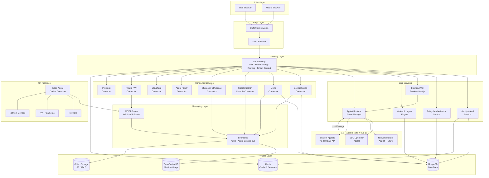
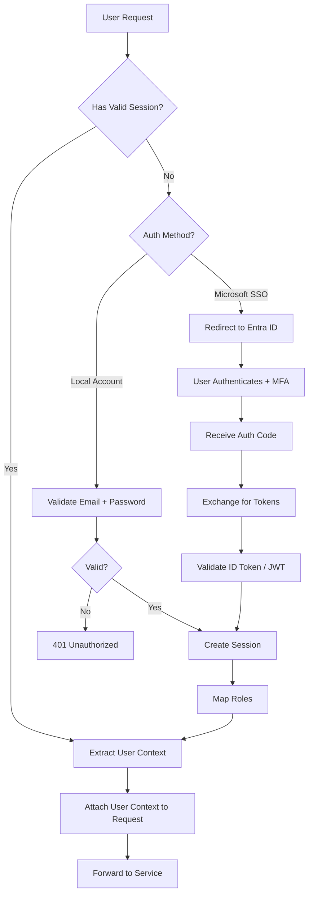
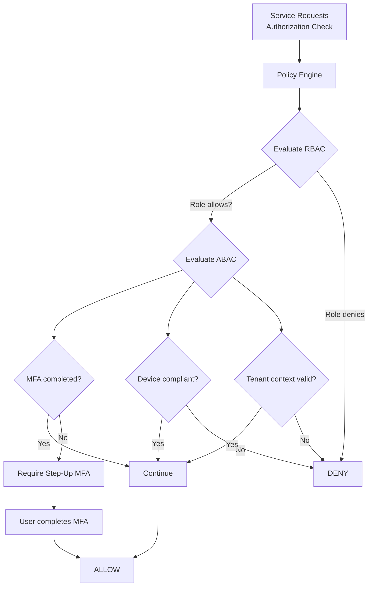
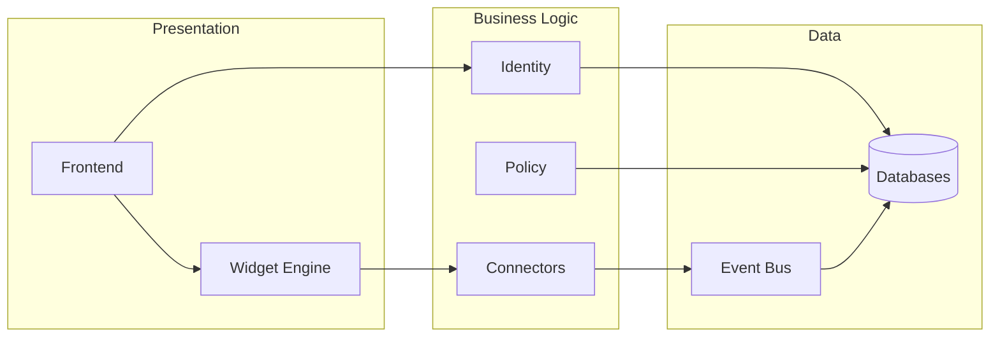
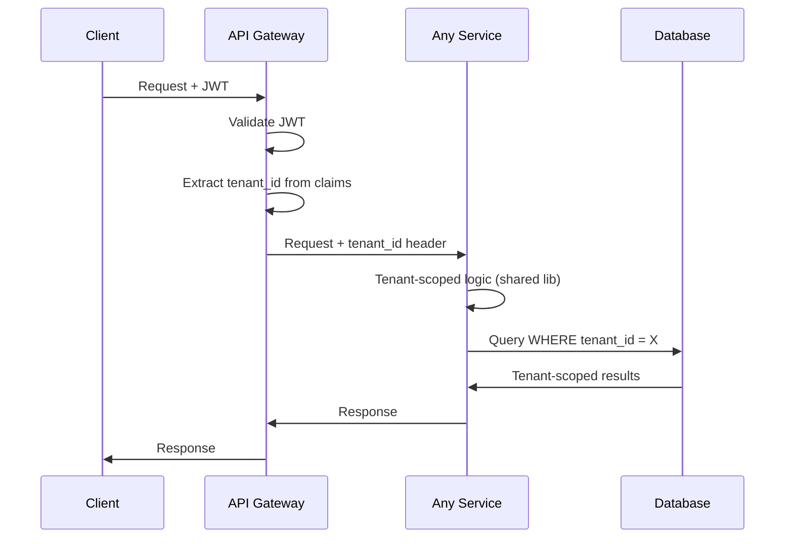
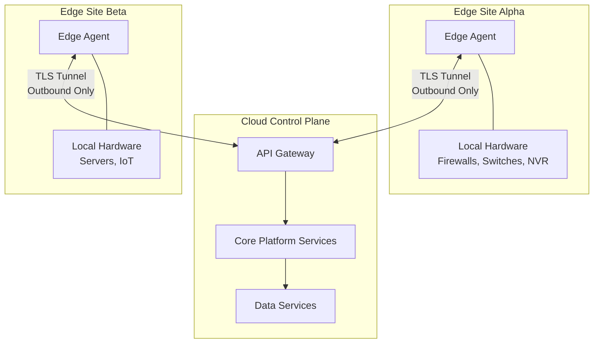
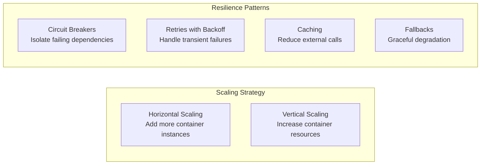
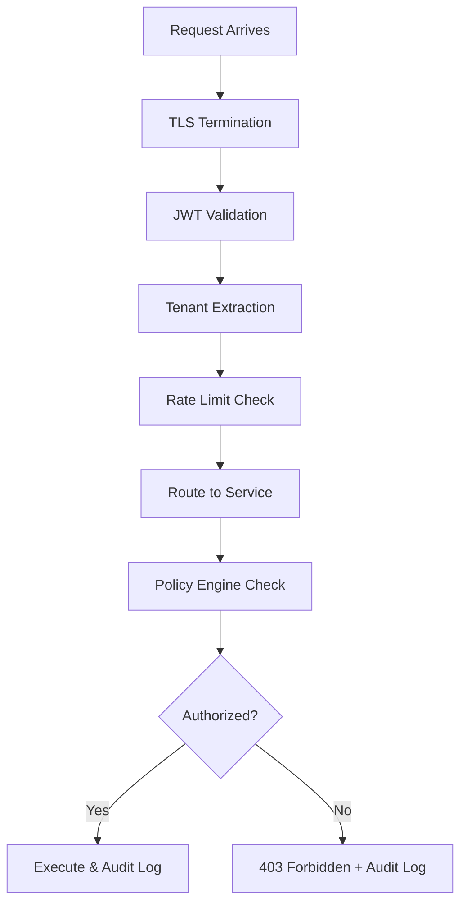
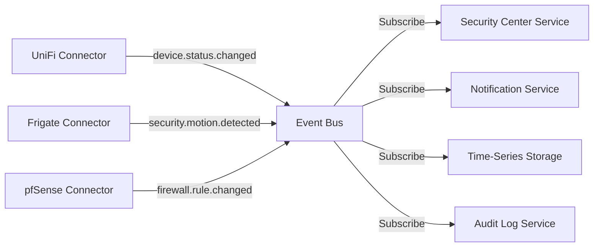
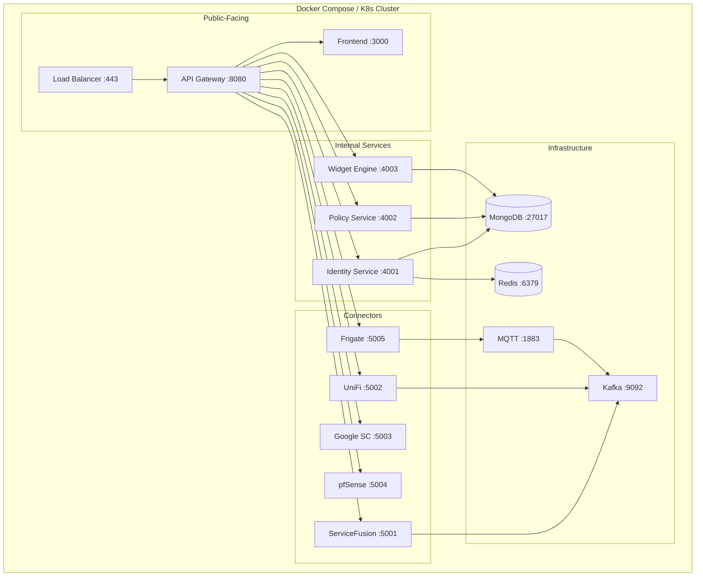

# 03 — Technical Architecture & Microservices Design

## Architecture Overview

HydroBOS is built on a **microservices architecture** where each service owns a distinct domain. Services are containerized with Docker, communicate through an API Gateway and event bus, and can be independently scaled and deployed.



---

## Service Decomposition

### Service Inventory

| Service | Domain | Responsibilities |
|---------|--------|-----------------|
| **API Gateway** | Ingress | Single entry point for all client/external requests; validates OIDC tokens; authorization enforcement; request routing; rate limiting; logging; tenant context extraction |
| **Identity & Auth Service** | Identity | Local account auth (bcrypt); optional Entra ID integration via OIDC/OAuth 2.0; login flows; JWT processing; session management; user/group management; role mapping |
| **Policy / Authorization Service** | Security | Central policy engine; RBAC/ABAC evaluation; answers "Can user X do action Y on resource Z given context C?"; context-aware (MFA status, device posture) |
| **Frontend / UI Service** | Presentation | Serves Next.js application and static assets; main layout, navigation, widgets, user interactions; connects to backend via API Gateway |
| **Widget & Layout Engine** | UI Config | Dashboard and widget configuration management; stores/retrieves user-specific layouts; widget registry; future marketplace host |
| **Applet Runtime** | Extension | Manages applet lifecycle; iframe container; host ↔ applet postMessage bridge; auth token provisioning; theme sync; API request proxy for applets |
| **Connector Services** (per integration) | Integration | Each handles auth to an external service, polls/listens for data, normalizes to canonical model, may execute commands |
| **Data Services** | Storage | Core data storage and retrieval; MongoDB for config/users; time-series for metrics; manages data retention, partitioning, multi-tenant isolation |
| **Event & Messaging Bus** | Communication | Async inter-service communication; connectors publish events, services subscribe; decoupling and event-driven architecture |

---

### Service Detail Cards

#### API Gateway

```
┌─────────────────────────────────────────────┐
│  API GATEWAY                                │
│─────────────────────────────────────────────│
│  Responsibilities:                          │
│  • TLS termination                          │
│  • JWT / OIDC token validation              │
│  • Tenant context extraction (from JWT)     │
│  • Request routing to internal services     │
│  • Rate limiting & throttling               │
│  • Request/response logging                 │
│  • CORS handling                            │
│                                             │
│  Inputs:  HTTPS requests from clients       │
│  Outputs: Routed requests to microservices  │
│  Tech:    Kong / Traefik / Custom (Node.js) │
└─────────────────────────────────────────────┘
```

#### Identity & Auth Service



#### Policy / Authorization Service



---

## Key Architectural Principles

### 1. Separation of Concerns

Each service has a **narrow, well-defined role**. Connectors and UI components can evolve independently without breaking the core. Services are loosely coupled via the event bus and API Gateway.



### 2. Multi-Tenancy

Tenant context is determined at **request ingress** (extracted from the JWT token) and passed through the entire system, ensuring data isolation.



**Tenant Isolation Layers:**

| Layer | Isolation Mechanism |
|-------|-------------------|
| **Network** | Tenant-specific request headers; service mesh policies |
| **Application** | Shared libraries enforce tenant scoping on every DB query |
| **Data** | Per-tenant database or schema-based partitioning |
| **Secrets** | Per-tenant encryption keys and credentials |

### 3. Hybrid Deployment



Edge agents:
- Lightweight Docker containers deployed on-premises
- Initiate **outbound-only** connections to the cloud (no inbound firewall rules needed)
- Interface with local resources (firewalls, NVRs, IoT, legacy servers)
- Cache data locally for resilience during connectivity loss
- Feed data back to the cloud control plane

### 4. Scalability & Resilience



- Services run in Docker containers → horizontal scaling via orchestration
- Circuit breaker pattern isolates failures in external APIs
- Caching (Redis) reduces load on external services and databases
- Event-driven architecture absorbs traffic spikes via message queuing
- Health checks and auto-restart on container failure

### 5. Security by Design



- **Transport**: All communications over HTTPS/TLS
- **Authentication**: Centrally enforced at the API Gateway
- **Authorization**: Policy Engine evaluates every action
- **Secrets**: Managed via Azure Key Vault / AWS Secrets Manager
- **Audit**: Every action logged for compliance
- **Isolation**: Services don't share credentials; minimal privileges

---

## Communication Patterns

### Synchronous (REST via API Gateway)

Used for: User-facing requests, CRUD operations, real-time queries

```
Client → API Gateway → Service → Database → Response
```

### Asynchronous (Event Bus)

Used for: Data ingestion, cross-service notifications, background processing



### MQTT (IoT & Physical Security)

Used for: Real-time events from NVR cameras, IoT sensors, physical access systems

```
Frigate NVR → MQTT Broker → Frigate Connector → Event Bus → Subscribers
```

---

## Container & Deployment Topology



---

## Technology Decisions

| Decision | Choice | Rationale |
|----------|--------|-----------|
| **Frontend Framework** | Next.js + React + TypeScript | SSR for SEO/performance, React ecosystem, type safety |
| **Applet Framework** | Vite + Vue 3 + TypeScript | Fast HMR, lightweight builds, ideal for iframe-embedded micro-apps |
| **Backend Language** | Node.js + TypeScript | Stack synergy with frontend, async I/O for connectors, broad ecosystem |
| **Service Framework** | NestJS | Modular architecture, built-in DI, TypeScript-native, decorator-based |
| **API Gateway** | Kong or custom (Express) | Mature plugin ecosystem; fallback to custom for full control |
| **Primary Database** | MongoDB | Flexible schema for MVP; document model fits config and connector data |
| **Cache** | Redis | Session storage, API response caching, rate limiting counters |
| **Event Bus** | Kafka (or Azure Service Bus) | Durable, ordered, scalable messaging; replay capability |
| **MQTT Broker** | Mosquitto | Lightweight, perfect for NVR/IoT event ingestion |
| **Containers** | Docker + Docker Compose → Kubernetes | Start simple, scale to K8s when needed |
| **CI/CD** | GitHub Actions / Azure DevOps | Automated build, test, scan, and deploy pipelines |
| **Secret Management** | Azure Key Vault / AWS Secrets Manager | Centralized, audited secret storage |
| **Monitoring** | Azure Monitor / Prometheus + Grafana | Metrics, alerting, and dashboarding for platform health |
