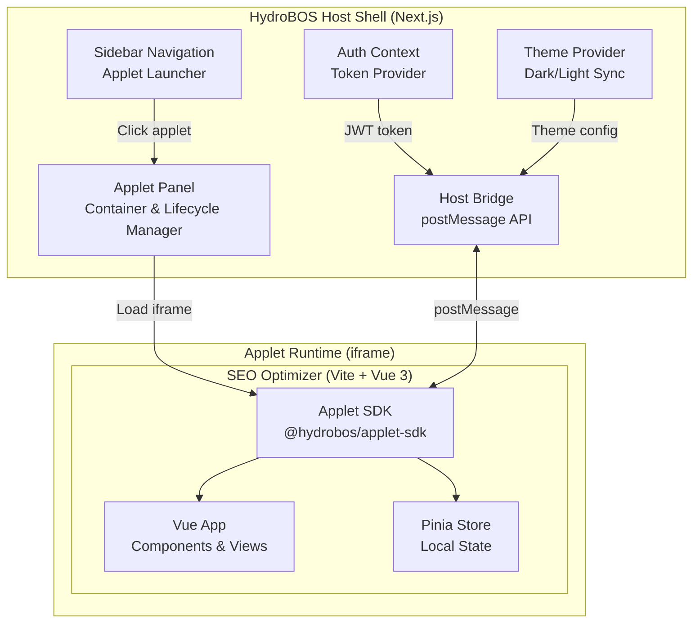
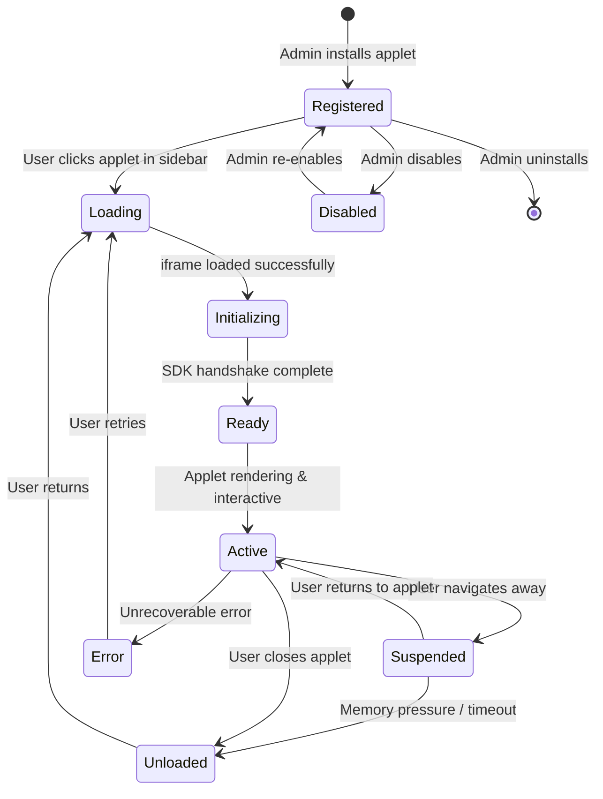
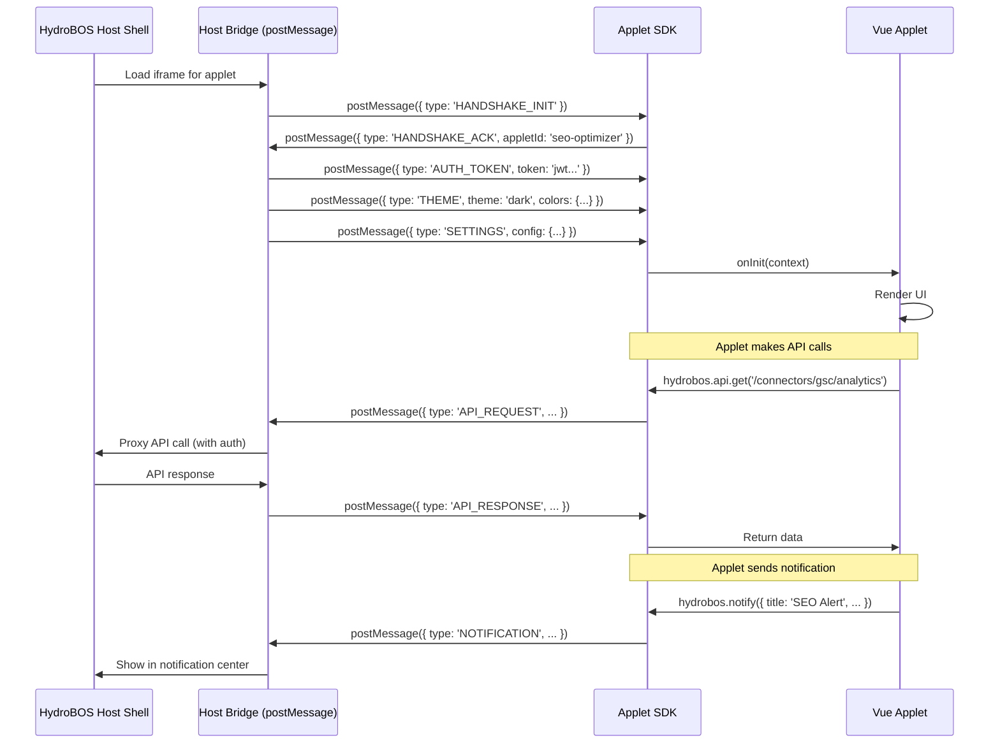
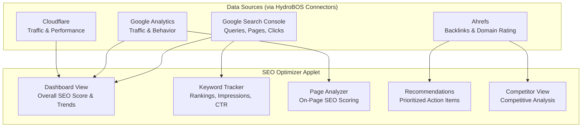
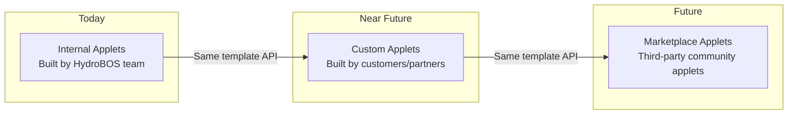
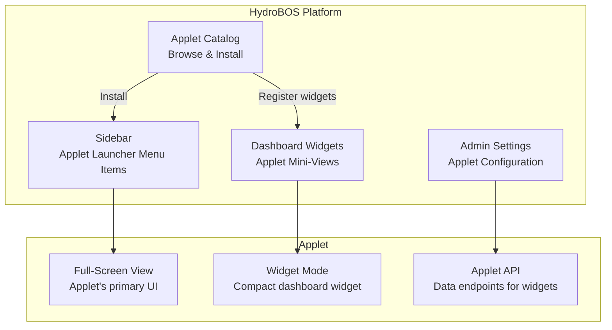
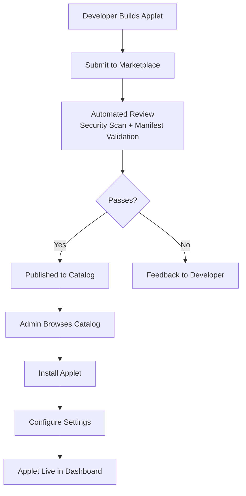

# 04 — Applet System Architecture

## Overview

HydroBOS uses an **applet model** to extend the dashboard with self-contained micro-applications. Applets are independently built and deployed apps (typically **Vite + Vue 3**) that run inside the HydroBOS shell via iframes, communicating with the host through a standardized API.

This architecture enables:
- Teams to build domain-specific tools without touching the core platform
- Custom applets for internal use and future third-party/marketplace distribution
- Technology flexibility — applets can use any framework (Vue, React, Svelte, vanilla JS)
- Strong isolation — applets run in sandboxed iframes with controlled permissions



---

## Applet Manifest

Every applet declares itself via an `applet.manifest.json` file. The host shell reads this manifest to register, display, and configure the applet.

```json
{
  "id": "seo-optimizer",
  "name": "SEO Optimizer",
  "version": "1.0.0",
  "description": "Keyword analysis, page scoring, and SEO recommendations powered by Google Search Console data.",
  "author": "HydroBOS Internal",
  "icon": "search-check",
  "category": "analytics",
  "entryPoint": "/applets/seo-optimizer/index.html",
  "permissions": [
    "auth:read",
    "theme:read",
    "connector:google-search-console",
    "notifications:write"
  ],
  "settings": [
    {
      "key": "defaultDomain",
      "label": "Default Domain",
      "type": "string",
      "required": true
    },
    {
      "key": "refreshInterval",
      "label": "Data Refresh Interval (minutes)",
      "type": "number",
      "default": 30
    }
  ],
  "minHostVersion": "1.0.0",
  "size": {
    "defaultWidth": "full",
    "minWidth": 600,
    "defaultHeight": "full"
  }
}
```

### Manifest Fields

| Field | Type | Description |
|-------|------|-------------|
| `id` | string | Unique applet identifier (kebab-case) |
| `name` | string | Display name shown in sidebar and settings |
| `version` | semver | Applet version for compatibility checks |
| `description` | string | Short description for applet catalog |
| `author` | string | Creator or team name |
| `icon` | string | Lucide icon name for sidebar display |
| `category` | enum | `analytics`, `operations`, `security`, `integration`, `utility` |
| `entryPoint` | string | Path to the applet's `index.html` (relative to applet root) |
| `permissions` | string[] | Required host permissions (auth, theme, connectors, etc.) |
| `settings` | object[] | Admin-configurable settings exposed in the applet settings page |
| `minHostVersion` | semver | Minimum HydroBOS version required |
| `size` | object | Default and minimum dimensions for the applet panel |

---

## Applet Lifecycle



### Lifecycle Hooks

| Hook | When Fired | Use Case |
|------|-----------|----------|
| `onInit` | SDK handshake complete, auth token received | Initialize stores, fetch initial data |
| `onActivate` | Applet becomes visible (first load or resume) | Start timers, refresh stale data |
| `onSuspend` | User navigates away from applet | Pause timers, save draft state |
| `onThemeChange` | Host theme toggled (dark ↔ light) | Update CSS variables, re-render charts |
| `onSettingsChange` | Admin updates applet settings | Reload config, adjust behavior |
| `onDestroy` | Applet being fully unloaded | Cleanup subscriptions, save state |

---

## Host ↔ Applet Communication (postMessage API)

All communication between the host shell and applets uses the browser's `postMessage` API with a structured message protocol.



### Message Types

| Type | Direction | Payload | Purpose |
|------|-----------|---------|---------|
| `HANDSHAKE_INIT` | Host → Applet | `{ hostVersion }` | Initiate SDK handshake |
| `HANDSHAKE_ACK` | Applet → Host | `{ appletId, sdkVersion }` | Confirm applet identity |
| `AUTH_TOKEN` | Host → Applet | `{ token, expiresAt, user }` | Provide JWT for API calls |
| `AUTH_TOKEN_REFRESH` | Host → Applet | `{ token, expiresAt }` | Updated token before expiry |
| `THEME` | Host → Applet | `{ mode, colors, fontFamily }` | Theme configuration |
| `SETTINGS` | Host → Applet | `{ config: {...} }` | Admin-defined settings values |
| `API_REQUEST` | Applet → Host | `{ id, method, path, body }` | Proxied API call through host |
| `API_RESPONSE` | Host → Applet | `{ id, status, data }` | API response back to applet |
| `NOTIFICATION` | Applet → Host | `{ title, body, severity }` | Show notification in host UI |
| `NAVIGATE` | Applet → Host | `{ path }` | Request host-level navigation |
| `RESIZE` | Applet → Host | `{ width, height }` | Request panel resize |
| `ERROR` | Either | `{ code, message }` | Report error to other side |

### Security Constraints

| Constraint | Implementation |
|-----------|----------------|
| **iframe sandbox** | `sandbox="allow-scripts allow-same-origin allow-forms allow-popups"` |
| **Origin validation** | All `postMessage` handlers verify `event.origin` matches expected host/applet origin |
| **Permission gating** | API requests checked against applet's declared `permissions` in manifest |
| **Token scoping** | Auth tokens passed to applets are scoped to allowed connectors/APIs only |
| **CSP headers** | Strict Content Security Policy prevents applet from loading unauthorized resources |
| **Rate limiting** | API requests from applets are rate-limited per-applet and per-tenant |

---

## Applet SDK (`@hydrobos/applet-sdk`)

A lightweight NPM package that abstracts the `postMessage` protocol and provides a friendly API for applet developers.

### Installation

```bash
pnpm add @hydrobos/applet-sdk
```

### Usage (Vue 3 Example)

```typescript
// main.ts — Applet entry point
import { createApp } from 'vue'
import { createPinia } from 'pinia'
import { HydroBOS } from '@hydrobos/applet-sdk'
import App from './App.vue'

const hydrobos = new HydroBOS({
  appletId: 'seo-optimizer',
  version: '1.0.0',
})

// Wait for host handshake before mounting
hydrobos.onInit(async (context) => {
  const app = createApp(App)
  app.use(createPinia())
  
  // Provide SDK instance to all components
  app.provide('hydrobos', hydrobos)
  
  app.mount('#app')
})

// Handle lifecycle events
hydrobos.onThemeChange((theme) => {
  document.documentElement.setAttribute('data-theme', theme.mode)
})

hydrobos.onSuspend(() => {
  // Pause data polling
})

hydrobos.onActivate(() => {
  // Resume data polling
})
```

### SDK API Reference

```typescript
class HydroBOS {
  // Lifecycle
  onInit(callback: (context: AppletContext) => void): void
  onActivate(callback: () => void): void
  onSuspend(callback: () => void): void
  onDestroy(callback: () => void): void
  onThemeChange(callback: (theme: ThemeConfig) => void): void
  onSettingsChange(callback: (settings: Record<string, any>) => void): void

  // API Access (proxied through host)
  api: {
    get<T>(path: string, params?: object): Promise<T>
    post<T>(path: string, body?: object): Promise<T>
    put<T>(path: string, body?: object): Promise<T>
    delete<T>(path: string): Promise<T>
  }

  // Host Interactions
  notify(options: NotificationOptions): void
  navigate(path: string): void
  resize(dimensions: { width?: number; height?: number }): void

  // Context
  getUser(): AppletUser
  getTheme(): ThemeConfig
  getSettings(): Record<string, any>
  getToken(): string
}

interface AppletContext {
  user: AppletUser
  theme: ThemeConfig
  settings: Record<string, any>
  hostVersion: string
}

interface AppletUser {
  id: string
  email: string
  name: string
  roles: string[]
  tenantId: string
}

interface ThemeConfig {
  mode: 'light' | 'dark'
  colors: {
    primary: string
    secondary: string
    background: string
    surface: string
    text: string
    border: string
  }
  fontFamily: string
}
```

---

## First Applet: SEO Optimizer

The **SEO Optimizer** is the first applet built for HydroBOS, serving as both a useful internal tool and the reference implementation for the applet framework.

### What It Does



### Technical Stack

| Layer | Technology |
|-------|-----------|
| **Build Tool** | Vite 5+ |
| **Framework** | Vue 3 (Composition API) |
| **Language** | TypeScript |
| **State** | Pinia |
| **Charts** | Chart.js / ECharts |
| **Styling** | UnoCSS or Tailwind CSS |
| **Testing** | Vitest + Vue Test Utils |
| **SDK** | `@hydrobos/applet-sdk` |

### Applet Views

| View | Description |
|------|-------------|
| **Dashboard** | Overall SEO health score, trend sparklines, key metrics summary |
| **Keywords** | Table of tracked keywords with rank, impressions, clicks, CTR, position change |
| **Pages** | Per-page SEO score with checklist (title, meta, headings, images, speed) |
| **Recommendations** | Prioritized list of SEO improvements with estimated impact |
| **Settings** | Default domain, tracked keywords, competitor domains, refresh interval |

### Project Structure

```
applets/seo-optimizer/
├── applet.manifest.json          # Applet declaration
├── index.html                    # Entry HTML
├── vite.config.ts                # Vite build config
├── package.json
├── tsconfig.json
├── src/
│   ├── main.ts                   # App bootstrap + SDK init
│   ├── App.vue                   # Root component
│   ├── views/
│   │   ├── DashboardView.vue     # SEO health overview
│   │   ├── KeywordsView.vue      # Keyword tracking table
│   │   ├── PagesView.vue         # Per-page analysis
│   │   ├── RecommendationsView.vue
│   │   └── SettingsView.vue
│   ├── components/
│   │   ├── SeoScoreGauge.vue     # Circular score indicator
│   │   ├── KeywordTable.vue      # Sortable keyword table
│   │   ├── TrendSparkline.vue    # Mini trend chart
│   │   ├── PageScoreCard.vue     # Page analysis card
│   │   └── ActionItem.vue        # Recommendation card
│   ├── composables/
│   │   ├── useHydroBOS.ts        # SDK wrapper composable
│   │   ├── useSeoData.ts         # Data fetching logic
│   │   └── useKeywords.ts        # Keyword tracking logic
│   ├── stores/
│   │   ├── seo.store.ts          # Main SEO data store
│   │   └── settings.store.ts     # Applet settings store
│   ├── types/
│   │   └── seo.types.ts          # TypeScript interfaces
│   └── styles/
│       └── theme.css             # Theme variables (synced from host)
└── dist/                         # Built output → served by HydroBOS
```

---

## Applet Template (Starter Kit)

To make building new applets fast, HydroBOS provides a starter template:

```bash
# Create a new applet from the template
pnpm create hydrobos-applet my-custom-applet
```

This scaffolds:

```
applets/my-custom-applet/
├── applet.manifest.json
├── index.html
├── vite.config.ts
├── package.json
├── src/
│   ├── main.ts                   # SDK bootstrap (ready to go)
│   ├── App.vue                   # Starter root component
│   ├── views/
│   │   └── HomeView.vue          # Placeholder view
│   ├── composables/
│   │   └── useHydroBOS.ts        # SDK composable (pre-wired)
│   └── styles/
│       └── theme.css             # Host theme variables
└── README.md                     # How to develop this applet
```

### Template API Design Principles

The applet template API is designed with **future integrations** in mind:



| Principle | Description |
|-----------|-------------|
| **Stable contract** | The `postMessage` protocol and SDK API are versioned; breaking changes require major version bump |
| **Permission model** | Applets declare required permissions upfront; host enforces them at runtime |
| **Framework agnostic** | Template uses Vue 3, but any framework works — the SDK is plain TypeScript |
| **Offline-capable** | Applets can cache data locally and function during connectivity disruptions |
| **Theming via CSS variables** | Applets receive theme via CSS custom properties, ensuring visual consistency |
| **No direct DB access** | All data flows through the host's API proxy — applets never touch databases directly |
| **Sandboxed execution** | iframe sandbox prevents applets from accessing host DOM, cookies, or storage |

---

## Applet Integration Points



### Integration Modes

| Mode | Context | Size | Description |
|------|---------|------|-------------|
| **Full Panel** | Sidebar navigation click | Full content area | Applet's primary experience; full iframe |
| **Dashboard Widget** | Embedded in widget grid | Configurable widget size | Compact view showing key metrics; click to open full panel |
| **Background** | No UI | N/A | Applet runs in background for data processing or sync tasks |

---

## Future Considerations

### Applet Marketplace (V2+)



### Planned Applet Ideas

| Applet | Category | Description |
|--------|----------|-------------|
| **SEO Optimizer** | Analytics | Keyword tracking, page scoring, recommendations (Phase 6) |
| **Network Monitor** | Infrastructure | UniFi device status, bandwidth graphs, client list |
| **Incident Tracker** | Operations | Ticket management, SLA tracking, escalation workflows |
| **Invoice Dashboard** | Business | ServiceFusion invoice tracking, revenue analytics |
| **Camera Grid** | Security | Frigate NVR camera feeds and motion event timeline |
| **Password Vault** | Security | Team secret storage with RBAC and audit trail |
| **Report Builder** | Analytics | Custom report designer with scheduled delivery |
| **Workflow Automator** | Operations | Visual workflow builder for business process automation |
