# 04 — Integration Strategy

## Philosophy

Connections to external systems are vital to HydroBOS's value proposition. The platform serves as an **integration hub** — bringing disparate systems into a single view through a modular **connector framework**.

Every connector:
1. **Authenticates** with the external service (OAuth, API key, certificate, etc.)
2. **Fetches or receives** data (polling, webhook, or event stream)
3. **Normalizes** data into the platform's **canonical data model**
4. **May execute commands** back to the external service (write operations)

---

## Canonical Data Model

The canonical data model is the **lingua franca** of HydroBOS. All connectors translate external data into these standardized entities, allowing dashboards, widgets, reports, and alerts to consume data uniformly regardless of source.

---

## Connector Inventory

### 1. Microsoft Entra ID (Azure AD)

| Attribute | Detail |
|-----------|--------|
| **Purpose** | SSO authentication; user and group directory |
| **Auth Method** | OIDC / OAuth 2.0 |
| **Data Consumed** | User profiles, group memberships, sign-in events, risk detections |
| **APIs Used** | OIDC endpoints, Microsoft Graph API (`/users`, `/groups`, `/auditLogs`) |
| **Write Operations** | User provisioning/deprovisioning (optional), group assignment |
| **Data Frequency** | Real-time (auth flow) + periodic sync (user/group directory) |
| **Canonical Mapping** | User, Alert (risky sign-ins) |

```mermaid
sequenceDiagram
    participant App as HydroBOS
    participant Entra as Entra ID
    participant Graph as MS Graph API

    Note over App,Entra: Authentication Flow
    App->>Entra: OIDC /authorize redirect
    Entra->>App: Authorization code
    App->>Entra: Exchange code → ID token + Access token
    
    Note over App,Graph: Data Sync
    App->>Graph: GET /users?$select=id,displayName,mail
    Graph->>App: User list
    App->>Graph: GET /groups
    Graph->>App: Group list with members
    App->>Graph: GET /auditLogs/signIns
    Graph->>App: Sign-in events
```

---

### 2. Microsoft 365 Services (Exchange, Teams, SharePoint)

| Attribute | Detail |
|-----------|--------|
| **Purpose** | Enrich modules with communication and document context |
| **Auth Method** | OAuth 2.0 (via Entra ID token) |
| **Data Consumed** | Emails, chat messages, calendar events, document metadata |
| **APIs Used** | Microsoft Graph REST API (`/me/messages`, `/teams`, `/sites`) |
| **Write Operations** | Send notifications via Teams, create calendar events |
| **Use Cases** | Show related communications on an incident page; surface calendar conflicts in ops planning |
| **Canonical Mapping** | Metric (activity counts), Alert (important notifications) |

---

### 3. Google Marketing Platform

| Attribute | Detail |
|-----------|--------|
| **Purpose** | SEO performance, ad metrics, website analytics |
| **Auth Method** | OAuth 2.0 service account or delegated user token |
| **Sub-Services** | |

#### Google Search Console
| Item | Detail |
|------|--------|
| **API** | Search Console API v1 |
| **Data** | Search queries, impressions, clicks, CTR, position by page/query |
| **Canonical Mapping** | Metric (SEO performance metrics) |

#### Google Ads
| Item | Detail |
|------|--------|
| **API** | Google Ads API v15+ |
| **Data** | Campaign spend, impressions, conversions, ROAS |
| **Canonical Mapping** | Metric (ad performance), Job (campaign as entity) |

#### Google Analytics
| Item | Detail |
|------|--------|
| **API** | Analytics Data API (GA4) |
| **Data** | Sessions, pageviews, user acquisition, conversions |
| **Canonical Mapping** | Metric (web analytics) |

---

### 4. Ahrefs

| Attribute | Detail |
|-----------|--------|
| **Purpose** | SEO backlink and keyword analytics |
| **Auth Method** | API key / Bearer token |
| **API** | Ahrefs API v3 |
| **Data Consumed** | Backlink profiles, domain ratings, keyword rankings, referring domains, organic traffic estimates |
| **Data Frequency** | Daily sync |
| **Canonical Mapping** | Metric (SEO metrics) |

---

### 5. ServiceFusion (CRM / Field Service)

| Attribute | Detail |
|-----------|--------|
| **Purpose** | Customer, job, estimate, and invoice data for operations |
| **Auth Method** | API key / OAuth |
| **API** | ServiceFusion REST API |
| **Data Consumed** | Customers, jobs, estimates, invoices, technician schedules |
| **Write Operations** | Create/update jobs, generate invoices, update customer records |
| **Data Frequency** | Real-time webhook + periodic full sync |
| **Canonical Mapping** | Job, User (customer), Metric (revenue, job counts) |

---

### 6. pfSense / OPNsense

| Attribute | Detail |
|-----------|--------|
| **Purpose** | Network firewall/router status and configuration |
| **Auth Method** | API key + secret (pfSense REST pkg); API key/secret (OPNsense) |
| **APIs** | pfSense REST/GraphQL API package; OPNsense official API |
| **Data Consumed** | System status, interface stats, firewall rules, DHCP leases, VPN status, logs |
| **Write Operations** | Apply firewall rule changes, toggle interfaces, restart services |
| **Deployment** | Via **on-prem edge agent** for secure connectivity |
| **Data Frequency** | Real-time polling (30s–60s intervals) |
| **Canonical Mapping** | Device (firewall), Alert (blocked connections, rule violations), Metric (throughput, CPU) |

---

### 7. Ubiquiti UniFi

| Attribute | Detail |
|-----------|--------|
| **Purpose** | Wi-Fi and network infrastructure monitoring |
| **Auth Method** | UniFi Site Manager API token |
| **API** | UniFi Site Manager API |
| **Data Consumed** | Access point status, switch status, connected clients, network usage, firmware versions |
| **Write Operations** | Reconnect client, block device, update SSID settings |
| **Data Frequency** | Real-time polling (10s–30s for client counts; 5min for full sync) |
| **Canonical Mapping** | Device (AP, switch), User (connected client), Metric (bandwidth, client count) |

---

### 8. Cloud Platforms (Azure, GCP)

| Attribute | Detail |
|-----------|--------|
| **Purpose** | Monitor and manage cloud resources |
| **Auth Method** | Service principal (Azure); service account (GCP) |
| **APIs** | Azure Resource Manager API, Azure Monitor; GCP Compute/Cloud APIs |
| **Data Consumed** | VM status, storage utilization, network configs, cost data, monitoring alerts |
| **Write Operations** | Start/stop/restart VMs (with approval workflow) |
| **Data Frequency** | 5-minute polling for status; daily for cost data |
| **Canonical Mapping** | Device (VM, storage account), Metric (CPU, memory, cost), Alert (monitoring alerts) |

---

### 9. Cloudflare

| Attribute | Detail |
|-----------|--------|
| **Purpose** | DNS, CDN, and web security management |
| **Auth Method** | API token |
| **API** | Cloudflare API v4 |
| **Data Consumed** | DNS records, firewall events, analytics (requests, bandwidth, threats), WAF events |
| **Write Operations** | Update DNS records, purge cache, toggle security rules |
| **Canonical Mapping** | Device (zone), Metric (traffic, threats blocked), Alert (WAF events) |

---

### 10. Proxmox

| Attribute | Detail |
|-----------|--------|
| **Purpose** | Virtualization infrastructure management |
| **Auth Method** | API token |
| **API** | Proxmox VE REST API |
| **Data Consumed** | Node status, VM/container status, storage, resource utilization |
| **Write Operations** | Start/stop VMs, create snapshots (with approval) |
| **Deployment** | Via on-prem edge agent |
| **Canonical Mapping** | Device (node, VM), Metric (CPU, memory, disk) |

---

### 11. Frigate NVR

| Attribute | Detail |
|-----------|--------|
| **Purpose** | Physical security camera monitoring and event detection |
| **Auth Method** | MQTT credentials; Frigate API (local) |
| **Protocol** | **MQTT** event feed (primary); REST API (secondary) |
| **Data Consumed** | Object detection events (person, vehicle, animal), camera status, recording clips |
| **Write Operations** | None (read-only surveillance data) |
| **Deployment** | Via on-prem edge agent connected to Frigate's MQTT broker |
| **Data Frequency** | Real-time event stream |
| **Canonical Mapping** | Alert (detection event), Device (camera) |

---

### 12. RADIUS (Physical Access / Network Auth)

| Attribute | Detail |
|-----------|--------|
| **Purpose** | Physical and network access control events |
| **Auth Method** | RADIUS shared secret; NPS integration |
| **Protocol** | RADIUS accounting / syslog |
| **Data Consumed** | Authentication events (door access, Wi-Fi auth), accept/reject logs |
| **Integration** | NPS Extension for Azure MFA — extend MFA to RADIUS-based systems |
| **Canonical Mapping** | Alert (access events), User (authenticated identity) |

---

## Connector Development Process

**Target:** < 2 weeks from request to production for a standard API connector.

---

## Integration Priority Matrix

| Priority | Connector | Phase | Rationale |
|----------|-----------|-------|-----------|
| 🔴 P0 | Microsoft Entra ID | Phase 1 | Core identity — required for everything |
| 🔴 P0 | ServiceFusion | Phase 2 | Primary business operations data |
| 🔴 P0 | UniFi | Phase 2 | Network visibility — key demo value |
| 🔴 P0 | Google Search Console | Phase 2 | SEO analytics — key demo value |
| 🟡 P1 | pfSense / OPNsense | Phase 3 | Network security management |
| 🟡 P1 | Frigate NVR | Phase 3 | Physical security — unique differentiator |
| 🟡 P1 | Cloudflare | Phase 3 | Web infrastructure management |
| 🟢 P2 | Azure / GCP | Phase 3 | Cloud resource management |
| 🟢 P2 | Proxmox | Phase 3 | Virtualization management |
| 🟢 P2 | Microsoft 365 | Phase 4 | Communication enrichment |
| 🟢 P2 | Ahrefs | Phase 4 | Advanced SEO analytics |
| 🟢 P2 | Google Ads / Analytics | Phase 4 | Marketing analytics expansion |
| ⚪ P3 | RADIUS | Phase 5 | Physical access control |
