```mermaid
flowchart TD
    A[IT Admin Opens Identity Module] --> B{Choose Action}
    B -->|View Users| C[User Directory]
    C --> D[Click User → Profile]
    D --> E[View Roles, Groups, Audit Trail]
    
    B -->|Manage Roles| F[Role Management]
    F --> G[Assign/Revoke Roles]
    G --> H[Audit Log Entry Created]
    
    B -->|Access Review| I[Review Dashboard]
    I --> J[Approve/Revoke Access]
    J --> H
    
    B -->|Pending Requests| K[Approval Queue]
    K --> L[Approve/Deny + Comment]
    L --> H
```

# 05 — Core Modules & Features

## Product Concept

HydroBOS is a **central business operating system for the company's internal workflows and data**. It provides an at-a-glance view of company health and operations, and allows performing both high-level and low-level tasks from one interface.

Key functional **modules** (or "micro-applications") span multiple domains. Each module appears as part of the unified web interface and follows consistent design and navigation principles.

The platform is **both inward-facing** (improving internal operations) and eventually **a product for external customers** who want a Business/IT operations platform with minimal setup.

---

## Module Map

```mermaid
graph TB
    subgraph "HydroBOS Platform"
        HOME[🏠 Home<br/>Company Health]
        IAM[🔐 Identity & Access]
        OPS[⚙️ Operations Hub]
        SEC[🛡️ Security Center]
        DOC[📚 Documentation<br/>& Knowledge]
        ANA[📊 Analytics / BI]
        NET[🌐 Network &<br/>Infrastructure]
        VID[📹 Video / NVR<br/>Surveillance]
        ADM[🔧 Admin Console]
    end

    HOME --- IAM
    HOME --- OPS
    HOME --- SEC
    HOME --- DOC
    HOME --- ANA
    HOME --- NET
    HOME --- VID
    ADM --- HOME
```



---

## Module Detail

### 🏠 Home — Company Health Dashboard

**Purpose:** Executive dashboard with high-level KPIs and health metrics across the entire business.

**Capabilities:**
- Real-time snapshot of organizational health
- Financial metrics and revenue indicators
- Operational efficiency scores
- Project status roll-ups
- Risk and security posture summary
- Active alerts and notifications
- Single source of truth for executives and managers

**Key Widgets:**
| Widget | Data Source | Description |
|--------|-----------|-------------|
| Revenue KPI | ServiceFusion / CRM | Monthly recurring revenue, pipeline value |
| System Health | All Connectors | Aggregate up/down status of all monitored systems |
| Security Score | Security Center | Composite score of identity protection, compliance |
| Active Incidents | Operations Hub | Open tickets, unresolved alerts |
| Network Status | UniFi / pfSense | Connectivity health, bandwidth utilization |
| Team Activity | Entra ID / Ops | Active users, recent actions, task completion |

**User Flow:**


---

### 🔐 Identity & Access

**Purpose:** Central hub for user and access management, integrated with Microsoft Entra ID.

**Capabilities:**
- **User Directory:** Browse and search all users, synced from Entra ID
- **Group & Role Management:** View and assign groups, map to in-app roles
- **Access Reviews:** Periodic reviews of who has access to what
- **Access Requests & Approvals:** Self-service request workflows for elevated access
- **Audit Logs:** Full trail of authentication events and permission changes
- **Least-Privilege Enforcement:** Role assignments follow minimum-necessary principles
- **Foundation of Zero Trust:** All access decisions flow through identity

**User Flow:**


---

### ⚙️ Operations Hub

**Purpose:** Workspace for operations and administration teams to manage day-to-day processes.

**Capabilities:**
- **User Lifecycle Management:** Automated onboarding/offboarding workflows
- **System Status Dashboards:** Real-time health of all monitored systems
- **IT Service Management Integration:** Create and track tickets/tasks
- **Workflow Automation:** Trigger multi-step processes (e.g., new employee onboarding provisions accounts, equipment, and permissions automatically)
- **Incident Management:** Pull alerts from monitoring tools; assign and track incident response

**Onboarding Workflow Example:**


---

### 🛡️ Security Center

**Purpose:** Dedicated section for security and compliance teams to monitor, investigate, and respond.

**Capabilities:**
- **Identity Protection Status:** MFA adoption rates, risky sign-ins, compromised accounts
- **Access Review Dashboards:** Visualize who has access to what, flag anomalies
- **Unified Audit Trail:** Searchable log of all security-relevant events
- **SIEM/SOAR Integration:** Ingest alerts from external security tools
- **Physical Security Events:** Door access logs, NVR camera alerts alongside cyber alerts
- **Zero Trust Visualization:** Identity and device trust scores
- **Policy Management:** Create, edit, and test authorization policies
- **Role-Based Views:** Security analysts see threats; compliance officers see audit reports

**Alert Processing Flow:**


---

### 📚 Documentation & Knowledge

**Purpose:** Internal knowledge base and runbook repository.

**Capabilities:**
- **Wiki-Like Interface:** Create and browse company documentation, SOPs, troubleshooting guides
- **Full-Text Search:** Find any document instantly
- **Integration with External Tools:** Unified search across Confluence, SharePoint, local docs
- **Collaborative Editing:** Multiple users can edit documents simultaneously
- **Stored Content Types:**
  - Network diagrams and IT architecture docs
  - Standard Operating Procedures (SOPs)
  - Compliance manuals and security runbooks
  - Project documentation and meeting notes
- **Search Assistant / Chatbot:** AI-powered help to find information quickly

---

### 📊 Analytics / BI Dashboards

**Purpose:** Aggregate data from various sources into interactive charts and reports.

**Capabilities:**
- **Marketing Analytics:** SEO metrics from Google Search Console, Ahrefs; campaign data from Google Ads
- **Sales Dashboards:** CRM pipeline, revenue tracking, customer metrics
- **Operations Analytics:** Project delivery timelines, resource utilization
- **Custom Reports:** Drag-and-drop report builder with export options
- **Data Lake Integration:** Supports growth into advanced analytics and ML-driven insights

**Data Flow:**


---

### 🌐 Network & Infrastructure

**Purpose:** Centralized view and control of network and IT infrastructure.

**Capabilities:**
- **Firewall Management:** Integrate with pfSense / OPNsense; view rules, logs, status; push configuration changes
- **Wi-Fi & Network Monitoring:** UniFi controller integration; access point status, connected clients, bandwidth
- **Cloud Infrastructure:** Azure and GCP resource status, VM health, storage and cost tracking
- **Real-Time Status:** Live network topology with device health indicators
- **Configuration Management:** Safe push of configuration changes with approval workflows
- **Hybrid View:** Combines cloud and on-prem infrastructure into one dashboard

**Network Monitoring View:**
```mermaid
graph TB
    subgraph "Network Overview"
        INT[Internet]
        FW[pfSense Firewall<br/>🟢 UP | 12ms latency]
        SW1[Core Switch<br/>🟢 UP | 48 ports]
        AP1[UniFi AP 1<br/>🟢 35 clients]
        AP2[UniFi AP 2<br/>🟡 47 clients]
        AP3[UniFi AP 3<br/>🟢 22 clients]
        SRV[Server Rack<br/>🟢 4/4 online]
        CAM[Camera VLAN<br/>🟢 8 cameras]
    end

    INT --> FW
    FW --> SW1
    SW1 --> AP1
    SW1 --> AP2
    SW1 --> AP3
    SW1 --> SRV
    SW1 --> CAM
```

---

### 📹 Video / NVR Surveillance

**Purpose:** Integrate physical security camera systems into the unified dashboard.

**Capabilities:**
- **Live Camera Feeds:** Display video feeds from Frigate NVR
- **Motion & Object Detection Alerts:** Real-time alerts on detected events
- **MQTT Event Ingestion:** Consume Frigate's MQTT event feed for immediate notification
- **Security Event Correlation:** Link physical events to identity context
  - Example: Detected face → employee profile lookup
  - Example: Unrecognized person after hours → automatic alert escalation
- **Incident Logging:** Record and timestamp physical security events for compliance
- **Cross-Domain Zero Trust:** Connect physical and digital security under one policy framework

**NVR Event Processing:**


---

### 🔧 Admin Console

**Purpose:** Supervisory tools for system administrators, especially in a multi-tenant SaaS context.

**Capabilities:**
- **Tenant Management:** Add/remove client organizations, manage subscriptions, verify isolation
- **System Configuration:** Global settings, feature flags, connector configuration
- **Platform Health Monitoring:** Service status, container metrics, error rates, latency
- **Debug Tools:** Log viewer, request tracer, service dependency map
- **Subscription & Billing:** Manage tenant plans and usage limits (SaaS mode)

---

## Cross-Module Interaction Patterns

All modules share three consistent interaction patterns:

```mermaid
graph LR
    S["🔍 SEARCH<br/>Find users, devices, tickets,<br/>documents, metrics — anything"]
    A["⚡ ACTION<br/>Approve, close, edit, provision,<br/>configure, escalate"]
    I["📈 INSIGHT<br/>View dashboards, analytics,<br/>audit trails, trend reports"]

    S --> A
    A --> I
    I --> S
```



**Example Cross-Module Journey:**


---

## Target Users / Personas

| Persona | Primary Modules | Key Needs |
|---------|----------------|-----------|
| **C-Suite & Executives** | Home Dashboard | High-level KPIs, risk posture, financial/operational metrics, drill-down capability |
| **IT Administrators** | Operations Hub, Network & Infrastructure | Full infrastructure visibility, device management, user provisioning, incident response |
| **Security & Compliance Teams** | Security Center, Identity & Access | Identity protection, security alerts, access reviews, policy management, physical security |
| **Department Managers & Business Teams** | Analytics/BI, Documentation | Business metrics (sales, marketing, ops), SOPs, runbooks, project docs |
| **System Administrators** (SaaS) | Admin Console | Tenant management, system config, platform health, troubleshooting |

Role-based access ensures each persona only sees what is relevant to them — enhancing security and minimizing noise.
