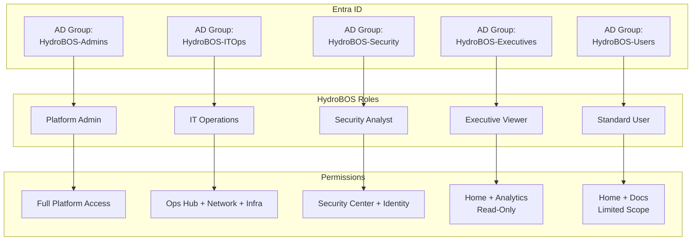
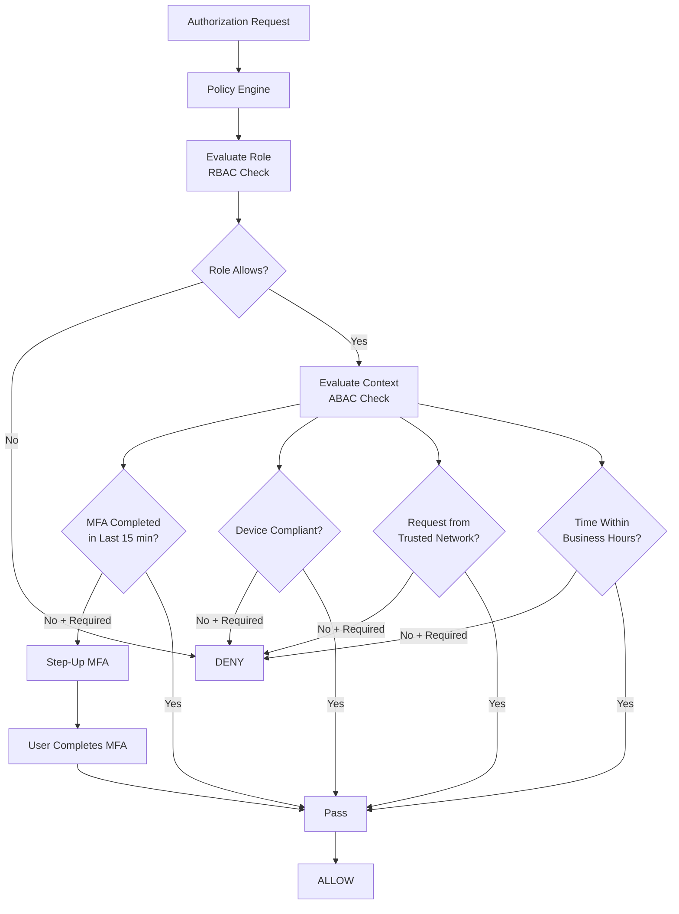
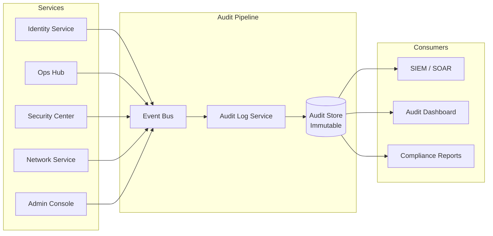
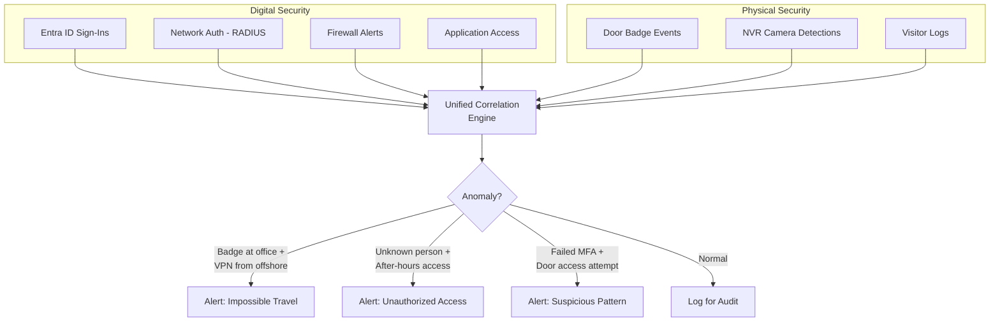
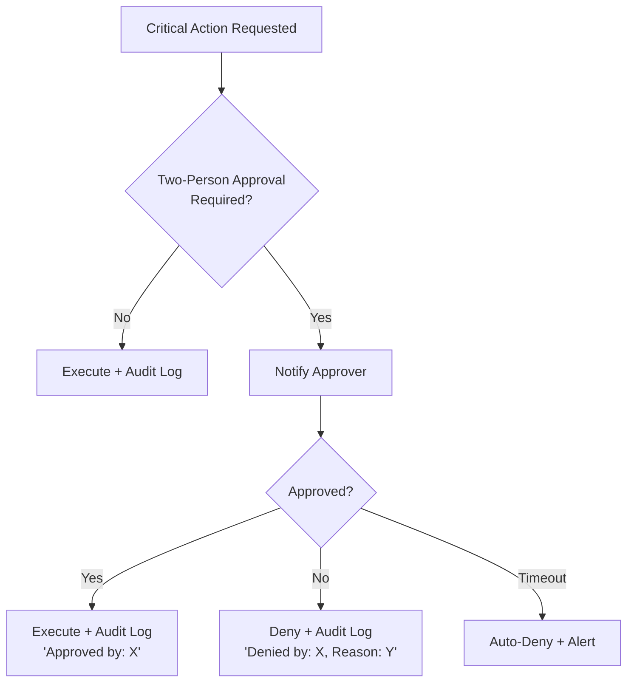

# 05 — Security Model

## Zero Trust Alignment

HydroBOS is designed around **Zero Trust Architecture** (ZTA) principles. No user, device, or network is inherently trusted. Every request is verified against identity, permissions, and context.

```mermaid
graph TB
    subgraph "Zero Trust Pillars in HydroBOS"
        ID["🔐 IDENTITY<br/>Who is making the request?<br/>• Entra ID SSO<br/>• MFA enforcement<br/>• Session validation"]
        DEV["💻 DEVICE<br/>Is the device trusted?<br/>• Conditional access<br/>• Compliance status<br/>• Device posture checks"]
        ACC["🎯 ACCESS<br/>What are they allowed to do?<br/>• RBAC roles<br/>• ABAC context policies<br/>• Least-privilege scope"]
        NET["🌐 NETWORK<br/>Where is the request from?<br/>• IP allowlisting<br/>• Network segmentation<br/>• Encrypted transport"]
        DATA["📦 DATA<br/>What data can they see?<br/>• Tenant isolation<br/>• Field-level access<br/>• Encryption at rest"]
        MON["👁️ MONITORING<br/>Is behavior normal?<br/>• Audit logging<br/>• Anomaly detection<br/>• Continuous verification"]
    end

    ID --> ACC
    DEV --> ACC
    ACC --> DATA
    NET --> ACC
    MON --> ID
    MON --> DEV
    MON --> ACC
    MON --> DATA
```



---

## Authentication Model

### SSO with Microsoft Entra ID

All authentication is handled by **Microsoft Entra ID** (Azure AD). HydroBOS does **not** store passwords.

**Key Properties:**
- **Protocol:** OpenID Connect (OIDC) over OAuth 2.0
- **Token Format:** JWT (JSON Web Tokens)
- **MFA:** Enforced at the IdP level via Entra ID Conditional Access
- **Passwordless:** Supports Windows Hello, FIDO2 keys, Microsoft Authenticator
- **Session Management:** Server-side sessions backed by Redis; configurable timeout

```mermaid
flowchart TD
    A[User Navigates to HydroBOS] --> B{Valid Session?}
    B -->|Yes| C[Load Dashboard]
    B -->|No| D[Redirect to Entra ID /authorize]
    D --> E[User Signs In + MFA]
    E --> F[Entra ID Issues Auth Code]
    F --> G[HydroBOS Exchanges Code for Tokens]
    G --> H[Validate ID Token]
    H --> I{Token Valid?}
    I -->|No| J[Reject — Redirect to Login]
    I -->|Yes| K[Extract Claims<br/>sub, name, email, groups, roles]
    K --> L[Create/Update Local User Record]
    L --> M[Establish Server Session]
    M --> C

    C --> N{Session Expired?}
    N -->|Yes| O[Attempt Silent Token Refresh]
    O --> P{Refresh Succeeded?}
    P -->|Yes| C
    P -->|No| D
```



### Token Validation Checklist

| Check | Description |
|-------|-------------|
| **Signature** | Verify JWT signature using Entra ID's public keys (JWKS endpoint) |
| **Issuer** | Must match expected Entra ID tenant issuer URL |
| **Audience** | Must match our application's client ID |
| **Expiration** | Token must not be expired (`exp` claim) |
| **Not Before** | Token must be active (`nbf` claim) |
| **Nonce** | Must match the nonce sent in the auth request (prevent replay) |

---

## Authorization Model

### Role-Based Access Control (RBAC)

Roles are mapped from **Azure AD groups** to in-app permissions. Each role defines which modules, actions, and data a user can access.



### Role-Permission Matrix

| Permission | Admin | IT Ops | Security | Executive | User |
|-----------|:-----:|:------:|:--------:|:---------:|:----:|
| Home Dashboard | ✅ | ✅ | ✅ | ✅ | ✅ |
| Identity & Access — View | ✅ | ✅ | ✅ | ❌ | ❌ |
| Identity & Access — Manage | ✅ | ❌ | ✅ | ❌ | ❌ |
| Operations Hub | ✅ | ✅ | ❌ | ❌ | ❌ |
| Security Center | ✅ | ❌ | ✅ | ❌ | ❌ |
| Documentation | ✅ | ✅ | ✅ | ✅ | ✅ |
| Analytics / BI | ✅ | ✅ | ✅ | ✅ | ❌ |
| Network & Infra — View | ✅ | ✅ | ✅ | ❌ | ❌ |
| Network & Infra — Config | ✅ | ✅ | ❌ | ❌ | ❌ |
| Video / NVR | ✅ | ❌ | ✅ | ❌ | ❌ |
| Admin Console | ✅ | ❌ | ❌ | ❌ | ❌ |
| Tenant Management | ✅ | ❌ | ❌ | ❌ | ❌ |

### Attribute-Based Access Control (ABAC) — Future

ABAC extends RBAC by evaluating **contextual attributes** alongside roles:



**ABAC Attribute Examples:**

| Attribute | Source | Example Policy |
|-----------|--------|---------------|
| `mfa_completed` | Entra ID token claims | Require MFA for admin actions |
| `device_compliant` | Entra ID device management | Block non-compliant devices from Security Center |
| `ip_address` | Request metadata | Restrict firewall config changes to office IPs |
| `time_of_day` | Server clock | Restrict physical access changes to business hours |
| `risk_level` | Entra ID risk detection | Require re-auth for users with elevated risk score |
| `tenant_id` | JWT claims | Enforce tenant data isolation |

---

## Policy Engine

The **Policy / Authorization Service** is a dedicated microservice that centralizes all authorization decisions. Other services delegate policy evaluation rather than implementing their own checks.

```mermaid
sequenceDiagram
    participant Client
    participant GW as API Gateway
    participant Svc as Business Service
    participant PE as Policy Engine
    participant DB as Policy Store

    Client->>GW: Request (with JWT)
    GW->>GW: Validate JWT ✓
    GW->>Svc: Forward request + user context
    Svc->>PE: Can user X do action Y<br/>on resource Z in context C?
    PE->>DB: Load policies for role + resource
    DB->>PE: Matching policies
    PE->>PE: Evaluate RBAC + ABAC rules
    PE->>Svc: Decision: ALLOW / DENY + reason
    
    alt Allowed
        Svc->>Svc: Execute action
        Svc->>Client: 200 OK + result
    else Denied
        Svc->>Client: 403 Forbidden + reason
    end
    
    Note over Svc: Audit log entry created for both outcomes
```



**Design Principles:**
- Separate **policy decision** from **policy enforcement**
- Policies stored as structured data (JSON/YAML), not hard-coded
- Support for policy versioning and testing
- Future: Consider OPA (Open Policy Agent) integration for complex rule evaluation

---

## Audit Logging

Every security-relevant action generates an **immutable audit log entry**.

### Audited Events

| Category | Events |
|----------|--------|
| **Authentication** | Login success/failure, MFA challenge, session creation/expiration, token refresh |
| **Authorization** | Permission check (allow/deny), role assignment/removal, access request/approval |
| **User Management** | User created/updated/deactivated, group membership changed |
| **Data Access** | Sensitive data viewed, report exported, configuration changed |
| **System Admin** | Tenant created/modified, connector configured, system settings changed |
| **Physical Security** | Door access events, NVR alerts, badge scans |
| **Network** | Firewall rule changes, device configuration pushes, VPN connections |

### Audit Log Schema

```json
{
  "id": "uuid",
  "timestamp": "2026-02-28T14:30:00Z",
  "tenantId": "tenant-123",
  "actorId": "user-456",
  "actorEmail": "jsmith@company.com",
  "actorRoles": ["IT Operations"],
  "action": "firewall.rule.create",
  "resource": "pfSense:fw-rule-789",
  "result": "success",
  "details": {
    "ruleName": "Allow VPN Traffic",
    "sourceIP": "10.0.0.0/24",
    "destPort": 443
  },
  "context": {
    "ipAddress": "192.168.1.50",
    "userAgent": "Mozilla/5.0...",
    "mfaCompleted": true,
    "deviceCompliant": true
  }
}
```

### Audit Log Flow



---

## Physical + Digital Security Convergence

HydroBOS uniquely unifies **physical security** (door access, cameras) with **digital security** (network access, application permissions) under one identity-driven framework.



**Cross-Domain Alert Examples:**
- Employee badges into office in NYC but VPN connects from overseas → **impossible travel alert**
- NVR detects unrecognized person after hours → **physical intrusion alert**
- User fails MFA 5 times then a door badge scan occurs → **suspicious pattern alert**
- Terminated employee's badge used → **revoked access alert** (tied to Entra ID deprovisioning)

---

## Compliance & Governance

### Compliance Framework Support

| Framework | How HydroBOS Helps |
|-----------|------------------|
| **SOC 2** | Audit logging, access controls, change management, monitoring |
| **GDPR** | Data isolation, consent management, right to erasure support |
| **HIPAA** | Access controls, audit trails, encryption, minimum necessary access |
| **ISO 27001** | Information security controls, risk management, incident response |

### Governance Controls

- **Two-Person Approval:** Critical actions (firewall changes, role escalation, tenant deletion) require approval from a second authorized user
- **Access Reviews:** Periodic (quarterly) automated reviews of user access; managers approve or revoke
- **Automatic Deprovisioning:** When a user is disabled in Entra ID, all HydroBOS access is immediately revoked
- **Data Retention Policies:** Configurable per-tenant retention periods for audit logs and connector data
- **Privacy Controls:** PII handling follows GDPR principles; data minimization; purpose limitation


