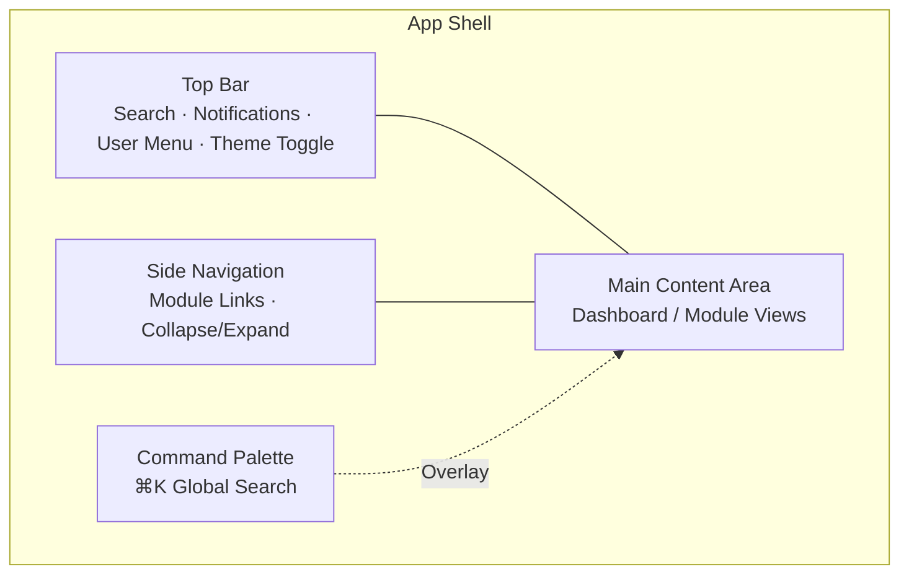
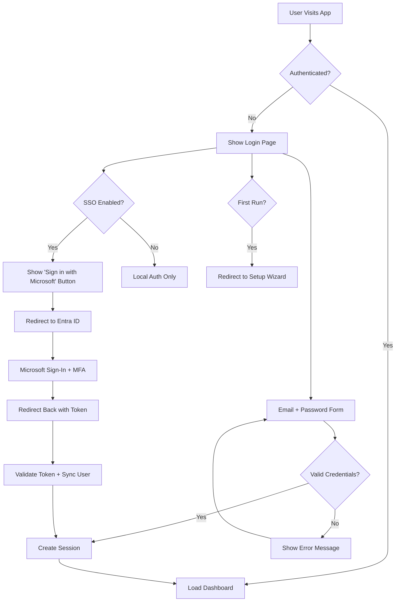
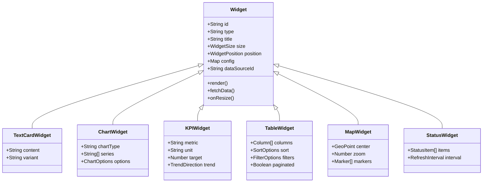
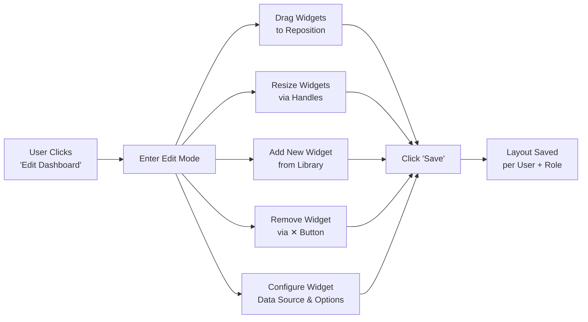
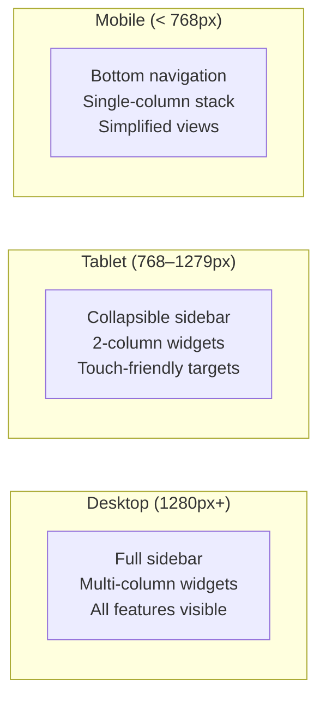

# 06 — Frontend Implementation Plan

> **The frontend is Phase 0 — we build the UI shell first, then wire backend services incrementally.** This "frontend-first" approach ensures we always have something visible and demonstrable.

## Framework & Stack

| Layer | Technology | Rationale |
|-------|-----------|-----------|
| **Framework** | Next.js 14+ (App Router) | SSR/SSG for performance, React ecosystem, excellent DX |
| **Language** | TypeScript | Type safety, refactoring confidence, team productivity |
| **UI Library** | React 18+ | Component model, hooks, concurrent features |
| **Styling** | Tailwind CSS + Shadcn/ui | Utility-first CSS, accessible components, fast prototyping |
| **State Management** | Zustand + React Query | Lightweight global state + server-state caching |
| **Charts** | Recharts / Tremor | React-native charting with accessibility |
| **Drag & Drop** | dnd-kit | Drag-and-drop widget layout engine |
| **Icons** | Lucide React | Consistent, lightweight icon set |
| **Forms** | React Hook Form + Zod | Performant forms with schema-based validation |
| **Testing** | Vitest + Testing Library + Playwright | Unit, integration, and E2E testing |

---

## Application Shell



### Layout Structure

```
┌─────────────────────────────────────────────────────────┐
│  🔍 Search...        │ 🔔 Notifications │ 👤 User │ 🌙 │
├──────────┬──────────────────────────────────────────────┤
│          │                                              │
│  🏠 Home │  [Main Content Area]                        │
│  🔐 IAM  │                                              │
│  ⚙️ Ops  │   ┌────────┐ ┌────────┐ ┌────────┐         │
│  🛡️ Sec  │   │Widget 1│ │Widget 2│ │Widget 3│         │
│  📚 Docs │   └────────┘ └────────┘ └────────┘         │
│  📊 BI   │   ┌────────────────────┐ ┌────────┐         │
│  🌐 Net  │   │    Widget 4       │ │Widget 5│         │
│  📹 NVR  │   └────────────────────┘ └────────┘         │
│  🔧 Admin│                                              │
│          │                                              │
└──────────┴──────────────────────────────────────────────┘
```

---

## Login Experience

### Flow



### Login Page Design

- Clean, branded login page with company logo
- **Primary:** email + password form (local accounts — always available)
- **Optional:** "Sign in with Microsoft" SSO button (shown when Entra ID connector is configured)
- First-run detection redirects to setup wizard for initial admin creation
- Error handling with clear messages for common issues
- "Forgot password?" link for self-service password reset
- Dev environment: feature-flagged quick login for testing

---

## Dashboard & Widget System

### Widget Architecture



### Widget Types (Initial Library)

| Widget Type | Description | Example Use |
|------------|-------------|-------------|
| **KPI Card** | Single metric with trend indicator | Revenue, Active Users, Uptime |
| **Line Chart** | Time-series data visualization | Network bandwidth over 24h |
| **Bar Chart** | Categorical comparisons | Jobs by status, Clicks by page |
| **Donut Chart** | Part-of-whole visualization | MFA adoption, Device compliance |
| **Data Table** | Sortable, filterable table | Open incidents, Connected clients |
| **Status Grid** | Health indicators for systems | Service status, AP status |
| **Text Card** | Rich text content | Announcements, Quick links |
| **Alert Feed** | Scrolling alert/event list | Security alerts, System notifications |
| **Map View** | Geographic visualization | Site locations, Client geo |
| **Embedded View** | iframe or micro-frontend | Camera feed, External tool |
| **Applet Widget** | Compact applet mini-view | SEO score gauge, Keyword trends |

### Drag-and-Drop Layout



**Layout persistence:**
- Saved per user → personal customization
- Default templates per role → sensible starting point
- Admin can define organization-wide default dashboards
- Layouts stored via Widget & Layout Engine API

---

## Global Navigation & Search

### Command Palette (⌘K / Ctrl+K)

```
┌─────────────────────────────────────────────┐
│  🔍 Search anything...                      │
├─────────────────────────────────────────────┤
│  RECENT                                     │
│    📄 Network Overview Dashboard            │
│    👤 jsmith@company.com                    │
│    🔧 pfSense — Firewall Rules              │
│                                             │
│  SUGGESTIONS                                │
│    👤 Users → Search user directory          │
│    📹 Cameras → View NVR feeds              │
│    📊 SEO → Search Console metrics          │
│    🔐 Roles → Manage role assignments       │
│                                             │
│  ACTIONS                                    │
│    ⚡ Create new incident                    │
│    ⚡ Start onboarding workflow              │
│    ⚡ Toggle dark mode                       │
└─────────────────────────────────────────────┘
```

**Features:**
- Type-ahead search across all entity types
- Results categorized by type (User, Device, Document, Alert, etc.)
- Direct navigation to any entity or module
- Keyboard shortcuts for power users
- Recent items and frequently accessed shortcuts

### Keyboard Shortcuts

| Shortcut | Action |
|----------|--------|
| `⌘K` / `Ctrl+K` | Open command palette |
| `⌘/` / `Ctrl+/` | Open keyboard shortcut help |
| `G then H` | Go to Home dashboard |
| `G then I` | Go to Identity module |
| `G then O` | Go to Operations Hub |
| `G then S` | Go to Security Center |
| `G then N` | Go to Network module |

---

## Theming

### Dark / Light Mode

- System-preference detection with manual override
- Theme toggle in top bar
- Full dark mode with appropriate contrast ratios
- Per-tenant branding support (logo, accent color)

### Color System

```
Primary:    #2563EB (Blue)      — Interactive elements, links
Secondary:  #7C3AED (Purple)    — Accents, highlights
Success:    #059669 (Green)     — Healthy status, confirmations
Warning:    #D97706 (Amber)     — Warnings, degraded status
Danger:     #DC2626 (Red)       — Errors, critical alerts, down status
Neutral:    #6B7280 (Gray)      — Text, borders, backgrounds

Dark Mode Background:   #0F172A → #1E293B → #334155
Light Mode Background:  #FFFFFF → #F8FAFC → #F1F5F9
```

---

## Responsive Design



---

## Accessibility (WCAG 2.1 AA)

| Requirement | Implementation |
|-------------|---------------|
| **Color Contrast** | Minimum 4.5:1 for text, 3:1 for large text and UI components |
| **Keyboard Navigation** | All interactive elements focusable and operable via keyboard |
| **Screen Readers** | Proper ARIA labels, roles, and live regions |
| **Focus Indicators** | Visible focus rings on all interactive elements |
| **Alt Text** | Descriptive alt text for all informational images and charts |
| **Motion** | Respect `prefers-reduced-motion`; no auto-playing animations |
| **Touch Targets** | Minimum 44×44px tap targets on mobile |
| **Error Messages** | Descriptive, associated with form fields, announced to assistive tech |

---

## Notifications Center

```
┌─────────────────────────────────────────────┐
│  🔔 Notifications                    Clear  │
├─────────────────────────────────────────────┤
│  🔴 CRITICAL                                │
│  ┌─────────────────────────────────────────┐│
│  │ pfSense: Firewall down — Site Alpha     ││
│  │ 2 minutes ago                           ││
│  └─────────────────────────────────────────┘│
│  🟡 WARNING                                 │
│  ┌─────────────────────────────────────────┐│
│  │ UniFi AP-3: High client count (47/50)   ││
│  │ 15 minutes ago                          ││
│  └─────────────────────────────────────────┘│
│  🔵 INFO                                    │
│  ┌─────────────────────────────────────────┐│
│  │ Access review due in 3 days             ││
│  │ 1 hour ago                              ││
│  └─────────────────────────────────────────┘│
└─────────────────────────────────────────────┘
```

- Real-time updates via WebSocket connections
- Severity-based categorization and filtering
- Click-through to relevant module/entity
- Bulk dismiss and mark-as-read
- Configurable notification preferences per user

---

## Page Structure by Module

| Module | Key Pages |
|--------|-----------|
| **Home** | Dashboard (widget grid) |
| **Identity** | User Directory, User Detail, Group Management, Role Management, Access Reviews, Audit Log |
| **Ops Hub** | Task Board, Workflow Templates, Incident List, Incident Detail, Onboarding Wizard |
| **Security** | Threat Dashboard, Alert List, Alert Detail, Policy Editor, Access Review, Audit Log |
| **Documentation** | Wiki Home, Document Editor, Search Results, Category Browser |
| **Analytics** | Report Builder, Saved Reports, SEO Dashboard, CRM Dashboard, Custom Dashboards |
| **Network** | Network Map, Device List, Device Detail, Firewall Rules, Client List |
| **NVR** | Camera Grid, Camera Detail, Event Timeline, Alert Config |
| **Applets** | Applet Launcher, Applet Full Panel (iframe container), Applet Settings |
| **Admin** | Tenant List, Tenant Detail, System Config, Platform Health, Connector Config, Applet Management |
