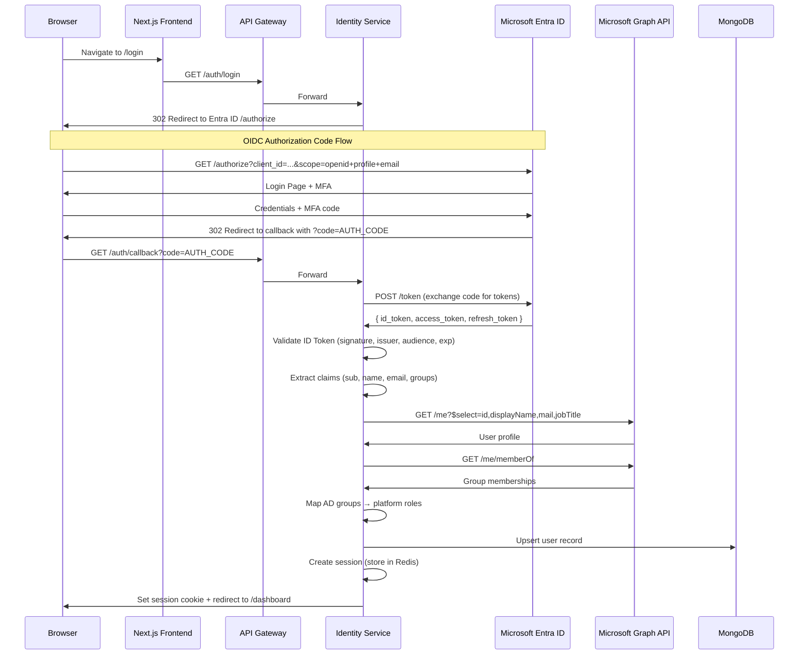
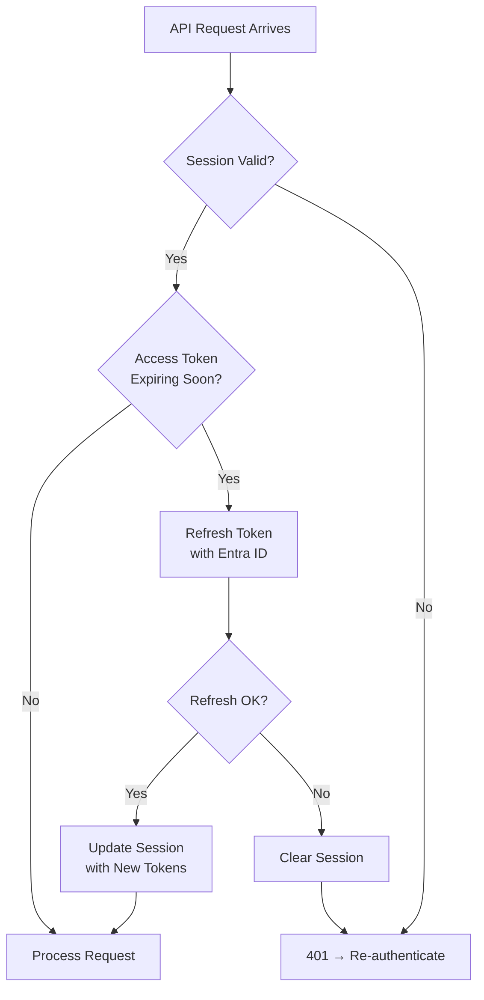
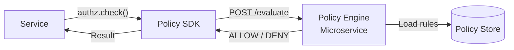
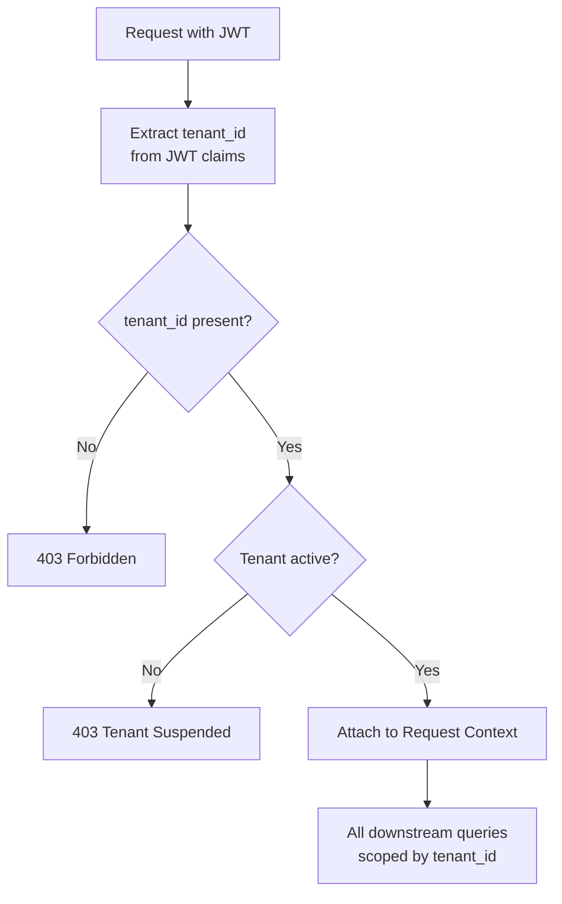
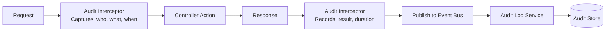
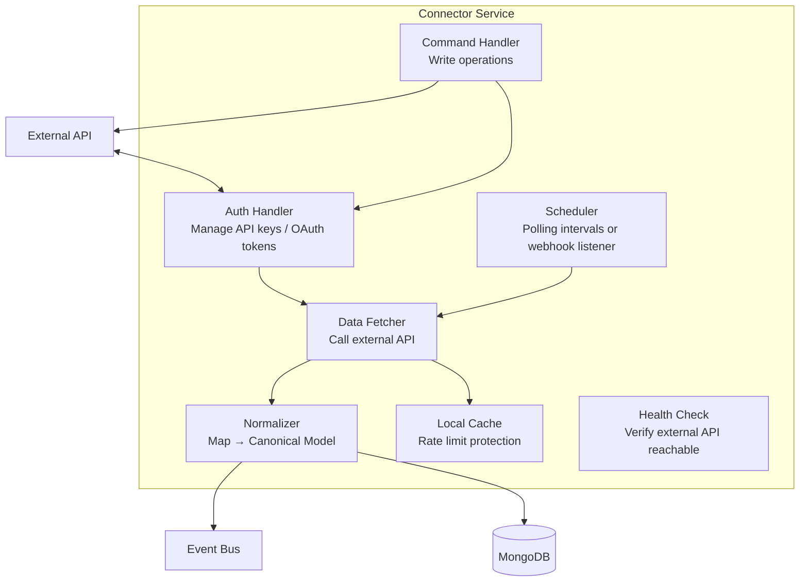
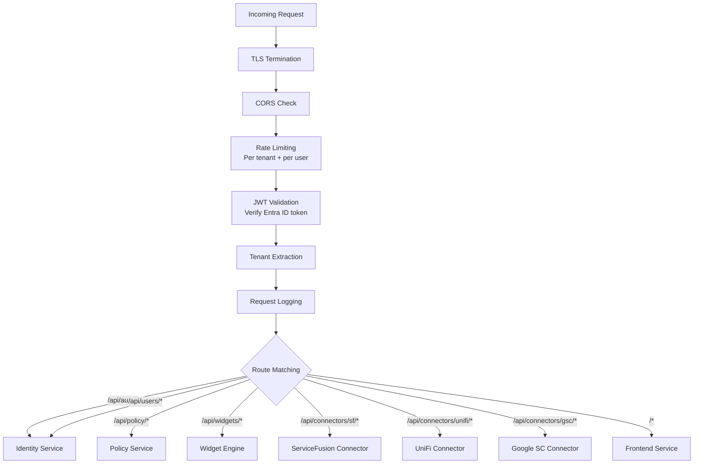
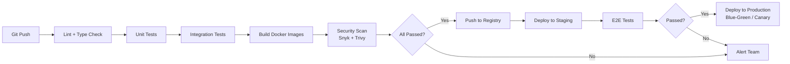
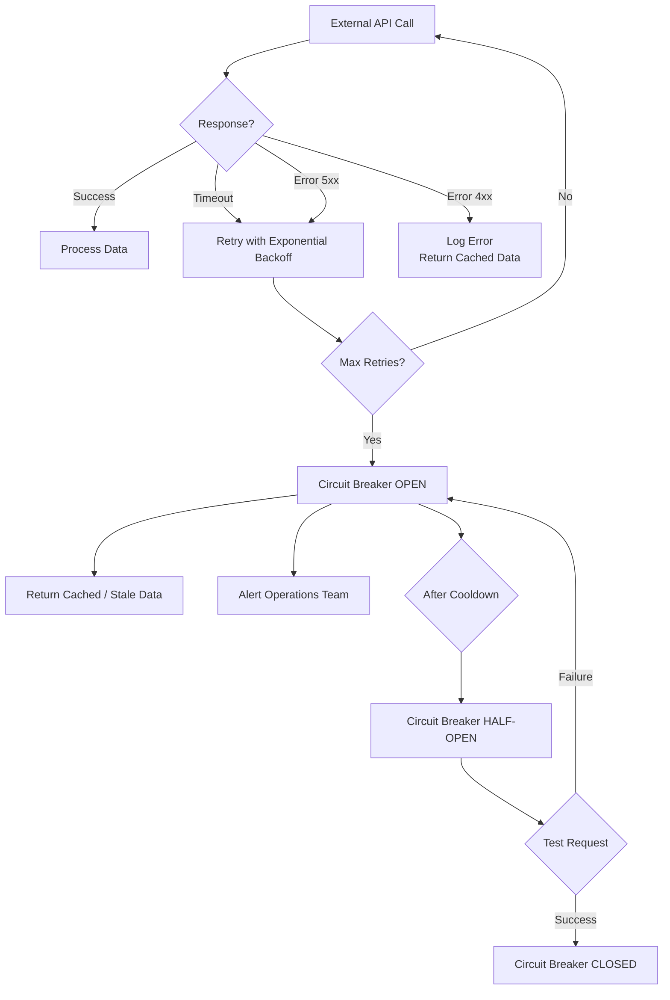

# 08 — Backend Implementation Plan

## Stack & Framework

| Component | Technology | Rationale |
|-----------|-----------|-----------|
| **Runtime** | Node.js 20 LTS | Async I/O for connectors, stack synergy with frontend |
| **Language** | TypeScript 5+ | Type safety, refactoring confidence, shared types with frontend |
| **Framework** | NestJS | Modular architecture, built-in DI, decorator-based, TypeScript-native |
| **API Format** | REST (JSON) | Simplicity, broad client support; GraphQL considered for future |
| **Validation** | class-validator + class-transformer | Decorator-based DTO validation in NestJS |
| **ORM / ODM** | Mongoose (MongoDB) + TypeORM (PostgreSQL) | Flexible document mapping; relational when needed |
| **Auth Library** | passport + passport-azure-ad | Battle-tested OIDC/OAuth flows for Node.js |
| **Testing** | Jest + Supertest | Unit and integration testing |
| **Containers** | Docker + Docker Compose | Local dev, CI, and production deployment |

---

## Service Structure

Each microservice follows a consistent internal structure:

```
service-name/
├── src/
│   ├── main.ts                    # Entry point, bootstrap NestJS app
│   ├── app.module.ts              # Root module
│   ├── config/
│   │   ├── configuration.ts       # Environment-based config
│   │   └── validation.ts          # Config schema validation
│   ├── modules/
│   │   └── feature/
│   │       ├── feature.module.ts
│   │       ├── feature.controller.ts
│   │       ├── feature.service.ts
│   │       ├── feature.repository.ts
│   │       ├── dto/
│   │       │   ├── create-feature.dto.ts
│   │       │   └── update-feature.dto.ts
│   │       ├── schemas/
│   │       │   └── feature.schema.ts
│   │       └── interfaces/
│   │           └── feature.interface.ts
│   ├── common/
│   │   ├── guards/
│   │   │   ├── auth.guard.ts
│   │   │   └── roles.guard.ts
│   │   ├── decorators/
│   │   │   ├── roles.decorator.ts
│   │   │   └── tenant.decorator.ts
│   │   ├── interceptors/
│   │   │   ├── audit-log.interceptor.ts
│   │   │   └── tenant-context.interceptor.ts
│   │   ├── filters/
│   │   │   └── http-exception.filter.ts
│   │   └── middleware/
│   │       └── tenant-extraction.middleware.ts
│   └── shared/
│       ├── tenant/
│       │   ├── tenant.module.ts
│       │   └── tenant.service.ts
│       ├── audit/
│       │   ├── audit.module.ts
│       │   └── audit.service.ts
│       └── event-bus/
│           ├── event-bus.module.ts
│           └── event-bus.service.ts
├── test/
│   ├── unit/
│   └── integration/
├── Dockerfile
├── package.json
├── tsconfig.json
└── .env.example
```

---

## Microsoft Entra ID Integration

### OIDC Authentication Flow



### Implementation Details

**OIDC Configuration:**
```typescript
// Pseudocode — NestJS OIDC Strategy
{
  identityMetadata: 'https://login.microsoftonline.com/{tenant}/v2.0/.well-known/openid-configuration',
  clientID: process.env.AZURE_CLIENT_ID,
  clientSecret: process.env.AZURE_CLIENT_SECRET,
  responseType: 'code',
  responseMode: 'query',
  redirectUrl: process.env.REDIRECT_URI,
  scope: ['openid', 'profile', 'email', 'User.Read', 'GroupMember.Read.All'],
  passReqToCallback: true,
  allowHttpForRedirectUrl: false,  // HTTPS only in production
}
```

**Group-to-Role Mapping:**
```typescript
// Role mapping configuration
const GROUP_ROLE_MAP = {
  'HydreOS-Admins':     'platform_admin',
  'HydreOS-ITOps':      'it_operations',
  'HydreOS-Security':   'security_analyst',
  'HydreOS-Executives': 'executive_viewer',
  'HydreOS-Users':      'standard_user',
};

function mapGroupsToRoles(adGroups: string[]): string[] {
  return adGroups
    .map(group => GROUP_ROLE_MAP[group])
    .filter(Boolean);
}
```

**Token Refresh Strategy:**


---

## RBAC / ABAC Implementation

### Role Guard (NestJS)

```typescript
// Decorator usage example
@Controller('network')
export class NetworkController {
  
  @Get('devices')
  @Roles('platform_admin', 'it_operations', 'security_analyst')
  async getDevices(@TenantId() tenantId: string) {
    return this.networkService.getDevices(tenantId);
  }

  @Post('firewall/rules')
  @Roles('platform_admin', 'it_operations')
  @RequireMFA()  // ABAC: requires recent MFA
  async createFirewallRule(@Body() dto: CreateFirewallRuleDto) {
    return this.networkService.createRule(dto);
  }
}
```

### Policy Engine Integration



**Policy Evaluation Request:**
```json
{
  "subject": {
    "userId": "user-456",
    "roles": ["it_operations"],
    "tenantId": "tenant-abc"
  },
  "action": "firewall.rule.create",
  "resource": {
    "type": "firewall",
    "id": "pfsense-01"
  },
  "context": {
    "mfaCompleted": true,
    "mfaTimestamp": "2026-02-28T14:25:00Z",
    "ipAddress": "192.168.1.50",
    "deviceCompliant": true,
    "timeOfDay": "14:30",
    "dayOfWeek": "Saturday"
  }
}
```

---

## Multi-Tenant Architecture

### Tenant Extraction Middleware



**Shared Library — Tenant-Scoped Repository:**
```typescript
// All repositories extend this base
abstract class TenantScopedRepository<T> {
  async find(tenantId: string, filter: object): Promise<T[]> {
    return this.model.find({ tenantId, ...filter });
  }

  async create(tenantId: string, data: Partial<T>): Promise<T> {
    return this.model.create({ tenantId, ...data });
  }

  // tenant_id is ALWAYS included — never optional
}
```

---

## Audit Logging

### Audit Interceptor (NestJS)

Every controller action automatically generates an audit log entry via an interceptor:



---

## Connector Service Pattern

Each connector follows a standard pattern:



**Connector Lifecycle:**
1. **Register:** Admin adds connector config (endpoint, credentials, polling interval)
2. **Authenticate:** Connector validates credentials with external API
3. **Sync:** Initial full data sync → normalize → store
4. **Poll/Listen:** Ongoing data fetch (scheduled poll or webhook/stream)
5. **Serve:** Platform queries connector's stored data via canonical model
6. **Command:** Platform sends write operations back to external API
7. **Health Check:** Periodic verification that external API is reachable

---

## API Gateway Configuration



---

## Security & DevOps

### Security Controls

| Control | Implementation |
|---------|---------------|
| **Transport Encryption** | TLS 1.3 for all external; mTLS between services (future) |
| **Secret Management** | Azure Key Vault / AWS Secrets Manager; never in code or env files |
| **Input Validation** | DTO validation on every endpoint; sanitize all user input |
| **Dependency Scanning** | `npm audit` + Snyk in CI pipeline |
| **Container Security** | Minimal base images (Alpine); non-root containers; image scanning |
| **Rate Limiting** | Per-tenant and per-user limits at API Gateway |
| **CORS** | Strict origin whitelist |
| **Helmet** | HTTP security headers (CSP, HSTS, X-Frame-Options) |

### CI/CD Pipeline



### Monitoring & Alerting

| Aspect | Tool | What's Monitored |
|--------|------|-----------------|
| **Metrics** | Prometheus + Grafana | Request latency, error rates, throughput, container CPU/memory |
| **Logs** | ELK Stack or Azure Log Analytics | Application logs, access logs, audit events |
| **Tracing** | OpenTelemetry + Jaeger | Distributed request traces across services |
| **Alerting** | Grafana Alerts / PagerDuty | SLA breaches, error spikes, service down |
| **Uptime** | Synthetic monitors | Endpoint availability from multiple regions |

### Error Handling & Resilience


