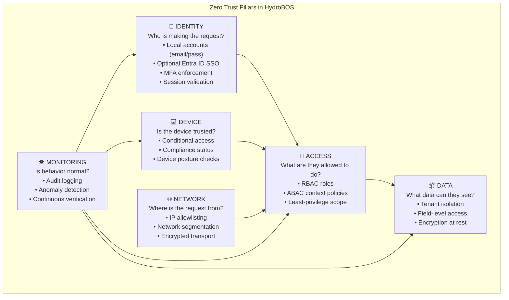
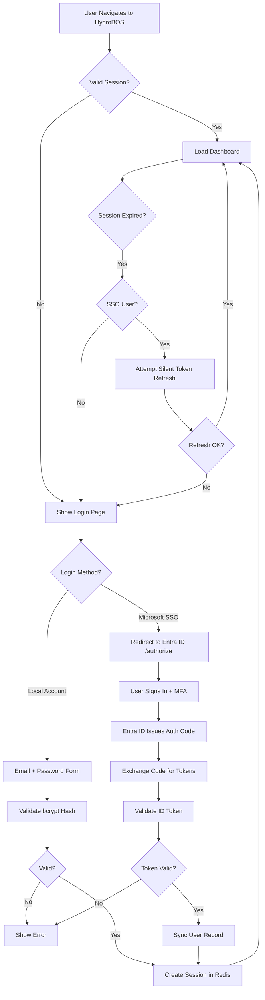
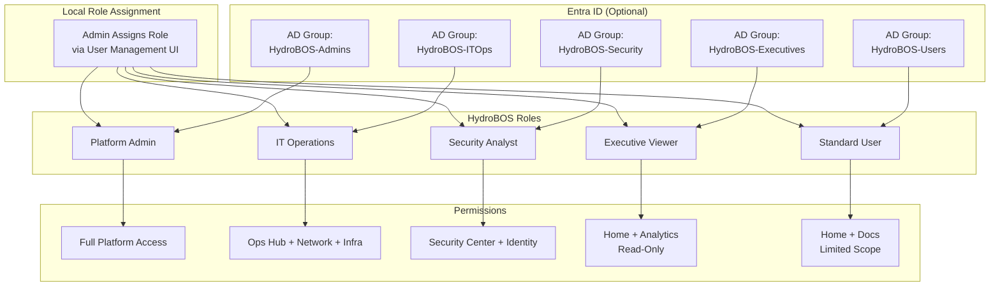
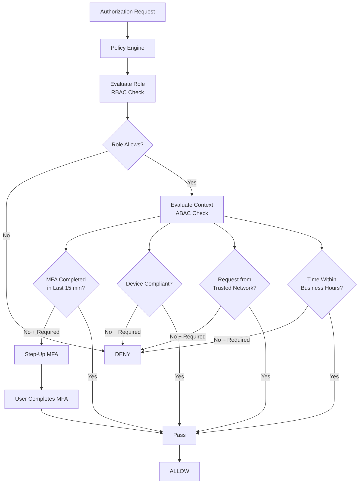
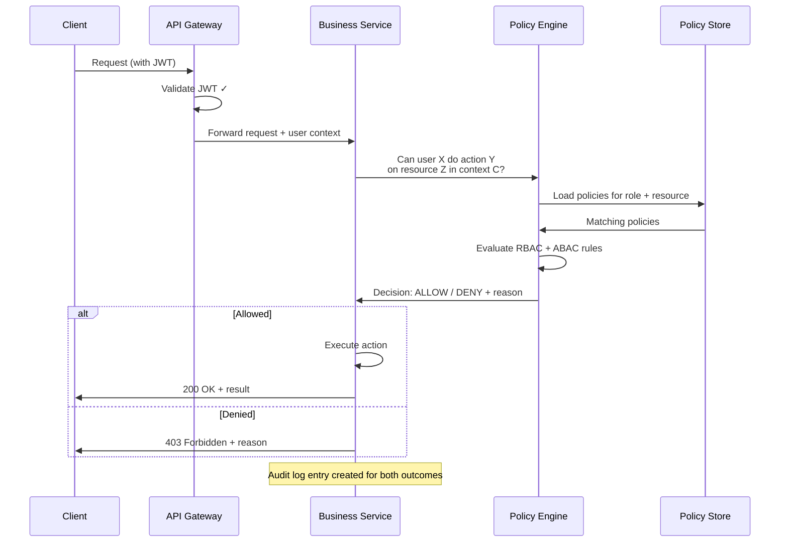
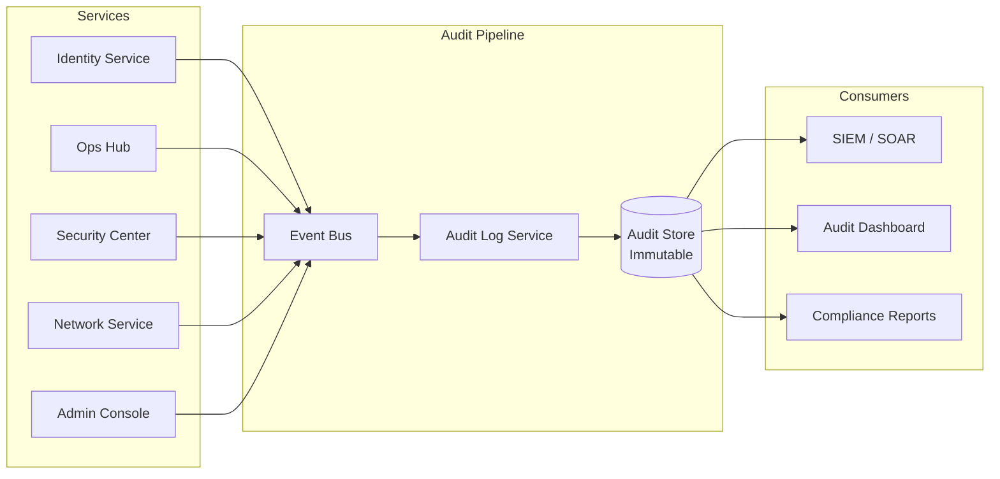
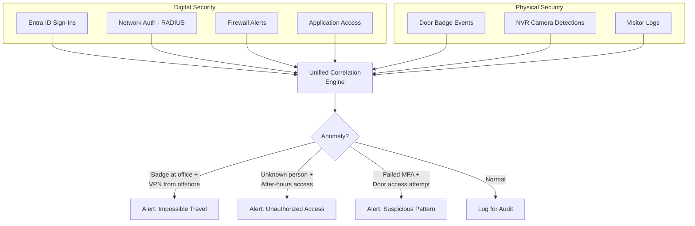
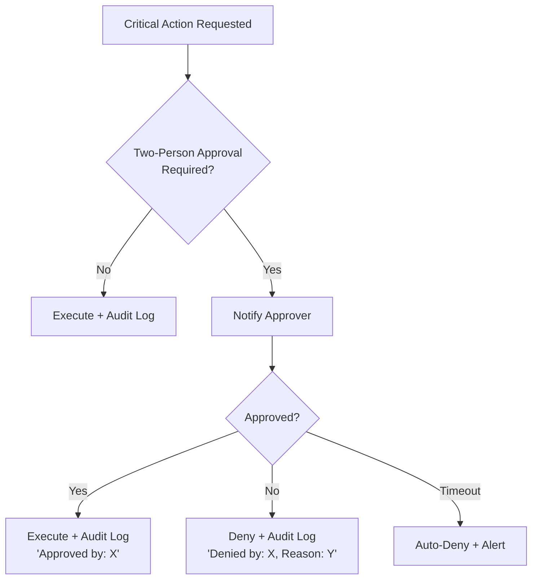

# 08 — Security Model

## Zero Trust Alignment

HydroBOS is designed around **Zero Trust Architecture** (ZTA) principles. No user, device, or network is inherently trusted. Every request is verified against identity, permissions, and context.



---

## Authentication Model

### Dual Authentication: Local Accounts + Optional SSO

HydroBOS supports **two authentication methods**. Local accounts are the **primary method** — always available. Microsoft Entra ID SSO is an **optional connector** added by admin configuration.

**Key Properties:**
- **Local Auth:** bcrypt-hashed passwords stored in MongoDB; email + password login
- **SSO (Optional):** OpenID Connect (OIDC) via Microsoft Entra ID when connector is enabled
- **Token Format:** JWT (JSON Web Tokens) for API authorization
- **MFA:** Supported via Entra ID Conditional Access (SSO users); TOTP planned for local users
- **Session Management:** Server-side sessions backed by Redis; configurable timeout



### First-Run: Admin Account Bootstrap

On first deployment, HydroBOS detects an empty database and forces the creation of an initial admin account. This account uses **local authentication** (email + password) — no external IdP dependency required to get started.

### Password Security (Local Accounts)

| Control | Implementation |
|---------|---------------|
| **Hashing** | bcrypt with cost factor 12+ |
| **Minimum Length** | 12 characters |
| **Complexity** | Configurable rules (uppercase, number, symbol) |
| **Breach Check** | Optional HaveIBeenPwned API check on password set |
| **Reset Flow** | Secure time-limited email tokens |
| **Lockout** | 5 failed attempts → 15-minute lockout |
| **History** | Last 5 passwords cannot be reused |

---

## Authorization Model

### Role-Based Access Control (RBAC)

Roles can be assigned **locally by admin** or **mapped from Azure AD groups** when Entra ID SSO is enabled. Both sources merge into the same permission system.



### Role-Permission Matrix

| Permission | Admin | IT Ops | Security | Executive | User |
|-----------|:-----:|:------:|:--------:|:---------:|:----:|
| Home Dashboard | ✅ | ✅ | ✅ | ✅ | ✅ |
| Identity & Access — View | ✅ | ✅ | ✅ | ❌ | ❌ |
| Identity & Access — Manage | ✅ | ❌ | ✅ | ❌ | ❌ |
| Operations Hub | ✅ | ✅ | ❌ | ❌ | ❌ |
| Security Center | ✅ | ❌ | ✅ | ❌ | ❌ |
| Documentation | ✅ | ✅ | ✅ | ✅ | ✅ |
| Analytics / BI | ✅ | ✅ | ✅ | ✅ | ❌ |
| Network & Infra — View | ✅ | ✅ | ✅ | ❌ | ❌ |
| Network & Infra — Config | ✅ | ✅ | ❌ | ❌ | ❌ |
| Video / NVR | ✅ | ❌ | ✅ | ❌ | ❌ |
| Admin Console | ✅ | ❌ | ❌ | ❌ | ❌ |
| Tenant Management | ✅ | ❌ | ❌ | ❌ | ❌ |

### Attribute-Based Access Control (ABAC) — Future

ABAC extends RBAC by evaluating **contextual attributes** alongside roles:



**ABAC Attribute Examples:**

| Attribute | Source | Example Policy |
|-----------|--------|---------------|
| `mfa_completed` | Entra ID token claims / TOTP check | Require MFA for admin actions |
| `device_compliant` | Entra ID device management | Block non-compliant devices from Security Center |
| `ip_address` | Request metadata | Restrict firewall config changes to office IPs |
| `time_of_day` | Server clock | Restrict physical access changes to business hours |
| `risk_level` | Entra ID risk detection | Require re-auth for users with elevated risk score |
| `tenant_id` | JWT claims | Enforce tenant data isolation |

---

## Policy Engine

The **Policy / Authorization Service** is a dedicated microservice that centralizes all authorization decisions. Other services delegate policy evaluation rather than implementing their own checks.



**Design Principles:**
- Separate **policy decision** from **policy enforcement**
- Policies stored as structured data (JSON/YAML), not hard-coded
- Support for policy versioning and testing
- Future: Consider OPA (Open Policy Agent) integration for complex rule evaluation

---

## Audit Logging

Every security-relevant action generates an **immutable audit log entry**.

### Audited Events

| Category | Events |
|----------|--------|
| **Authentication** | Login success/failure, MFA challenge, session creation/expiration, token refresh |
| **Authorization** | Permission check (allow/deny), role assignment/removal, access request/approval |
| **User Management** | User created/updated/deactivated, group membership changed |
| **Data Access** | Sensitive data viewed, report exported, configuration changed |
| **System Admin** | Tenant created/modified, connector configured, system settings changed |
| **Physical Security** | Door access events, NVR alerts, badge scans |
| **Network** | Firewall rule changes, device configuration pushes, VPN connections |

### Audit Log Schema

```json
{
  "id": "uuid",
  "timestamp": "2026-02-28T14:30:00Z",
  "tenantId": "tenant-123",
  "actorId": "user-456",
  "actorEmail": "jsmith@company.com",
  "actorRoles": ["IT Operations"],
  "action": "firewall.rule.create",
  "resource": "pfSense:fw-rule-789",
  "result": "success",
  "details": {
    "ruleName": "Allow VPN Traffic",
    "sourceIP": "10.0.0.0/24",
    "destPort": 443
  },
  "context": {
    "ipAddress": "192.168.1.50",
    "userAgent": "Mozilla/5.0...",
    "mfaCompleted": true,
    "deviceCompliant": true
  }
}
```

### Audit Log Flow



---

## Physical + Digital Security Convergence

HydroBOS uniquely unifies **physical security** (door access, cameras) with **digital security** (network access, application permissions) under one identity-driven framework.



**Cross-Domain Alert Examples:**
- Employee badges into office in NYC but VPN connects from overseas → **impossible travel alert**
- NVR detects unrecognized person after hours → **physical intrusion alert**
- User fails MFA 5 times then a door badge scan occurs → **suspicious pattern alert**
- Terminated employee's badge used → **revoked access alert** (tied to Entra ID deprovisioning)

---

## Compliance & Governance

### Compliance Framework Support

| Framework | How HydroBOS Helps |
|-----------|------------------|
| **SOC 2** | Audit logging, access controls, change management, monitoring |
| **GDPR** | Data isolation, consent management, right to erasure support |
| **HIPAA** | Access controls, audit trails, encryption, minimum necessary access |
| **ISO 27001** | Information security controls, risk management, incident response |

### Governance Controls

- **Two-Person Approval:** Critical actions (firewall changes, role escalation, tenant deletion) require approval from a second authorized user
- **Access Reviews:** Periodic (quarterly) automated reviews of user access; managers approve or revoke
- **Automatic Deprovisioning:** When a user is disabled in Entra ID (SSO users) or deactivated locally, all HydroBOS access is immediately revoked
- **Data Retention Policies:** Configurable per-tenant retention periods for audit logs and connector data
- **Privacy Controls:** PII handling follows GDPR principles; data minimization; purpose limitation


