# 09 — UX & Design Requirements

## Design Philosophy

HydreOS targets a **premium enterprise experience** — professional, fast, and intuitive. The design must feel polished enough to justify SaaS pricing while remaining functional for daily operator use.

**Core Principles:**
1. **Clarity** — Information hierarchy is immediately obvious; no visual noise
2. **Speed** — Users complete tasks in minimum clicks/keystrokes
3. **Consistency** — Same patterns everywhere; learn once, apply everywhere
4. **Accessibility** — Fully usable by people with disabilities
5. **Density** — Show more data per screen without sacrificing readability

---

## Design System

### Component Library

Build on **Shadcn/ui** (Radix-based accessible primitives) with Tailwind CSS, customized to the HydreOS brand.

| Component Category | Components |
|-------------------|------------|
| **Layout** | App Shell, Sidebar, Top Bar, Page Container, Grid, Card |
| **Navigation** | Nav Links, Breadcrumbs, Tabs, Command Palette, Pagination |
| **Data Display** | Table, Data Grid, KPI Card, Badge, Avatar, Status Indicator, Timeline |
| **Charts** | Line, Bar, Area, Donut, Sparkline, Heatmap |
| **Forms** | Input, Select, Checkbox, Radio, Switch, Date Picker, File Upload |
| **Feedback** | Toast, Alert Banner, Modal, Drawer, Loading Skeleton, Progress Bar |
| **Actions** | Button, Dropdown Menu, Context Menu, Tooltip, Popover |

### Typography

| Role | Font | Size | Weight |
|------|------|------|--------|
| **Headings** | Inter | 24/20/16px | Semibold (600) |
| **Body** | Inter | 14px | Regular (400) |
| **Monospace** | JetBrains Mono | 13px | Regular (400) |
| **Captions** | Inter | 12px | Medium (500) |

### Spacing Scale

```
4px  — Tight (inline padding)
8px  — Compact (element spacing)
12px — Default (component padding)
16px — Comfortable (section spacing)
24px — Spacious (card padding)
32px — Section (module spacing)
48px — Page (top-level separation)
```

### Color Tokens

| Token | Light Mode | Dark Mode | Usage |
|-------|-----------|-----------|-------|
| `--bg-primary` | `#FFFFFF` | `#0F172A` | Page background |
| `--bg-secondary` | `#F8FAFC` | `#1E293B` | Card/sidebar background |
| `--bg-tertiary` | `#F1F5F9` | `#334155` | Hover/active states |
| `--text-primary` | `#0F172A` | `#F8FAFC` | Primary text |
| `--text-secondary` | `#64748B` | `#94A3B8` | Secondary/helper text |
| `--border` | `#E2E8F0` | `#334155` | Borders, dividers |
| `--accent` | `#2563EB` | `#3B82F6` | Primary actions, links |
| `--success` | `#059669` | `#10B981` | Online, healthy, approved |
| `--warning` | `#D97706` | `#F59E0B` | Degraded, attention needed |
| `--danger` | `#DC2626` | `#EF4444` | Down, critical, error |
| `--info` | `#0284C7` | `#38BDF8` | Informational indicators |

### Iconography

Use **Lucide React** icon set for consistency. Guidelines:
- 20px default size for navigation and actions
- 16px for inline/compact contexts
- 24px for emphasis and empty states
- Stroke width: 1.5px (matches Inter weight balance)

---

## Interaction Patterns

### Search → Action → Insight

The universal user flow across all modules:

```mermaid
flowchart LR
    S["🔍 SEARCH<br/>Find entity by name,<br/>ID, type, or attribute"]
    A["⚡ ACTION<br/>Create, edit, approve,<br/>deny, configure, send"]
    I["📈 INSIGHT<br/>View status, history,<br/>trends, correlations"]

    S --> A
    A --> I
    I -->|"Discover more"| S
```



**Every module page supports:**
1. **Search** — Find any entity quickly (filter bar, command palette, or module-level search)
2. **Action** — Perform contextual operations (buttons in tables, detail pages, or batch actions)
3. **Insight** — Understand state through dashboards, charts, timelines, and audit trails

### Contextual Navigation & Drill-Down

Users should be able to navigate from any high-level metric to its underlying details:

```mermaid
flowchart TD
    A[Home Dashboard:<br/>Network Health 🟡 92%] -->|Click| B[Network Module:<br/>Device List]
    B -->|Click troubled device| C[Device Detail:<br/>AP-3, High Load]
    C -->|View connected clients| D[Client List:<br/>47 connected]
    C -->|View logs| E[Device Logs:<br/>Recent Events]
    C -->|Take action| F[Restart AP / Block Client]
    
    F -->|Action taken| G[Audit Log Entry Created]
    G --> H[Return to Device Detail<br/>Status Updated]
```



### Direct Actions

Users can take action **without leaving their current context**:

| Context | Action | UX Pattern |
|---------|--------|-----------|
| Alert in feed | Acknowledge / Dismiss | Inline button |
| User in table | Assign role | Dropdown in row |
| Firewall rule | Enable/Disable | Toggle switch in row |
| Incident | Assign to me | Button on card |
| Access request | Approve/Deny | Button pair in notification |
| Widget | Configure | Gear icon → drawer |

---

## Notification Design

### Notification Priority Hierarchy

```mermaid
graph TD
    subgraph "Priority Levels"
        P1["🔴 CRITICAL<br/>Full-width banner + sound<br/>Requires acknowledgment"]
        P2["🟡 WARNING<br/>Toast notification<br/>Auto-dismiss after 10s"]
        P3["🔵 INFO<br/>Badge counter update<br/>Available in drawer"]
        P4["⚪ LOW<br/>Log only<br/>Visible in notification history"]
    end
```



### Delivery Channels

| Channel | When Used |
|---------|-----------|
| **In-App Banner** | Critical alerts that demand immediate attention |
| **Toast** | Real-time updates (new incidents, completed tasks) |
| **Bell Badge** | Unread notification count |
| **Notification Drawer** | Full notification history with filters |
| **Browser Push** | Optional — for critical alerts when tab is backgrounded |
| **Email** | Digest summaries and escalations |

---

## Onboarding & Help

### First-Run Experience


### In-Context Help

| Help Type | Implementation |
|-----------|---------------|
| **Tooltips** | Hover explanations on complex controls and metrics |
| **Info Panels** | Expandable '?' sections on module pages explaining purpose |
| **Guided Walkthroughs** | Step-by-step overlays for complex workflows (onboarding, policy creation) |
| **Documentation Links** | "Learn more" links connecting to the Documentation module |
| **Search Assistant** | AI-powered chat widget for natural language questions (future) |
| **Keyboard Shortcut Help** | Overlay shown via `⌘/` showing all available shortcuts |

---

## Tenant Branding (SaaS)

For multi-tenant deployments, each tenant can customize:

| Element | Customizable? | Default |
|---------|:---:|---------|
| **Logo** | ✅ | HydreOS logo |
| **Accent Color** | ✅ | Blue (#2563EB) |
| **Login Background** | ✅ | Default gradient |
| **Favicon** | ✅ | HydreOS icon |
| **App Title** | ✅ | "HydreOS" |
| **Dark/Light Mode** | ✅ | System preference |
| **Custom CSS** | ❌ | — (security risk) |
| **Widget Library** | ❌ | Shared (with tenant data isolation) |

---

## Performance Targets

| Metric | Target | Measurement |
|--------|--------|-------------|
| **Initial Load (TTI)** | < 2 seconds | Time to interactive on dashboard |
| **Route Navigation** | < 500ms | Client-side navigation between modules |
| **Widget Render** | < 1 second | Individual widget data + render time |
| **Search Results** | < 300ms | Command palette / search results appearance |
| **API Response** | < 200ms p95 | Backend API response time |
| **WebSocket Latency** | < 500ms | Time from event to UI notification |
| **Lighthouse Score** | > 90 | Performance + Accessibility + Best Practices |
