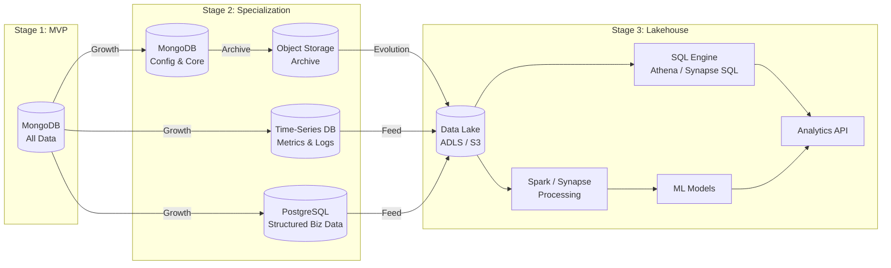
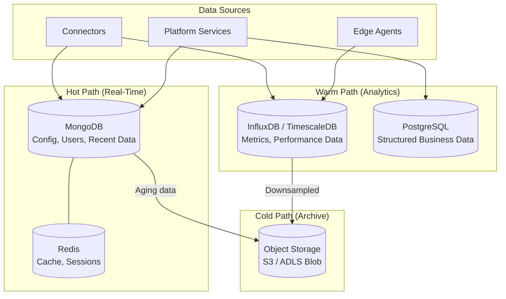
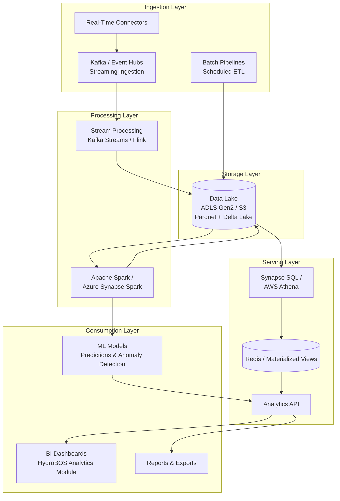
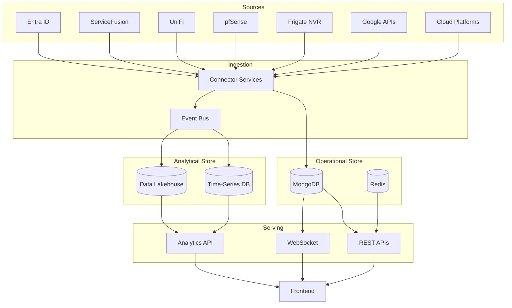

# 10 — Data Platform Strategy

## Evolution from Product DB to Lakehouse

HydroBOS's data architecture is designed to **grow with the organization** — starting simple with a single document database and evolving into a full data lakehouse for advanced analytics and machine learning.



---

## Stage 1: MVP (Months 0–9)

**Database:** MongoDB (single cluster)

**What's Stored:**
| Collection | Data | Purpose |
|-----------|------|---------|
| `users` | User profiles, role assignments | Identity & access |
| `tenants` | Tenant configurations, subscription info | Multi-tenancy |
| `dashboards` | Widget layouts, user preferences | UI personalization |
| `connectors` | Connector configs, credentials (encrypted) | Integration management |
| `connector_data` | Recent data pulled from third-party APIs | Real-time display |
| `audit_logs` | Security and admin action logs | Compliance |
| `events` | Recent events from connectors | Alert processing |

**Design Decisions:**
- MongoDB's flexible schema accommodates rapid iteration during MVP
- Document model naturally fits configuration data and connector payloads
- Single cluster keeps operational complexity low
- Per-tenant data isolation via `tenantId` field on every document
- Indexes on `tenantId` + relevant query fields for performance

**Multi-Tenant Data Pattern:**
```json
{
  "_id": "ObjectId",
  "tenantId": "tenant-abc-123",
  "entityType": "job",
  "sourceConnector": "servicefusion",
  "data": {
    "jobId": "SF-4521",
    "customer": "Acme Corp",
    "status": "in_progress",
    "scheduledDate": "2026-03-15"
  },
  "syncedAt": "2026-02-28T10:00:00Z"
}
```

---

## Stage 2: Specialization (Months 9–15)

As data volume increases, introduce **purpose-built stores** alongside MongoDB.



### Store Responsibilities

| Store | Type | Data | Query Pattern |
|-------|------|------|--------------|
| **MongoDB** | Document | Users, tenants, dashboards, connector configs, recent connector data | Key-value lookups, flexible queries |
| **Redis** | Cache | Sessions, API response cache, rate limit counters | Sub-millisecond reads |
| **InfluxDB / TimescaleDB** | Time-Series | Network throughput, CPU/memory metrics, connector poll data, event counts | Time-range aggregations |
| **PostgreSQL** | Relational | Structured business data (jobs, invoices, customers), reporting tables | Complex joins, aggregations |
| **Object Storage** | Blob | Archived logs, old connector data, NVR clips, backup snapshots | Batch reads, compliance retrieval |

### Data Retention Policy

| Data Type | Hot (Online) | Warm (Queryable) | Cold (Archive) |
|-----------|:----:|:----:|:----:|
| Audit Logs | 30 days | 1 year | 7 years |
| Connector Data | 7 days | 90 days | 1 year |
| Metrics/Time-Series | 24 hours (full res) | 90 days (downsampled) | 1 year (aggregated) |
| NVR Events | 7 days | 30 days | 90 days |
| User/Config Data | Always | — | Retained until deleted |

---

## Stage 3: Lakehouse Architecture (Month 16+)

For long-term scalability and advanced analytics, create a **data lakehouse** that combines the best of data lakes (cheap storage, schema flexibility) and data warehouses (structured queries, performance).



### Lakehouse Design Principles

1. **Multi-Tenant Isolation in the Lake**
   - Data partitioned by `tenant_id` at the storage level
   - Access policies enforce tenant-scoped queries
   - Encryption keys per tenant for sensitive data

2. **Schema Evolution**
   - Use Delta Lake or Apache Iceberg for ACID transactions on the lake
   - Support schema evolution without breaking existing queries
   - Maintain metadata catalog for data lineage

3. **Zone Architecture**
   ```
   data-lake/
   ├── raw/                    # Raw data as ingested (immutable)
   │   ├── tenant-abc/
   │   │   ├── servicefusion/
   │   │   ├── unifi/
   │   │   └── entra-id/
   │   └── tenant-xyz/
   ├── curated/                # Cleaned, transformed, canonical format
   │   ├── tenant-abc/
   │   │   ├── users/
   │   │   ├── devices/
   │   │   ├── metrics/
   │   │   └── events/
   │   └── tenant-xyz/
   └── aggregated/             # Pre-computed aggregations for dashboards
       ├── tenant-abc/
       │   ├── daily-kpis/
       │   ├── weekly-trends/
       │   └── monthly-reports/
       └── tenant-xyz/
   ```

4. **Cross-Domain Analytics**
   Once data from all connectors lives in a unified curated zone, analysts can run cross-domain queries:
   - Correlate network incidents with CRM job delays
   - Predict equipment failures from trending metrics
   - Identify SEO performance impact from infrastructure outages
   - Build security risk scores from combined digital + physical signals

### Technology Options

| Component | Azure Stack | AWS Stack |
|-----------|------------|-----------|
| **Object Storage** | ADLS Gen2 | S3 |
| **Streaming Ingestion** | Azure Event Hubs | Amazon Kinesis |
| **Stream Processing** | Azure Stream Analytics | Kinesis Data Analytics / Flink |
| **Batch Processing** | Azure Synapse Spark | AWS Glue / EMR |
| **SQL Engine** | Synapse Serverless SQL | Athena |
| **Table Format** | Delta Lake | Delta Lake / Iceberg |
| **ML Platform** | Azure ML | SageMaker |
| **Metadata Catalog** | Azure Purview | AWS Glue Data Catalog |

---

## Data Flow Summary


