# 10 — Roadmap

## Phased Delivery Plan

HydreOS follows an incremental delivery model — each phase builds on the last, delivering usable value at every milestone.

---

## Phase Details

### Phase 0 — Foundations & Architecture (Months 0–3)

**Goal:** Establish the technical foundation so all subsequent phases build on solid ground.

| Deliverable | Description |
|------------|-------------|
| Architecture Decision Records (ADRs) | Document all technology choices and trade-offs |
| Data model schemas | MongoDB schemas for core entities (users, tenants, roles, connectors) |
| API contracts | OpenAPI specs for inter-service communication |
| Service boundary definitions | Clear ownership of each microservice domain |
| Repository initialization | Monorepo or multi-repo with shared packages |
| Docker Compose setup | Local development environment with all services |
| CI/CD pipeline (v1) | Build, lint, test, containerize on every push |
| Entra ID app registration | Register application in Azure AD; configure OIDC |
| Development environment docs | Onboarding guide for new developers |

**Exit Criteria:**
- [ ] All services scaffold and start in Docker Compose
- [ ] CI pipeline runs on every PR
- [ ] Entra ID app registered and OIDC metadata confirmed
- [ ] Data models documented and reviewed

---

### Phase 1 — Identity & UI Shell (Months 3–6)

**Goal:** Users can sign in with Entra ID SSO and see a functional app shell with role-based navigation.

| Deliverable | Description |
|------------|-------------|
| OIDC login flow | Full redirect flow with Entra ID; token validation; session creation |
| User sync | Pull user profiles and groups from Microsoft Graph API |
| Role mapping | Azure AD groups → platform roles; stored in DB |
| Core UI layout | Sidebar navigation, top bar, main content area |
| Placeholder module pages | Stub pages for each major module |
| RBAC enforcement | Show/hide modules and menu items based on user role |
| Admin console (basic) | View users, roles, connector status |
| Dark/light theme | Theme toggle with system-preference detection |
| Dev login bypass | Feature-flagged `admin/admin` for local development |

```mermaid
flowchart TD
    A[Phase 1 Complete] --> B{User can...}
    B --> C[✅ Sign in via Entra ID SSO]
    B --> D[✅ See role-appropriate navigation]
    B --> E[✅ View user directory from Entra ID]
    B --> F[✅ Toggle dark/light theme]
    B --> G[✅ Access admin console if admin role]
```

**Exit Criteria:**
- [ ] SSO login works end-to-end with Entra ID
- [ ] Roles correctly mapped from AD groups
- [ ] Non-admin users cannot see admin-only modules
- [ ] UI shell responsive on desktop and tablet

---

### Phase 2 — MVP Integrations & Dashboard (Months 4–9)

**Goal:** A working dashboard with real data from three "hero" integrations, plus basic ops and security features.

| Deliverable | Description |
|------------|-------------|
| Widget engine | Drag-and-drop dashboard with save/load layouts |
| Widget library v1 | KPI card, line chart, bar chart, data table, status grid, text card |
| ServiceFusion connector | Fetch jobs, customers, invoices; display in Ops widgets |
| UniFi connector | Fetch APs, switches, client counts; display in Network widgets |
| Google Search Console connector | Fetch search analytics; display in BI widgets |
| Home dashboard | Default layout with widgets pulling from all three connectors |
| Operations page (basic) | Task list, system status, basic incident tracking |
| Security page (basic) | Sign-in log from Entra ID, basic audit trail viewer |
| Local Docker deployment | Full stack deployable via `docker-compose up` |
| Command palette | Global search across users, devices, jobs |

```mermaid
flowchart TD
    A[Phase 2 Complete] --> B{User can...}
    B --> C[✅ View personalized dashboard with real data]
    B --> D[✅ Drag/drop widgets to customize layout]
    B --> E[✅ See ServiceFusion jobs and customers]
    B --> F[✅ Monitor UniFi network devices]
    B --> G[✅ View SEO metrics from Search Console]
    B --> H[✅ Search across all data types]
    B --> I[✅ Deploy full stack locally]
```

**Exit Criteria:**
- [ ] Dashboard loads with live data from 3 connectors
- [ ] Widget layout persists per user
- [ ] Command palette returns results from all entity types
- [ ] Local Docker deployment documented and reproducible

---

### Phase 3 — Hardening & Expanded Functionality (Months 6–12)

**Goal:** Production-quality security, more integrations, refined UX, and operational readiness.

| Deliverable | Description |
|------------|-------------|
| Security review | Input validation, CSP headers, dependency scanning, pen-test prep |
| Circuit breakers & resilience | Fault tolerance for external API failures |
| Encryption | Data at rest encryption; verify TLS everywhere |
| pfSense/OPNsense connector | Firewall status, rules, logs; push config changes |
| Frigate NVR connector | MQTT event ingestion; camera status; security alerts |
| Cloudflare connector | DNS, analytics, WAF events |
| Azure/GCP connector | Cloud resource status and cost monitoring |
| Event bus implementation | Kafka or Azure Service Bus for async messaging |
| Expanded widget library | Donut chart, alert feed, map view, sparklines |
| UI/UX refinement | Based on user feedback; improved navigation and theming |
| Help system | In-context tooltips, guided tours, keyboard shortcut overlay |
| UAT program | Internal users test and provide structured feedback |

**Exit Criteria:**
- [ ] Security review completed with no critical findings
- [ ] 7+ connectors operational
- [ ] Event bus processing cross-service events
- [ ] UAT participants can complete core workflows without assistance

---

### Phase 4 — Multi-Tenancy & SaaS Launch (Months 9–15)

**Goal:** The platform can securely host multiple customer tenants and launches as a pilot SaaS offering.

| Deliverable | Description |
|------------|-------------|
| Tenant data isolation | Per-tenant DB partitioning validated |
| Tenant provisioning workflow | Admin creates new tenant → auto-configures DB, roles, defaults |
| Tenant admin roles | Tenant-scoped admins who manage their own users/connectors |
| Billing/subscription integration | Stripe or equivalent; usage tracking |
| Custom branding per tenant | Logo, accent color, app title |
| Performance testing | Load test with simulated multi-tenant workloads |
| Isolation verification | Pen-test confirming zero cross-tenant data leakage |
| SaaS infrastructure | Cloud deployment, monitoring, alerting, backup |
| V1 launch to pilot customers | Select customers onboarded with white-glove support |

```mermaid
flowchart TD
    A[New Customer Signup] --> B[Tenant Created]
    B --> C[Admin Account Provisioned<br/>via Entra ID]
    C --> D[Default Dashboard Loaded]
    D --> E[Connector Setup Wizard]
    E --> F[First Data Sync]
    F --> G[Customer Operational 🎉]
```

**Exit Criteria:**
- [ ] 3+ pilot tenants onboarded and operational
- [ ] No cross-tenant data leakage confirmed by pen-test
- [ ] Platform sustains target load under multi-tenant simulation
- [ ] Billing tracking active

---

### Phase 5 — V2 Development (Month 16+)

**Goal:** Advanced features that deepen the platform's value and competitive differentiation.

| Deliverable | Description |
|------------|-------------|
| Data lakehouse | Unified analytics across all connector data; Spark processing |
| Password safe / secret management module | Team-based secret storage with audit trail |
| Advanced ABAC policies | OPA integration or custom engine; context-aware rules |
| Visual workflow automation | Drag-and-drop workflow builder for IT/business processes |
| Deepened IoT/physical security | RADIUS integration; expanded NVR features; badge correlation |
| Extension marketplace | Third-party or community-built widgets and connectors |
| AI-powered insights | Anomaly detection, predictive alerts, natural-language queries |
| SIEM/SOAR deep integration | Bi-directional with Sentinel, Splunk, or similar |
| Mobile app (PWA) | Progressive Web App for on-the-go access |

---

## Milestone Summary

---

## Risk Mitigation

| Risk | Impact | Mitigation |
|------|--------|-----------|
| Entra ID integration complexity | Blocks all auth | Start Phase 0; dedicated resource; fallback dev auth |
| External API rate limits | Data freshness issues | Caching, backoff, respect rate headers |
| Multi-tenant isolation gaps | Security breach, trust loss | Early architecture review; pen testing; shared library enforcement |
| Scope creep in connectors | Delays MVP | Strict MVP feature set per connector; P0/P1/P2 prioritization |
| Team scaling | Delivery delays | Modular architecture enables parallel workstreams |
| Performance under load | SaaS viability | Load testing in Phase 4; horizontal scaling design |
