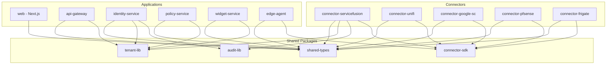
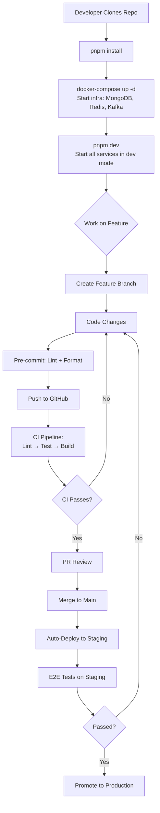

# 11 — Project Structure Goals

## Repository Strategy

**Approach:** Monorepo with clearly separated packages for shared code, services, and frontend.

**Rationale:**
- Shared TypeScript types and utilities across frontend and backend
- Unified CI/CD pipeline with selective builds
- Easier cross-service refactoring during early development
- Single source of truth for API contracts

---

## Target Codebase Structure

```
hydroeos/
│
├── README.md                           # Project overview (this doc set)
├── docs/                              # Documentation (this folder)
│   ├── 01-vision-and-objectives.md
│   ├── 02-architecture.md
│   ├── 03-modules-and-features.md
│   ├── 04-integration-strategy.md
│   ├── 05-security-model.md
│   ├── 06-data-platform-strategy.md
│   ├── 07-frontend-plan.md
│   ├── 08-backend-plan.md
│   ├── 09-ux-design-requirements.md
│   ├── 10-roadmap.md
│   └── 11-project-structure.md
│
├── marketing/                         # Sales & marketing materials
│   └── hydroeos-3-pager.md
│
├── packages/                          # Shared libraries (monorepo)
│   ├── shared-types/                  # TypeScript types shared across all services
│   │   ├── src/
│   │   │   ├── entities/              # Canonical data model types
│   │   │   │   ├── user.ts
│   │   │   │   ├── device.ts
│   │   │   │   ├── alert.ts
│   │   │   │   ├── job.ts
│   │   │   │   ├── metric.ts
│   │   │   │   └── index.ts
│   │   │   ├── auth/                  # Auth-related types (roles, permissions, claims)
│   │   │   │   ├── roles.ts
│   │   │   │   ├── permissions.ts
│   │   │   │   └── index.ts
│   │   │   ├── api/                   # API request/response types
│   │   │   │   ├── pagination.ts
│   │   │   │   ├── error.ts
│   │   │   │   └── index.ts
│   │   │   └── index.ts
│   │   ├── package.json
│   │   └── tsconfig.json
│   │
│   ├── tenant-lib/                    # Multi-tenancy shared library
│   │   ├── src/
│   │   │   ├── tenant-context.ts      # Tenant extraction and propagation
│   │   │   ├── tenant-scoped-repo.ts  # Base repository with tenant isolation
│   │   │   ├── tenant-guard.ts        # NestJS guard for tenant validation
│   │   │   └── index.ts
│   │   ├── package.json
│   │   └── tsconfig.json
│   │
│   ├── audit-lib/                     # Audit logging shared library
│   │   ├── src/
│   │   │   ├── audit-logger.ts        # Audit event publisher
│   │   │   ├── audit-interceptor.ts   # NestJS interceptor for auto-logging
│   │   │   ├── audit-types.ts         # Audit event schema
│   │   │   └── index.ts
│   │   ├── package.json
│   │   └── tsconfig.json
│   │
│   └── connector-sdk/                 # SDK for building connectors
│       ├── src/
│       │   ├── base-connector.ts      # Abstract connector class
│       │   ├── auth-handlers/         # OAuth, API key, certificate handlers
│       │   ├── normalizer.ts          # Base normalizer for canonical model
│       │   ├── scheduler.ts           # Polling scheduler
│       │   ├── health-check.ts        # External API health checker
│       │   └── index.ts
│       ├── package.json
│       └── tsconfig.json
│
├── apps/                              # Deployable applications
│   │
│   ├── web/                           # Next.js Frontend Application
│   │   ├── public/
│   │   │   ├── favicon.ico
│   │   │   └── images/
│   │   ├── src/
│   │   │   ├── app/                   # Next.js App Router
│   │   │   │   ├── layout.tsx         # Root layout (shell, sidebar, topbar)
│   │   │   │   ├── page.tsx           # Home / Dashboard
│   │   │   │   ├── login/
│   │   │   │   │   └── page.tsx
│   │   │   │   ├── identity/
│   │   │   │   │   ├── page.tsx       # User directory
│   │   │   │   │   ├── [userId]/
│   │   │   │   │   │   └── page.tsx   # User detail
│   │   │   │   │   └── roles/
│   │   │   │   │       └── page.tsx
│   │   │   │   ├── operations/
│   │   │   │   │   ├── page.tsx
│   │   │   │   │   ├── tasks/
│   │   │   │   │   └── incidents/
│   │   │   │   ├── security/
│   │   │   │   │   ├── page.tsx
│   │   │   │   │   ├── alerts/
│   │   │   │   │   ├── policies/
│   │   │   │   │   └── audit/
│   │   │   │   ├── docs/
│   │   │   │   │   └── page.tsx
│   │   │   │   ├── analytics/
│   │   │   │   │   ├── page.tsx
│   │   │   │   │   └── reports/
│   │   │   │   ├── network/
│   │   │   │   │   ├── page.tsx
│   │   │   │   │   ├── devices/
│   │   │   │   │   └── firewall/
│   │   │   │   ├── nvr/
│   │   │   │   │   ├── page.tsx
│   │   │   │   │   └── cameras/
│   │   │   │   └── admin/
│   │   │   │       ├── page.tsx
│   │   │   │       ├── tenants/
│   │   │   │       ├── connectors/
│   │   │   │       └── system/
│   │   │   ├── components/            # React components
│   │   │   │   ├── ui/                # Base UI components (Shadcn)
│   │   │   │   ├── layout/            # Shell, Sidebar, TopBar, Breadcrumbs
│   │   │   │   ├── widgets/           # Dashboard widget components
│   │   │   │   │   ├── kpi-card.tsx
│   │   │   │   │   ├── line-chart.tsx
│   │   │   │   │   ├── bar-chart.tsx
│   │   │   │   │   ├── data-table.tsx
│   │   │   │   │   ├── status-grid.tsx
│   │   │   │   │   ├── alert-feed.tsx
│   │   │   │   │   └── widget-wrapper.tsx
│   │   │   │   ├── command-palette/   # Global search / ⌘K
│   │   │   │   ├── notifications/     # Notification center
│   │   │   │   └── common/            # Shared components
│   │   │   ├── hooks/                 # Custom React hooks
│   │   │   │   ├── use-auth.ts
│   │   │   │   ├── use-tenant.ts
│   │   │   │   ├── use-permissions.ts
│   │   │   │   └── use-websocket.ts
│   │   │   ├── lib/                   # Utilities
│   │   │   │   ├── api-client.ts      # API Gateway HTTP client
│   │   │   │   ├── auth.ts            # Auth helpers
│   │   │   │   └── utils.ts
│   │   │   ├── stores/                # Zustand stores
│   │   │   │   ├── auth-store.ts
│   │   │   │   ├── theme-store.ts
│   │   │   │   └── notification-store.ts
│   │   │   └── styles/
│   │   │       └── globals.css
│   │   ├── next.config.js
│   │   ├── tailwind.config.ts
│   │   ├── package.json
│   │   └── tsconfig.json
│   │
│   ├── api-gateway/                   # API Gateway Service
│   │   ├── src/
│   │   │   ├── main.ts
│   │   │   ├── app.module.ts
│   │   │   ├── proxy/                 # Request routing and proxying
│   │   │   ├── auth/                  # JWT validation middleware
│   │   │   ├── rate-limiting/         # Per-tenant rate limiting
│   │   │   ├── logging/              # Request/response logging
│   │   │   └── tenant/               # Tenant context extraction
│   │   ├── Dockerfile
│   │   └── package.json
│   │
│   ├── identity-service/              # Identity & Auth Microservice
│   │   ├── src/
│   │   │   ├── main.ts
│   │   │   ├── app.module.ts
│   │   │   ├── auth/                  # OIDC flows, token management
│   │   │   ├── users/                 # User CRUD, sync from Graph API
│   │   │   ├── groups/                # Group management, role mapping
│   │   │   └── sessions/             # Session management (Redis)
│   │   ├── Dockerfile
│   │   └── package.json
│   │
│   ├── policy-service/                # Policy / Authorization Microservice
│   │   ├── src/
│   │   │   ├── main.ts
│   │   │   ├── app.module.ts
│   │   │   ├── engine/               # Policy evaluation engine
│   │   │   ├── policies/             # Policy CRUD and versioning
│   │   │   └── evaluation/           # Request evaluation endpoint
│   │   ├── Dockerfile
│   │   └── package.json
│   │
│   ├── widget-service/                # Widget & Layout Engine
│   │   ├── src/
│   │   │   ├── main.ts
│   │   │   ├── app.module.ts
│   │   │   ├── dashboards/           # Dashboard layout CRUD
│   │   │   ├── widgets/              # Widget registry and config
│   │   │   └── templates/            # Default dashboard templates
│   │   ├── Dockerfile
│   │   └── package.json
│   │
│   └── edge-agent/                    # On-Premises Edge Agent
│       ├── src/
│       │   ├── main.ts
│       │   ├── tunnel/               # Secure outbound connection to cloud
│       │   ├── collectors/           # Local data collectors
│       │   │   ├── pfsense.ts
│       │   │   ├── opnsense.ts
│       │   │   ├── frigate.ts
│       │   │   └── unifi.ts
│       │   └── cache/                # Local cache for offline resilience
│       ├── Dockerfile
│       └── package.json
│
├── connectors/                        # Connector Microservices
│   ├── connector-servicefusion/
│   │   ├── src/
│   │   │   ├── main.ts
│   │   │   ├── servicefusion.connector.ts
│   │   │   ├── auth.handler.ts
│   │   │   ├── normalizers/
│   │   │   └── commands/
│   │   ├── Dockerfile
│   │   └── package.json
│   │
│   ├── connector-unifi/
│   ├── connector-google-search-console/
│   ├── connector-pfsense/
│   ├── connector-opnsense/
│   ├── connector-frigate/
│   ├── connector-cloudflare/
│   ├── connector-azure/
│   ├── connector-gcp/
│   ├── connector-proxmox/
│   ├── connector-ahrefs/
│   └── connector-google-ads/
│
├── infrastructure/                    # Infrastructure as Code & Config
│   ├── docker/
│   │   ├── docker-compose.yml         # Full local development stack
│   │   ├── docker-compose.prod.yml    # Production overlay
│   │   └── .env.example               # Environment variable template
│   ├── k8s/                           # Kubernetes manifests (future)
│   │   ├── namespaces/
│   │   ├── deployments/
│   │   ├── services/
│   │   └── ingress/
│   ├── terraform/                     # Infrastructure provisioning (future)
│   │   ├── azure/
│   │   └── gcp/
│   └── scripts/
│       ├── setup-dev.sh               # Developer onboarding script
│       ├── seed-data.sh               # Seed database with test data
│       └── rotate-secrets.sh          # Secret rotation helper
│
├── .github/                           # GitHub Actions CI/CD
│   └── workflows/
│       ├── ci.yml                     # Lint, test, build on PR
│       ├── build-images.yml           # Build & push Docker images
│       ├── deploy-staging.yml         # Deploy to staging
│       └── deploy-production.yml      # Deploy to production
│
├── package.json                       # Monorepo root (workspace config)
├── turbo.json                         # Turborepo config (build orchestration)
├── tsconfig.base.json                 # Shared TypeScript config
├── .eslintrc.js                       # Shared ESLint config
├── .prettierrc                        # Code formatting
├── .gitignore
└── .env.example                       # Root env variables
```

---

## Dependency Map



---

## Build & Development Tooling

| Tool | Purpose |
|------|---------|
| **Turborepo** | Monorepo build orchestration; caching; parallel builds |
| **pnpm** | Package manager (workspace-aware, fast, disk-efficient) |
| **TypeScript** | Shared `tsconfig.base.json` extended by each package/app |
| **ESLint** | Consistent linting rules across all packages |
| **Prettier** | Consistent code formatting |
| **Husky + lint-staged** | Pre-commit hooks for lint and format |
| **Docker Compose** | Local development environment |
| **Vitest / Jest** | Unit testing |
| **Playwright** | E2E testing |
| **GitHub Actions** | CI/CD pipelines |

---

## Development Workflow



---

## Naming Conventions

| Category | Convention | Example |
|----------|-----------|---------|
| **Packages** | `@hydroeos/name` | `@hydroeos/shared-types` |
| **Services** | `kebab-case` | `identity-service`, `api-gateway` |
| **Connectors** | `connector-{name}` | `connector-servicefusion` |
| **Files** | `kebab-case.ts` | `tenant-context.ts` |
| **Classes** | `PascalCase` | `TenantContextMiddleware` |
| **Functions** | `camelCase` | `mapGroupsToRoles()` |
| **Constants** | `UPPER_SNAKE_CASE` | `MAX_RETRY_COUNT` |
| **DB Collections** | `snake_case` | `audit_logs`, `connector_data` |
| **API Routes** | `kebab-case` | `/api/v1/identity/users` |
| **Environment Vars** | `UPPER_SNAKE_CASE` | `AZURE_CLIENT_ID` |
| **Docker Images** | `hydroeos/{service}` | `hydroeos/identity-service` |
