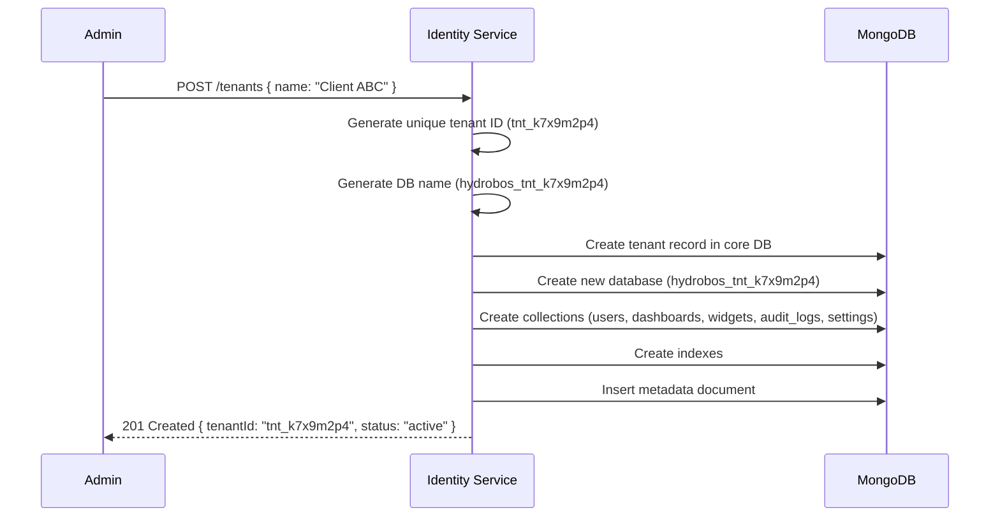

# 14 — Infrastructure & Docker Setup

## Docker Compose Architecture

HydroBOS uses Docker Compose for local development, providing all infrastructure dependencies in containers. Services (Node.js microservices) run directly on the host for hot-reload during development.

### Container Inventory

| Container | Image | Port | Purpose |
|-----------|-------|------|---------|
| **MongoDB** | `mongo:7` | 27017 | Primary database — users, configs, dashboards, widgets, tenants |
| **Redis** | `redis:7-alpine` | 6379 | Session cache, rate limiting, pub/sub |
| **Kafka** | `bitnami/kafka:3.7` | 9092 | Event bus — async inter-service communication |
| **Kafka UI** | `provectuslabs/kafka-ui` | 8080 | Dev-only Kafka topic browser |
| **Mongo Express** | `mongo-express:1` | 8081 | Dev-only MongoDB web UI |

### Dev Tool Containers

Kafka UI and Mongo Express are gated behind the `dev-tools` profile. To start them:

```bash
# Core infrastructure only
docker compose up -d

# With dev tools (Kafka UI + Mongo Express)
docker compose --profile dev-tools up -d
```

### Health Checks

All containers have health checks configured:

- **MongoDB**: `mongosh --eval "db.adminCommand('ping')"`
- **Redis**: `redis-cli ping`
- **Kafka**: `kafka-broker-api-versions.sh --bootstrap-server localhost:9092`

### Volumes

| Volume | Container | Purpose |
|--------|-----------|---------|
| `hydrobos_mongo_data` | MongoDB | Persistent database storage |
| `hydrobos_redis_data` | Redis | Persistent cache/session data |
| `hydrobos_kafka_data` | Kafka | Persistent event log |

### Network

All containers share a Docker bridge network named `hydrobos-network` for inter-container communication.

---

## Multi-Tenant Database Strategy

HydroBOS supports **database-per-tenant** isolation:

1. **Core database** (`hydrobos`) — stores platform-level data: users, organizations, tenants, SSO config
2. **Tenant databases** (`hydrobos_tnt_xxxxxxxx`) — isolated databases provisioned per tenant with their own collections

### Tenant Provisioning Flow



### Tenant ID Format

Tenant IDs are auto-generated with the format `tnt_` + 8 random alphanumeric characters:
- Example: `tnt_k7x9m2p4`, `tnt_a3b5c7d9`
- Generated using `crypto.randomBytes()` for uniqueness
- Stored as a unique indexed field

### Provisioned Collections Per Tenant

| Collection | Purpose |
|-----------|---------|
| `users` | Tenant-scoped user accounts |
| `dashboards` | Dashboard configurations |
| `widgets` | Widget instances |
| `audit_logs` | Audit trail |
| `settings` | Tenant metadata and config |

---

## Service Ports (Development)

| Service | Port | Type |
|---------|------|------|
| API Gateway | 5000 | Node.js (host) |
| Identity Service | 5001 | Node.js (host) |
| Widget Service | 5002 | Node.js (host) |
| Vite Dev Server | 5173 | Node.js (host) |
| MongoDB | 27017 | Docker |
| Redis | 6379 | Docker |
| Kafka | 9092 | Docker |
| Kafka UI | 8080 | Docker (dev-tools) |
| Mongo Express | 8081 | Docker (dev-tools) |

---

## Environment Variables

All services use `.env` files with sensible defaults for local development:

| Variable | Default | Used By |
|----------|---------|---------|
| `MONGO_URI` | `mongodb://localhost:27017/hydrobos` | Identity, Widget |
| `JWT_SECRET` | `hydrobos-dev-secret` | Identity, Widget |
| `PORT` | Service-specific (5000-5002) | All services |
| `NODE_ENV` | `development` | All services |
| `CLIENT_URL` | `http://localhost:5173` | Gateway |
| `IDENTITY_SERVICE_URL` | `http://localhost:5001` | Gateway, Widget |
| `WIDGET_SERVICE_URL` | `http://localhost:5002` | Gateway |
| `ENTRA_ENABLED` | `false` | Identity |
| `ENTRA_TENANT_ID` | — | Identity |
| `ENTRA_CLIENT_ID` | — | Identity |
| `ENTRA_CLIENT_SECRET` | — | Identity |
| `ENTRA_REDIRECT_URI` | `http://localhost:5000/api/auth/sso/callback` | Identity |

---

## Starting the Full Stack

```bash
# 1. Start infrastructure
docker compose up -d

# 2. Start backend services (separate terminals)
cd services/identity && npx tsx src/index.ts
cd services/widget && npx tsx src/index.ts
cd services/gateway && npx tsx src/index.ts

# 3. Start frontend
cd client && npx vite --host
```
