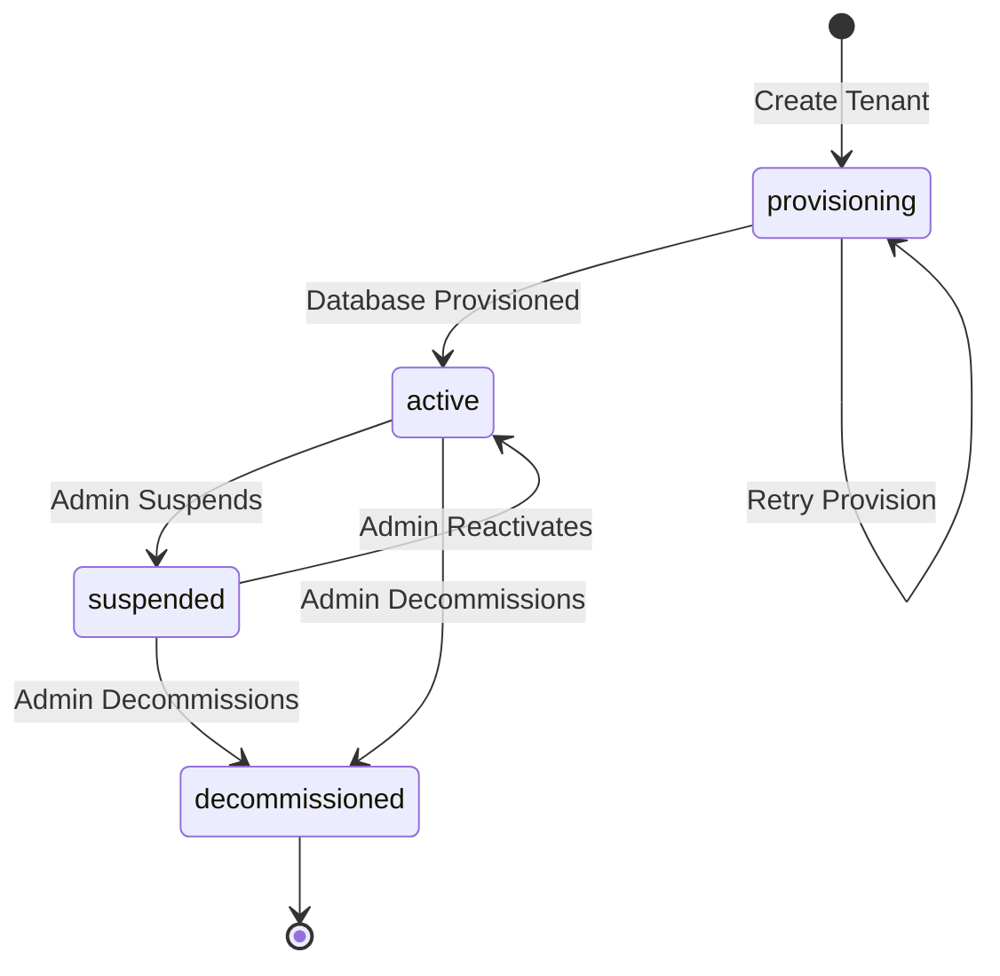
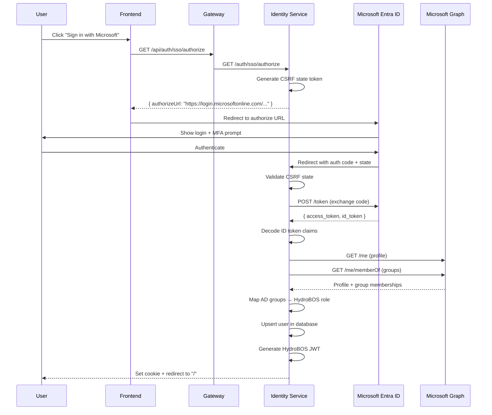

# 15 — Admin Portal & Multi-Tenancy

## Admin Portal Overview

The HydroBOS Admin Portal (`/admin`) is a dedicated settings interface for platform administrators. It consolidates organization management, tenant provisioning, SSO configuration, and user management into a single tabbed interface.

### Access Control

Only users with `platform_admin` or `admin` roles can access admin routes. All admin API endpoints verify the JWT token and reject non-admin requests with `403 Forbidden`.

---

## Tab Structure

### 1. Organization Settings (`/admin` → Organization tab)

Configures the top-level organization that owns this HydroBOS instance.

| Field | Type | Description |
|-------|------|-------------|
| Name | Required | Organization display name |
| Domain | Optional | Primary domain (e.g., `acme.com`) |
| Brand Color | Optional | Primary UI accent color |
| Timezone | Select | Default timezone for reports |
| Locale | Select | Display language/format |
| Contact Email | Optional | Organization contact |
| Contact Phone | Optional | Phone number |
| Website | Optional | Organization website |
| Address | Optional | Physical address |

**API**: `GET /api/organization`, `PUT /api/organization`

---

### 2. Tenant Management (`/admin` → Tenants tab)

Create and manage isolated tenant environments. Each tenant gets:
- A unique **Tenant ID** (format: `tnt_xxxxxxxx`)
- An isolated **MongoDB database** (name: `hydrobos_tnt_xxxxxxxx`)
- Configurable **user limits** and **storage quotas**
- **Feature flags** controlling which modules are available

#### Tenant Lifecycle

#### Create Tenant Form

| Field | Type | Default | Description |
|-------|------|---------|-------------|
| Name | Required | — | Tenant display name |
| Description | Optional | — | Notes about this tenant |
| Max Users | Number | 25 | User account limit |
| Storage (MB) | Number | 1024 | Storage quota |
| Industry | Optional | — | Business vertical |
| Region | Optional | — | Geographic region |

#### Tenant Card Display

Each tenant card shows:
- Name and status badge (active/provisioning/suspended/decommissioned)
- Unique tenant ID with copy button
- Database name
- User & storage limits
- Actions: Retry provision (if failed), Decommission

**API**: `GET /api/tenants`, `POST /api/tenants`, `PATCH /api/tenants/:id`, `DELETE /api/tenants/:id`, `POST /api/tenants/:id/provision`

---

### 3. Entra ID SSO (`/admin` → SSO tab)

Full configuration interface for Microsoft Entra ID (Azure AD) single sign-on.

#### Setup Guide (embedded in UI)

1. Go to Azure Portal → Microsoft Entra ID → App registrations → New registration
2. Set the Redirect URI to: `http://localhost:5000/api/auth/sso/callback`
3. Under Certificates & secrets, create a new Client secret
4. Under API Permissions, add `User.Read` and `GroupMember.Read.All` (delegated)
5. Under Token configuration, optionally add `groups` claim
6. Copy Tenant ID, Client ID, and Client Secret into the form

#### Configuration Fields

| Field | Type | Description |
|-------|------|-------------|
| Enable SSO | Toggle | Turn SSO on/off |
| Entra Tenant ID | Required | Azure AD tenant GUID |
| Application (Client) ID | Required | App registration client GUID |
| Client Secret | Required | App registration secret |
| Redirect URI | Required | OAuth callback URL |
| Scopes | Text | Comma-separated OIDC scopes |
| Auto-provision | Toggle | Create users on first SSO login |
| Default Role | Select | Role for auto-provisioned users |

#### AD Group → Role Mapping

| AD Group Name | → | HydroBOS Role |
|--------------|---|---------------|
| `HydroBOS-Admins` | → | `platform_admin` |
| `HydroBOS-IT-Ops` | → | `it_operations` |
| `HydroBOS-Security` | → | `security_analyst` |
| `HydroBOS-Executives` | → | `executive_viewer` |
| *Others* | → | Default role |

Multiple mappings supported. The highest-priority role wins when a user belongs to multiple mapped groups.

**Role Priority Order**: `platform_admin` > `admin` > `it_operations` > `security_analyst` > `executive_viewer` > `user` > `viewer`

#### Actions

- **Save SSO Configuration** — Creates or updates the SSO config
- **Test Connection** — Verifies SSO status endpoint responds
- **Remove SSO** — Deletes all SSO configuration (requires confirmation)

**API**: `GET /api/sso/config`, `PUT /api/sso/config`, `DELETE /api/sso/config`, `GET /api/auth/sso/status`

#### SSO Authentication Flow

---

### 4. User Management (`/admin` → Users tab)

View, create, and manage user accounts.

#### User List Table

| Column | Description |
|--------|-------------|
| User | Display name + email |
| Role | Color-coded role badge |
| Provider | Local or Entra ID |
| Status | Active/Disabled indicator |
| Last Login | Date of last authentication |
| Actions | Enable/Disable toggle |

#### Create User Form

| Field | Type | Validation |
|-------|------|------------|
| Display Name | Required | — |
| Email | Required | Valid email format |
| Password | Required | Min 12 chars, uppercase, lowercase, number |
| Role | Select | Any valid role |

**API**: `GET /api/users`, `POST /api/users`, `PATCH /api/users/:id`

---

## API Route Summary

| Method | Path | Description | Auth |
|--------|------|-------------|------|
| GET | `/api/organization` | Get org settings | Admin |
| PUT | `/api/organization` | Create/update org | Admin |
| GET | `/api/tenants` | List tenants | Admin |
| POST | `/api/tenants` | Create tenant + provision DB | Admin |
| GET | `/api/tenants/:id` | Get tenant details | Admin |
| PATCH | `/api/tenants/:id` | Update tenant | Admin |
| DELETE | `/api/tenants/:id` | Decommission tenant | Admin |
| POST | `/api/tenants/:id/provision` | Retry DB provision | Admin |
| GET | `/api/sso/config` | Get SSO config | Admin |
| PUT | `/api/sso/config` | Save SSO config | Admin |
| DELETE | `/api/sso/config` | Remove SSO config | Admin |
| GET | `/api/auth/sso/status` | Check SSO status | Public |
| GET | `/api/auth/sso/authorize` | Start OIDC flow | Public |
| GET | `/api/auth/sso/callback` | Handle OIDC callback | Public |
