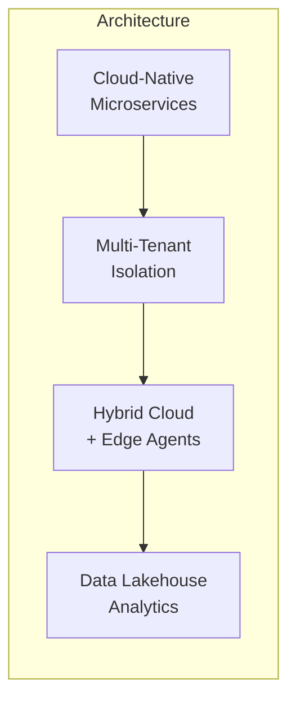

# HydroBOS

### The Enterprise Operating System Your Business Has Been Missing

---

<br/>

## The Problem

**Your business runs on dozens of disconnected tools.** Your IT team monitors networks in one console, checks security alerts in another, manages users in a third, and tracks jobs in a fourth. Executives piece together KPIs from spreadsheets, emails, and fragmented dashboards. Security events live in silos — digital threats in one system, physical access in another.

**The result?** Slower response times. Missed alerts. Context-switching overhead. Duplicated effort. Security blind spots. And a growing stack of tools that don't talk to each other.

Every minute your team spends switching between systems is a minute not spent growing your business.

---

## The Solution: HydroBOS

**HydroBOS is a unified Enterprise Operating System** — a single, beautiful dashboard that brings your entire operation into one view.

It's not another monitoring tool. It's not another ticketing system. **It's the operating system that connects all of them** — giving every stakeholder exactly the view they need, from the C-suite to the IT closet.

<br/>

### One Dashboard. Every Signal. Total Control.

```
┌─────────────────────────────────────────────────────────────────┐
│                                                                 │
│   🏠 Company Health    📊 Revenue: $2.4M ↑12%                 │
│   ──────────────────   🟢 All Systems Operational              │
│                        🛡️ Security Score: 94/100               │
│   🔐 Identity          📈 SEO Traffic: +18% MoM               │
│   ⚙️ Operations                                                │
│   🛡️ Security         ┌──────────┐ ┌──────────┐ ┌──────────┐  │
│   📊 Analytics        │ Network  │ │ Open     │ │ Active   │  │
│   🌐 Network          │ 🟢 98.7% │ │ Jobs: 47 │ │Users: 312│  │
│   📹 Cameras          └──────────┘ └──────────┘ └──────────┘  │
│                                                                 │
└─────────────────────────────────────────────────────────────────┘
```

<br/>

---

## What Makes HydroBOS Different

### 🔐 Identity at the Core

HydroBOS is built on **Microsoft Entra ID** (Azure AD) Single Sign-On. Your team signs in once with their corporate credentials — no new passwords, no separate accounts. Multi-factor authentication, conditional access, and role-based permissions work out of the box.

Every action, every view, every data point is governed by **who you are and what you're authorized to see**. This isn't bolted-on security — it's the foundation.

### 🔌 Connects to Everything You Already Use

HydroBOS doesn't replace your tools — it **unifies them**. Pre-built connectors bring data from across your stack into one coherent view:

| **Business** | **IT Infrastructure** | **Security** |
|:---:|:---:|:---:|
| ServiceFusion | pfSense / OPNsense | Entra ID Protection |
| Google Search Console | Ubiquiti UniFi | Frigate NVR |
| Google Ads & Analytics | Azure / GCP | RADIUS Access Control |
| Ahrefs SEO | Proxmox / VMware | SIEM Integration |
| Cloudflare | Microsoft 365 | Physical Access Logs |

New connectors can be added in **under two weeks** thanks to our modular connector SDK and canonical data model.

### 🛡️ Zero Trust — Digital Meets Physical

HydroBOS is the first platform to **unify digital and physical security** under one identity-driven policy framework:

- A badge scan at the front door and a VPN login from another country? **Impossible travel alert — automatically.**
- An unrecognized person detected by cameras after hours? **Alert escalated to security — instantly.**
- A terminated employee tries to access any system? **Blocked everywhere — digital and physical — in real time.**

### 📊 Every Role Gets Their Perfect View

HydroBOS delivers **role-specific dashboards** — not a one-size-fits-all screen:

| **Executives** | **IT Admins** | **Security Teams** | **Business Teams** |
|:---:|:---:|:---:|:---:|
| Revenue KPIs | Network health | Threat alerts | SEO metrics |
| Risk posture | Device status | Access reviews | CRM pipeline |
| Operational efficiency | Incident queue | Audit trails | Project status |
| Drill-down to any metric | Push config changes | Policy management | Custom reports |

Users see only what's relevant to their role. Drag-and-drop widgets let everyone customize their view.

---

<br/>

## Built for Scale, Ready for SaaS

HydroBOS isn't just an internal tool — it's a **platform built for productization**.



**Multi-Tenant by Design** — Strict data isolation at every layer means you can host dozens of customer organizations on one deployment without risk of data leakage. Each tenant gets their own branding, connectors, roles, and dashboards.

**Hybrid Cloud Native** — Core services run in the cloud (Azure/GCP). Lightweight edge agents deploy on-premises to interface with firewalls, cameras, and local infrastructure — feeding data back securely without opening inbound firewall ports.

**Scales from Startup to Enterprise** — Start with MongoDB and Docker Compose. Grow into Kubernetes, data lakes, and ML-driven insights as your customer base scales.

---

## The Business Case

| Without HydroBOS | With HydroBOS |
|:---:|:---:|
| 8+ tools to check daily | **1 dashboard** |
| Minutes to find context | **Seconds** — global search finds anything |
| Siloed security monitoring | **Unified** digital + physical security |
| Manual onboarding workflows | **Automated** — one click provisions everything |
| Disconnected metrics | **Correlated insights** across all data sources |
| Per-tool licensing costs | **One platform** — reduced tool sprawl |

### ROI Drivers

- **30–50% reduction** in operational tool sprawl
- **Faster incident response** — all signals in one place
- **Reduced security risk** — Zero Trust enforcement, unified audit trail
- **Revenue opportunity** — productize as SaaS for your customers
- **Faster employee onboarding** — automated provisioning workflows

---

## Roadmap

```
  Q1 2026          Q2 2026         Q3–Q4 2026         Q1–Q2 2027          Q3 2027+
  ────────         ────────        ──────────          ──────────          ────────
  Foundation       SSO + UI        MVP Dashboard       Multi-Tenant        V2 Platform
  Architecture     Shell           3 Connectors        SaaS Launch         Data Lake
  CI/CD Setup      RBAC            Widget Engine       Pilot Customers     AI Insights
                   Entra ID        Live Data           Scale Testing       Marketplace
```

**V1 SaaS target: Q2 2027** with pilot customers onboarded.

---

## Why Now?

The tools exist. The APIs exist. The identity infrastructure exists. What's been missing is the **connective tissue** — a single platform smart enough to bring it all together and secure enough to trust with everything.

**HydroBOS is that platform.**

---

<br/>

<div align="center">

### Ready to unify your operations?

**HydroBOS** — One dashboard. Every signal. Total control.

*Contact: [team@hydrobos.com](mailto:team@hydrobos.com)*

</div>
