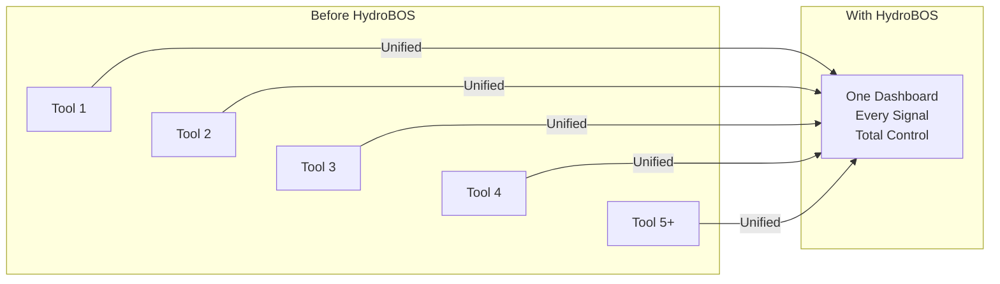
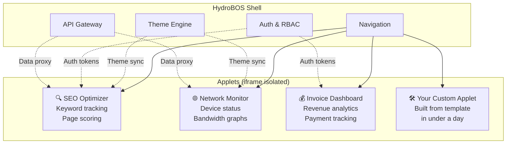
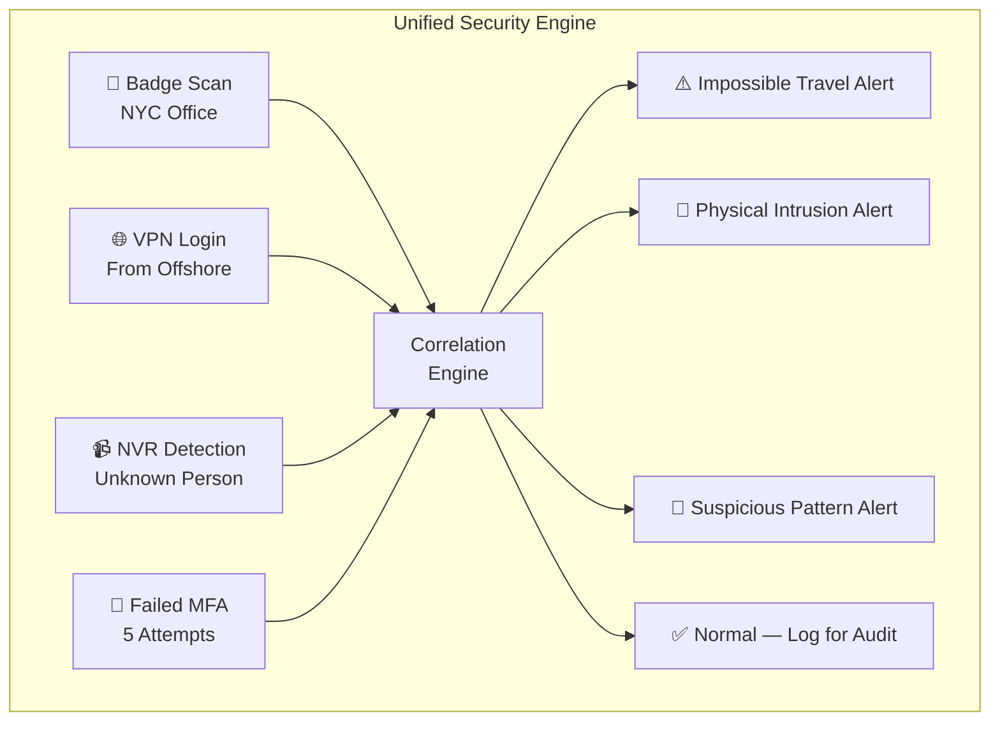
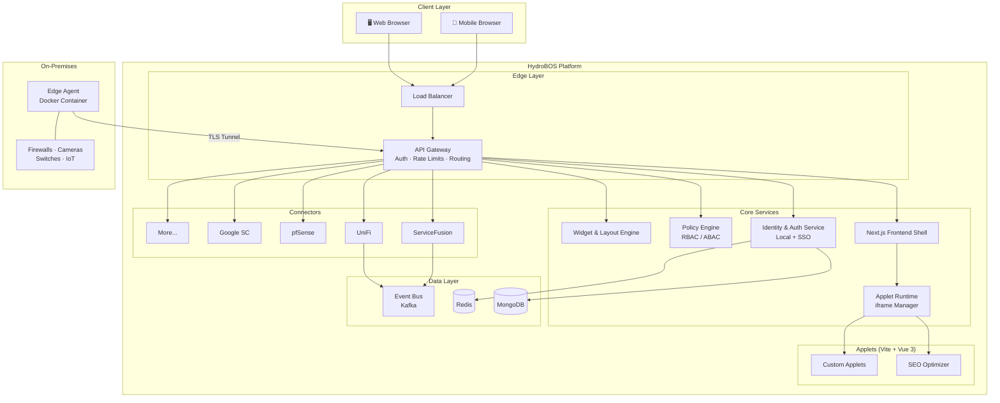
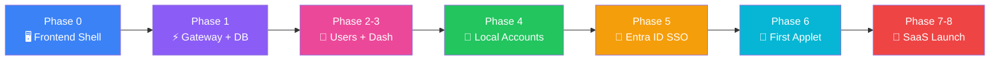
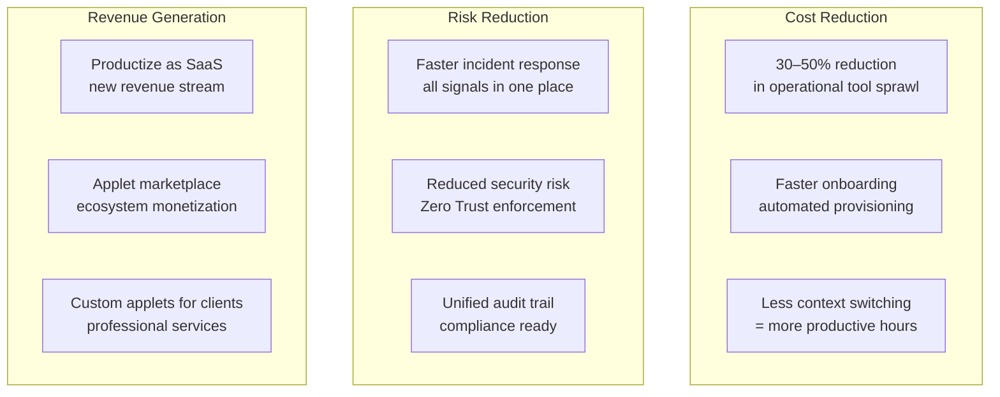
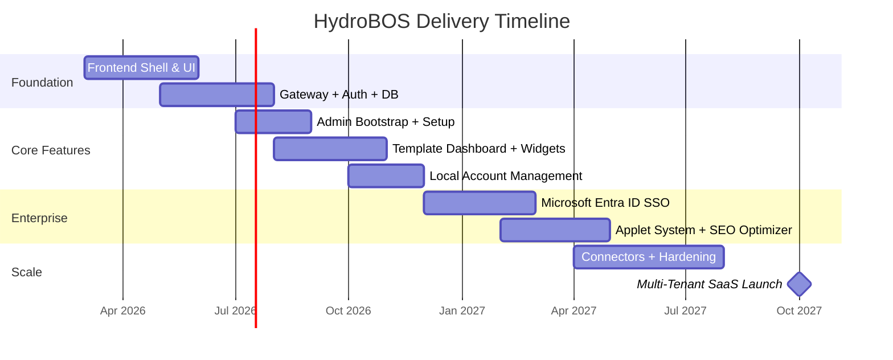
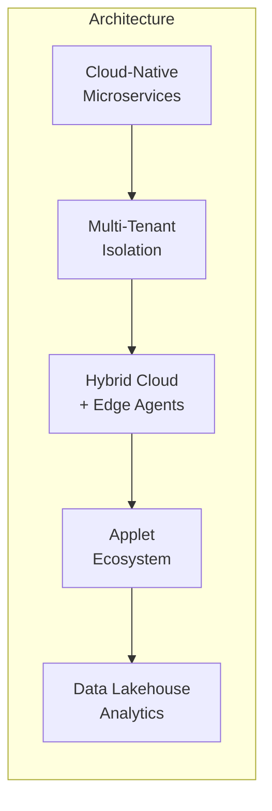
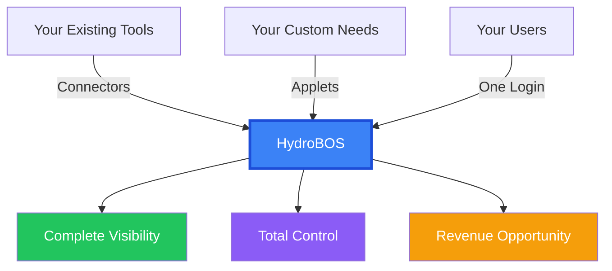

# HydroBOS

### The Hydro Business Operating System Your Company Has Been Missing

---

<br/>

## PAGE 1 — THE PROBLEM & THE SOLUTION

---

### The Problem

**Your business runs on dozens of disconnected tools.** Your IT team monitors networks in one console, checks security alerts in another, manages users in a third, and tracks jobs in a fourth. Executives piece together KPIs from spreadsheets, emails, and fragmented dashboards. Security events live in silos — digital threats in one system, physical access in another.

```
┌────────────────────────────────────────────────────────────────────────┐
│                    THE TOOL SPRAWL PROBLEM                            │
│                                                                        │
│   ┌──────────┐  ┌──────────┐  ┌──────────┐  ┌──────────┐            │
│   │ Network  │  │ Security │  │  Users   │  │  Jobs    │            │
│   │ Console  │  │  SIEM    │  │ Active   │  │ CRM/ERP  │            │
│   │          │  │          │  │ Directory│  │          │            │
│   └──────────┘  └──────────┘  └──────────┘  └──────────┘            │
│        ↕              ↕              ↕              ↕                │
│   ┌──────────┐  ┌──────────┐  ┌──────────┐  ┌──────────┐            │
│   │ Cameras  │  │ Firewall │  │ Analytics│  │  Docs    │            │
│   │  NVR     │  │  Mgmt    │  │  SEO     │  │  Wiki    │            │
│   └──────────┘  └──────────┘  └──────────┘  └──────────┘            │
│                                                                        │
│   ❌ No cross-tool correlation    ❌ 8+ logins daily                  │
│   ❌ Minutes to find context      ❌ Security blind spots              │
│   ❌ Manual onboarding            ❌ Duplicated effort                 │
└────────────────────────────────────────────────────────────────────────┘
```

**The result?** Slower response times. Missed alerts. Context-switching overhead. Security blind spots. Every minute your team spends switching between systems is a minute not spent growing your business.

---

### The Solution: HydroBOS

**HydroBOS is a unified Business Operating System** — a single, beautiful dashboard that brings your entire operation into one view.

It's not another monitoring tool. It's not another ticketing system. **It's the operating system that connects all of them** — giving every stakeholder exactly the view they need, from the C-suite to the IT closet.

```
┌─────────────────────────────────────────────────────────────────────┐
│                                                                     │
│   🏠 Company Health    📊 Revenue: $2.4M ↑12%                     │
│   ──────────────────   🟢 All Systems Operational                  │
│                        🛡️ Security Score: 94/100                   │
│   🔐 Identity          📈 SEO Traffic: +18% MoM                   │
│   ⚙️ Operations                                                    │
│   🛡️ Security         ┌──────────┐ ┌──────────┐ ┌──────────┐      │
│   📊 Analytics        │ Network  │ │ Open     │ │ Active   │      │
│   🌐 Network          │ 🟢 98.7% │ │ Jobs: 47 │ │Users: 312│      │
│   📹 Cameras          └──────────┘ └──────────┘ └──────────┘      │
│   🧩 Applets                                                       │
│                        ┌──────────────────────┐ ┌──────────┐        │
│   🔧 Admin            │  SEO Optimizer 📈    │ │ Alerts   │        │
│                        │  Score: 87 | +4 pts  │ │ 🔴 2 New │        │
│                        └──────────────────────┘ └──────────┘        │
│                                                                     │
└─────────────────────────────────────────────────────────────────────┘
```

<br/>

### One Dashboard. Every Signal. Total Control.



---

<br/>

## PAGE 2 — WHAT MAKES HYDROBOS DIFFERENT

---

### 🔐 Flexible Authentication — Start Simple, Scale Up

HydroBOS ships with **local account authentication** that works out of the box — no external identity provider required. Need enterprise SSO? Add **Microsoft Entra ID** (Azure AD) as an optional connector whenever you're ready.

```
┌─────────────────────────────────────────────────────────────────┐
│                    AUTHENTICATION MODES                         │
│                                                                 │
│   ┌─────────────────────┐    ┌─────────────────────────────┐   │
│   │  LOCAL ACCOUNTS     │    │  MICROSOFT ENTRA ID SSO     │   │
│   │  ─────────────────  │    │  ─────────────────────────  │   │
│   │                     │    │                             │   │
│   │  ✅ Works instantly │    │  ✅ Corporate SSO           │   │
│   │  ✅ No IdP needed   │    │  ✅ MFA via Conditional     │   │
│   │  ✅ Email + Password│    │     Access                  │   │
│   │  ✅ Invite flows    │    │  ✅ AD Group → Role Mapping │   │
│   │  ✅ Password reset  │    │  ✅ Auto-deprovisioning     │   │
│   │                     │    │                             │   │
│   │  📦 Built-in        │    │  🔌 Optional Connector      │   │
│   └─────────────────────┘    └─────────────────────────────┘   │
│                                                                 │
│        Use one, the other, or BOTH simultaneously.              │
└─────────────────────────────────────────────────────────────────┘
```

Every action, every view, every data point is governed by **who you are and what you're authorized to see**. This isn't bolted-on security — it's the foundation.

---

### 🧩 Applet System — Build Anything, Embed Everywhere

HydroBOS isn't just a dashboard — it's a **platform for building micro-applications**. Applets are lightweight apps (built with Vite + Vue 3) that run inside the HydroBOS shell, inheriting auth, theming, and data access automatically.



**Why this matters:**
- **Today:** Build internal tools as applets instead of standalone apps
- **Tomorrow:** Let customers build custom applets for their needs
- **Future:** Open an applet marketplace for third-party developers

The first applet — the **SEO Optimizer** — ships in Phase 6, providing keyword analysis, page scoring, and actionable SEO recommendations powered by Google Search Console data.

---

### 🔌 Connects to Everything You Already Use

HydroBOS doesn't replace your tools — it **unifies them**. Pre-built connectors bring data from across your stack into one coherent view:

```
┌─────────────────────────────────────────────────────────────────┐
│                    CONNECTOR ECOSYSTEM                          │
│                                                                 │
│   BUSINESS             IT INFRASTRUCTURE      SECURITY          │
│   ────────             ─────────────────      ────────          │
│   ▸ ServiceFusion      ▸ pfSense/OPNsense    ▸ Entra ID        │
│   ▸ Google Search      ▸ Ubiquiti UniFi       ▸ Frigate NVR     │
│     Console            ▸ Azure / GCP          ▸ RADIUS          │
│   ▸ Google Ads &       ▸ Proxmox / VMware     ▸ SIEM            │
│     Analytics          ▸ Microsoft 365        ▸ Physical        │
│   ▸ Ahrefs SEO         ▸ Cloudflare             Access Logs    │
│                                                                 │
│   🔧 New connectors in ~2 weeks via Connector SDK              │
└─────────────────────────────────────────────────────────────────┘
```

---

### 🛡️ Zero Trust — Digital Meets Physical

HydroBOS is the first platform to **unify digital and physical security** under one identity-driven policy framework:



- Badge at the office AND VPN from another country? **Impossible travel alert — automatically.**
- Unrecognized person after hours? **Alert escalated — instantly.**
- Terminated employee tries *anything*? **Blocked everywhere — digital and physical — in real time.**

---

### 📊 Every Role Gets Their Perfect View

```
┌───────────────┬───────────────┬───────────────┬───────────────┐
│  EXECUTIVES   │   IT ADMINS   │   SECURITY    │   BUSINESS    │
│───────────────│───────────────│───────────────│───────────────│
│               │               │               │               │
│ Revenue KPIs  │ Network health│ Threat alerts │ SEO metrics   │
│ Risk posture  │ Device status │ Access reviews│ CRM pipeline  │
│ Operational   │ Incident queue│ Audit trails  │ Project status│
│ efficiency    │ Push config   │ Policy mgmt   │ Custom reports│
│               │ changes       │               │               │
│ Drill-down    │ Full control  │ Unified view  │ Self-service  │
│ to any metric │               │ digital+phys  │ dashboards    │
│               │               │               │               │
└───────────────┴───────────────┴───────────────┴───────────────┘

      Drag-and-drop widgets let everyone customize their view.
          Users see ONLY what's relevant to their role.
```

---

<br/>

## PAGE 3 — HOW IT WORKS

---

### Architecture at a Glance



---

### Development Philosophy: Frontend-First

HydroBOS is built **starting with what users see**. The UI shell comes first, then backend services are layered in progressively — ensuring there's always something visible and impressive at every milestone.



> **Principle:** Always have something clickable. Build the experience first, layer logic second.

---

### Applet Architecture Deep Dive

```
┌──────────────────────────────────────────────────────────────────┐
│  HYDROBOS HOST SHELL (Next.js)                                  │
│  ┌──────────────────────────────────────────────────────────┐   │
│  │  Sidebar · Top Bar · Theme · Auth · Navigation           │   │
│  └──────────────────────────────────────────────────────────┘   │
│                                                                  │
│  ┌──────────────────────────────────────────────────────────┐   │
│  │  APPLET CONTAINER (iframe sandbox)                       │   │
│  │  ┌──────────────────────────────────────────────────┐    │   │
│  │  │  Vite + Vue 3 Applet                             │    │   │
│  │  │  ┌────────────┐ ┌────────────┐ ┌────────────┐   │    │   │
│  │  │  │  Views     │ │ Components │ │  Stores    │   │    │   │
│  │  │  └────────────┘ └────────────┘ └────────────┘   │    │   │
│  │  │                                                  │    │   │
│  │  │  ┌──────────────────────────────────────────┐    │    │   │
│  │  │  │  @hydrobos/applet-sdk                    │    │    │   │
│  │  │  │  Auth · Theme · API Proxy · Events       │    │    │   │
│  │  │  └──────────────────────────────────────────┘    │    │   │
│  │  └──────────────────────────────────────────────────┘    │   │
│  │                    ↕ postMessage                          │   │
│  │  ┌──────────────────────────────────────────────────┐    │   │
│  │  │  HOST BRIDGE                                     │    │   │
│  │  │  Token Provider · Theme Sync · API Router        │    │   │
│  │  └──────────────────────────────────────────────────┘    │   │
│  └──────────────────────────────────────────────────────────┘   │
└──────────────────────────────────────────────────────────────────┘
```

**Key innovation:** Applets are **framework-agnostic**. The SDK is plain TypeScript — use Vue, React, Svelte, or vanilla JS. The template uses Vue 3 for optimal DX and lightweight builds.

---

<br/>

## PAGE 4 — THE BUSINESS CASE

---

### Before vs. After

```
┌────────────────────────────┐    ┌────────────────────────────────┐
│   WITHOUT HYDROBOS         │    │   WITH HYDROBOS                │
│────────────────────────────│    │────────────────────────────────│
│                            │    │                                │
│   8+ tools to check daily  │    │   1 dashboard                  │
│                            │    │                                │
│   Minutes to find context  │    │   Seconds — global search      │
│                            │    │   finds anything               │
│   Siloed security          │    │                                │
│   monitoring               │    │   Unified digital + physical   │
│                            │    │   security                     │
│   Manual onboarding        │    │                                │
│   workflows                │    │   Automated — one click        │
│                            │    │   provisions everything        │
│   Disconnected metrics     │    │                                │
│                            │    │   Correlated insights across   │
│   Per-tool licensing       │    │   all data sources             │
│   costs                    │    │                                │
│                            │    │   One platform — reduced       │
│   Custom tools = months    │    │   tool sprawl                  │
│   of development           │    │                                │
│                            │    │   Custom applets in days       │
│                            │    │   via template SDK             │
└────────────────────────────┘    └────────────────────────────────┘
```

---

### ROI Drivers



| Impact Area | Metric | Estimate |
|------------|--------|----------|
| **Tool Consolidation** | Reduction in standalone tools | 30–50% |
| **Incident Response** | Time to detect & respond | 40–60% faster |
| **Onboarding** | Time to provision new employee | 90% faster |
| **Context Switching** | Daily tool switches per person | 70% reduction |
| **Compliance** | Audit preparation time | 60% reduction |
| **Development** | Time to build internal tools (applets) | 5x faster |

---

### Total Cost of Ownership

```
┌─────────────────────────────────────────────────────────────────┐
│               TRADITIONAL APPROACH vs HYDROBOS                  │
│                                                                 │
│   Traditional:                                                  │
│   ┌──────────────────────────────────────────────────────┐     │
│   │  Tool A license   $10K/yr                            │     │
│   │  Tool B license   $15K/yr                            │     │
│   │  Tool C license    $8K/yr                            │     │
│   │  Custom glue code  $50K (one-time) + $20K/yr maint  │     │
│   │  Training (5 tools) $5K/yr                           │     │
│   │  Context-switching overhead  $30K/yr (est. lost prod)│     │
│   │  ────────────────────────────────────────────────    │     │
│   │  Year 1: $118K   │   Year 2+: $88K/yr               │     │
│   └──────────────────────────────────────────────────────┘     │
│                                                                 │
│   HydroBOS:                                                     │
│   ┌──────────────────────────────────────────────────────┐     │
│   │  Platform license  $25K/yr (or self-hosted: $0)      │     │
│   │  Infrastructure    $5K/yr (cloud + monitoring)       │     │
│   │  Training (1 tool) $1K/yr                            │     │
│   │  Custom applets    Built in-house with template SDK  │     │
│   │  ────────────────────────────────────────────────    │     │
│   │  Year 1: $31K    │   Year 2+: $31K/yr               │     │
│   └──────────────────────────────────────────────────────┘     │
│                                                                 │
│   💰 Estimated savings: $57K+ in Year 2                        │
└─────────────────────────────────────────────────────────────────┘
```

---

<br/>

## PAGE 5 — ROADMAP & GETTING STARTED

---

### Development Roadmap



```
  Q1 2026        Q2-Q3 2026       Q4 2026         Q1-Q2 2027        Q3-Q4 2027
  ────────       ──────────       ────────        ──────────        ──────────
  Frontend       Gateway + DB     Local Users     Entra ID SSO      SaaS Launch
  Shell          Admin Setup      Accounts        First Applet      Multi-Tenant
  Mock Dash      Widget Engine    User Mgmt       SEO Optimizer     Connectors
  Theme          RBAC             Invites         Applet SDK        Scale Test
```

---

### Built for Scale, Ready for SaaS



**Multi-Tenant by Design** — Strict data isolation at every layer. Each tenant gets their own branding, connectors, roles, applets, and dashboards.

**Hybrid Cloud Native** — Core services run in the cloud. Lightweight edge agents deploy on-premises — feeding data back securely without opening inbound firewall ports.

**Applet Ecosystem** — The template SDK lets anyone build custom micro-apps in days, not months. Internal tools today, marketplace tomorrow.

**Scales from Startup to Enterprise** — Start with MongoDB and Docker Compose. Grow into Kubernetes, data lakes, and ML-driven insights.

---

### Tech Stack

```
┌─────────────────────────────────────────────────────────────────┐
│                    HYDROBOS TECH STACK                           │
│                                                                 │
│   FRONTEND SHELL          APPLETS             BACKEND           │
│   ──────────────          ───────             ───────           │
│   Next.js 14+             Vite 5+             Node.js 20 LTS   │
│   React 18+               Vue 3               NestJS            │
│   TypeScript              TypeScript           TypeScript        │
│   Tailwind + Shadcn       Pinia               REST APIs         │
│   Zustand + React Query   Chart.js            MongoDB           │
│                                                                 │
│   AUTH                    INFRA               MESSAGING          │
│   ────                    ─────               ─────────          │
│   Local (bcrypt)          Docker Compose      Kafka              │
│   Microsoft Entra ID      Kubernetes (scale)  Azure Service Bus │
│   JWT Sessions            Redis Cache         MQTT (IoT)        │
│   RBAC / ABAC             GitHub Actions CI                     │
└─────────────────────────────────────────────────────────────────┘
```

---

### Why Now?

The tools exist. The APIs exist. The identity infrastructure exists. What's been missing is the **connective tissue** — a single platform smart enough to bring it all together, extensible enough to grow with your needs, and secure enough to trust with everything.

**HydroBOS is that platform.**



---

<br/>

<div align="center">

### Ready to unify your operations?

**HydroBOS** — One dashboard. Every signal. Total control.

*Contact: [team@hydrobos.com](mailto:team@hydrobos.com)*

</div>
